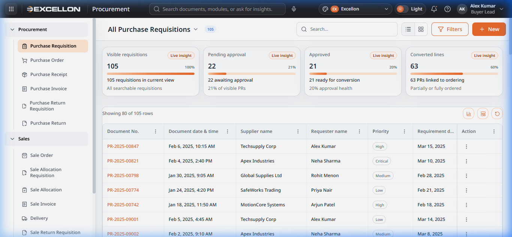
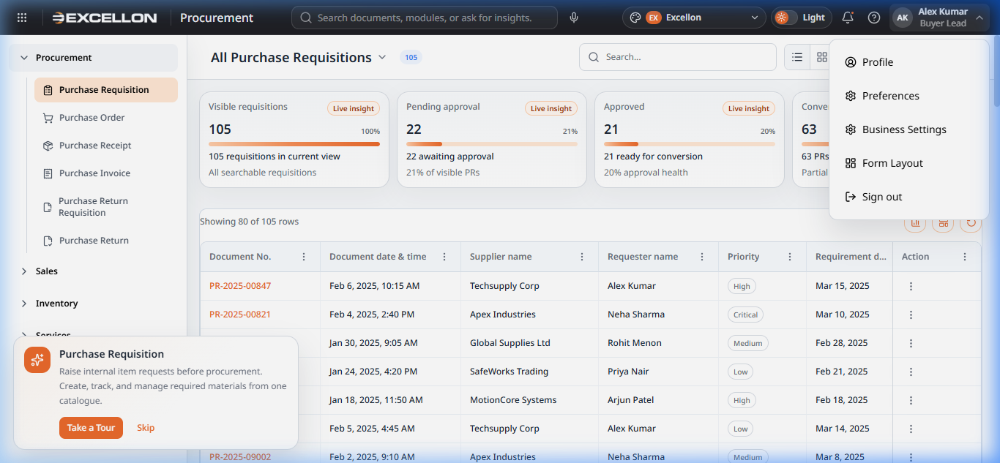

# Component 01 — App Shell (Application Layout)

> **Source Files:**  
> `src/components/common/AppShell.tsx` (Main wrapper)  
> `src/components/common/AppSidebar.tsx` (240 lines — Sidebar navigation)  
> `src/components/common/AppTopHeader.tsx` (891 lines — Top header bar)  
> `src/components/common/appShellShared.ts` (275 lines — Shared menu data, types, voice utilities)  

---

## What It Is

The **App Shell** is the overall container that wraps every page in the iDMS application. It provides the two persistent navigation areas that are always visible regardless of which page the user is on:

1. **Left Sidebar** — Module and sub-module navigation
2. **Top Header Bar** — Branding, search, voice commands, theme controls, and user profile

Think of the App Shell as the "frame" around every screen.

---

## Screenshot

---

## Part A — Left Sidebar

### Purpose
The sidebar provides **primary navigation** across all business modules. It is organized as a tree of expandable menu groups.

### Module Structure

| Module | Sub-Modules |
|---|---|
| **Procurement** | Purchase Requisition, Purchase Order, Purchase Receipt, Purchase Invoice, Purchase Return Requisition, Purchase Return |
| **Sales** | Sale Order, Sale Allocation Requisition, Sale Allocation, Sale Invoice, Delivery, Sale Return Requisition, Sale Return |
| **Inventory** | *(Sub-modules listed in sidebar)* |
| **Services** | *(Sub-modules listed in sidebar)* |

### User Behavior

| Action | What Happens |
|---|---|
| Click a **module name** (e.g., "Procurement") | Expands or collapses the group to show/hide sub-modules |
| Click a **sub-module** (e.g., "Purchase Requisition") | Navigates to that sub-module's catalogue (list) page |
| The **active sub-module** | Is visually highlighted with a coloured background |

### Key Features
- **Collapsible groups** — Users can expand/collapse module groups to reduce visual clutter
- **Active item highlighting** — The currently viewed sub-module is clearly highlighted
- **Consistent position** — The sidebar remains visible on all pages for quick navigation
- **Icon-based identification** — Each sub-module has a unique icon for quick visual scanning

---

## Part B — Top Header Bar

### Purpose
The top header bar provides **global utilities** available on every page.

### Layout (Left to Right)

| Area | Description |
|---|---|
| **App Grid Icon** (⊞) | A grid/waffle icon on the far left for application-level access |
| **Brand Logo** | Displays the "EXCELLON" logo and current module name (e.g., "Procurement") |
| **Global Search Bar** | Central search input: "Search documents, modules, or ask for insights" |
| **Voice Command** (🎤) | Microphone icon for voice-activated navigation |
| **Brand Theme Selector** | Dropdown showing current brand (e.g., "Excellon") with options to switch |
| **Appearance Toggle** | Light/Dark mode toggle switch |
| **Notification Bell** (🔔) | Shows pending notifications |
| **Help Icon** (❓) | Links to help resources |
| **User Profile** | Shows logged-in user name, role, and avatar. Clicking opens a profile menu |

### User Behavior

| Action | What Happens |
|---|---|
| Click the **search bar** | Opens the Global Search Panel (documented separately) |
| Click the **microphone** icon | Activates voice-command mode for hands-free navigation |
| Select a **brand theme** | Changes the application's colour scheme to match the selected brand |
| Toggle **Light/Dark** | Switches between light mode and dark mode across the entire application |
| Click the **user avatar** | Opens a dropdown with profile options (settings, form layout, logout) |

---

## Part C — Voice Command System

> **Implemented in:** `src/components/common/AppTopHeader.tsx`

### What It Is
The **Voice Command** feature allows hands-free navigation and data querying using the browser's built-in Speech Recognition API.

### How It Works
1. **Direct mode** — Click the microphone icon and speak a command directly
2. **Wake-word mode** — If microphone permission is already granted, the system listens in the background for the wake word **"Hi"**, then awaits a follow-up command
3. **Command mode** — After the wake phrase is detected, the system listens for the actual command

### Voice States
| State | Description |
|---|---|
| Idle | Microphone not actively listening |
| Listening | Actively listening for speech |
| Processing | Interpreting the spoken command |
| Success | Command recognized and acted upon |
| Error | Recognition failed or command not understood |
| Unsupported | Browser does not support Speech Recognition |

### Supported Commands
- **Navigation:** "Go to sale order screen", "Open purchase invoice" — navigates to the specified module
- **Document search:** "Open Purchase Order of HPCL" — searches and navigates to a matching document
- **Insights:** "Today's total sale", "Today's total purchase" — retrieves analytical data

### Voice Panel UI
When active, a voice panel appears below the search bar showing:
- Animated **sound wave** visualization during listening
- **Transcript** of what was heard ("You said: ...")
- **Suggestions list** if multiple documents match the command
- **Insight card** if an analytics query was matched
- Close (✕) button to dismiss

---

## Part D — Profile Menu

> **Implemented in:** `src/components/common/AppTopHeader.tsx`

### What It Is
The profile dropdown in the top-right corner provides access to user account settings.

### Screenshot

### Menu Items
| Item | Icon | Action |
|---|---|---|
| My Profile | 👤 | Navigates to user profile page |
| Dashboard | 📊 | Navigates to the main dashboard |
| Settings | ⚙️ | Opens application settings |
| Form Layout | — | Opens the Form Layout Settings page |
| Business Settings | — | Opens business configuration |
| Logout | 🚪 | Logs the user out of the application |

---

## Part E — Sidebar Navigation Data (appShellShared.ts)

> **Source File:** `src/components/common/appShellShared.ts` (275 lines)

### What It Is
A shared data file that defines the **complete menu structure** for the sidebar and shared TypeScript types used by both the Sidebar and Top Header components.

### Menu Structure Defined

| Module | Sub-Modules |
|---|---|
| **Procurement** | Purchase Requisition, Purchase Order, Purchase Receipt, Purchase Invoice, Purchase Return Requisition, Purchase Return |
| **Sales** | Sale Order, Sale Allocation Requisition, Sale Allocation, Sale Invoice, Delivery, Sale Return Requisition, Sale Return |
| **Inventory** | Stock Transfer Requisition, Stock Transfer, Stock Adjustment Requisition, Stock Adjustment |
| **Services** | Appointment, Service Estimate, Job Card, Spare Issue, Spare Issue Return, Service Invoice, Service Invoice Return |

### Shared Utilities
- `navigateToHash()` — Handles hash-based page navigation
- `getSpeechRecognitionConstructor()` — Detects browser Speech Recognition support
- `normalizeVoiceText()` — Cleans voice input for matching
- `getTranscriptFromResults()` — Extracts text from speech recognition results
- `getWakeCommand()` — Parses the "Hi" wake phrase from speech input

---

## Related File(s)

| File | Role |
|---|---|
| `src/components/common/AppShell.tsx` | Main wrapper — combines sidebar + header + content area |
| `src/components/common/AppSidebar.tsx` | Sidebar navigation — module tree, expand/collapse, active highlighting |
| `src/components/common/AppTopHeader.tsx` | Top header — search, voice commands, theme, profile menu |
| `src/components/common/appShellShared.ts` | Shared menu data, type definitions, voice/navigation utilities |
| `src/components/common/ThemeSwitcher.tsx` | Theme dropdown + dark/light toggle in the header |
