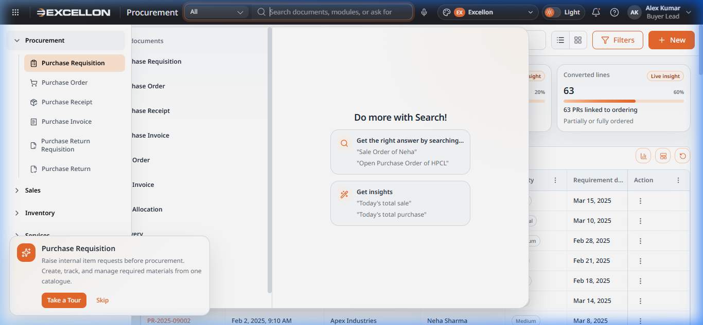

# Component 02 — Global Search Panel

> **Source File:** `src/components/common/GlobalSearchPanel.tsx` (306 lines)

---

## What It Is

The **Global Search Panel** is a full-screen overlay that appears when the user clicks the search bar in the top header. It provides a unified search experience across all modules and documents in the system.

---

## Screenshot

---

## How It Works

### Opening the Search
- Click the search bar in the top header that reads *"Search documents, modules, or ask for insights"*
- The panel opens as a full-width overlay with a focused search input

### Panel Layout

| Section | Description |
|---|---|
| **Search Input** | The main text field at the top where the user types a query. Includes a module filter dropdown ("All") |
| **Module Shortcuts** | A vertical list of quick-access links to all document types (Purchase Requisition, Purchase Order, etc.) |
| **"Do more with Search"** | Right-side panel with tips showing example searches and insight queries |
| **Recent Searches** | Previously searched terms appear for quick re-access |
| **Live Results** | As the user types, matching documents appear in real-time with highlighted matches |

### User Behavior

| Action | What Happens |
|---|---|
| **Type a search query** | Results appear live below the search bar, with matching text highlighted |
| **Click a module shortcut** | Navigates directly to that module's catalogue page |
| **Click a search result** | Opens the specific document or navigates to the relevant page |
| **Press Escape** | Closes the search panel and returns to the previous page |
| **Filter by module** | Use the "All" dropdown to narrow search to a specific module |

### Key Features
- **Real-time search** — Results update as the user types, no need to press Enter
- **Text highlighting** — Matching words are visually highlighted in results
- **Module filtering** — Narrow search to a specific module for faster results
- **Search insights** — Example queries help users discover data insights (e.g., "Today's total sale")
- **Keyboard accessible** — Escape key closes the panel; arrow keys navigate results

---

## Related File(s)

| File | Role |
|---|---|
| `src/components/common/GlobalSearchPanel.tsx` | Search results UI, module shortcuts, insight tips |
| `src/components/common/AppShell.tsx` | Hosts the search bar trigger and manages open/close state |
| `src/search/` | Search index and utility logic |
