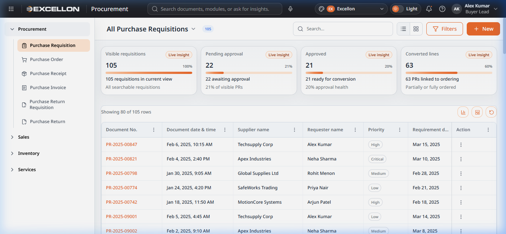
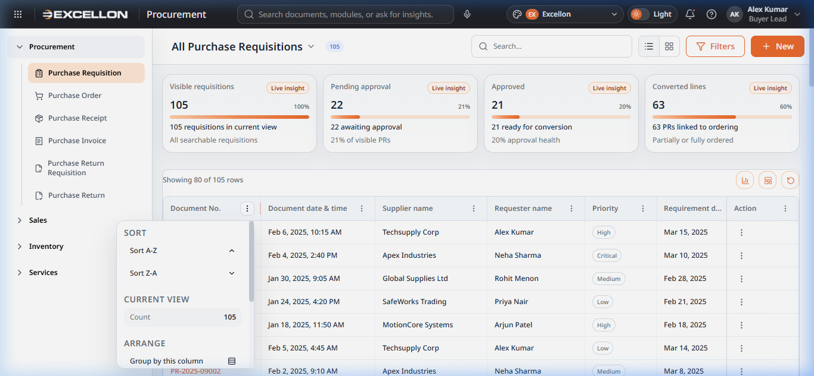

# Component 03 — Common Data Grid & Sortable Table Header

> **Source Files:**  
> `src/components/common/CommonDataGrid.tsx` (799 lines)  
> `src/components/common/SortableTableHeader.tsx` (406 lines)  
> `src/components/common/dataGridTypes.ts` (114 lines)  
> `src/components/common/gridKeyboard.ts` (61 lines)

---

## What It Is

The **Common Data Grid** is the main table/list component used across all catalogue (list) pages. It displays documents (Purchase Requisitions, Sale Orders, etc.) in a structured, scrollable table with powerful features for sorting, filtering, grouping, and customization.

The **Sortable Table Header** is the header row of the data grid that provides column-specific actions through a context menu.

---

## Screenshots

---

## Data Grid Features

### Core Display
- Displays data in a structured **rows and columns** table format
- Each row represents a document (e.g., one Purchase Requisition)
- Each column shows a specific field (Document No., Date, Supplier, Priority, etc.)
- Supports **incremental rendering** — loads rows in batches for smooth performance

### Toolbar Area
The toolbar sits above the column headers and provides:

| Element | Description |
|---|---|
| **Row count** | "Showing 80 of 105 rows" — tells users how many records are displayed |
| **Chart icon** (📊) | Opens the Data Grid Chart Drawer for visual analytics |
| **Grid View icon** (⊞) | Opens the Grid Configurator to manage columns |
| **Refresh icon** (↻) | Refreshes the grid data |

### Sorting
- Click any **column header** to sort ascending/descending
- A sort indicator arrow (↑ or ↓) appears on the active sort column
- Click again to reverse the sort direction

### Column Header Menu
Click the **three-dot icon (⋮)** next to any column header to access:

| Menu Option | Description |
|---|---|
| **Sort A–Z / Sort Z–A** | Sort the column in ascending or descending order |
| **Count** | Shows the total count of values in that column |
| **Group by this column** | Groups rows by the values in that column |
| **Pin Left / Pin Right** | Freezes the column to the left or right edge so it stays visible when scrolling |
| **Hide column** | Hides the column from the grid (can be restored from the Grid Configurator) |
| **Reset view** | Reverts all column customizations to the default layout |

### Row Selection & Bulk Actions
- Checkbox in the first column allows selecting individual rows
- A "select all" checkbox selects all visible rows
- When rows are selected, **bulk action buttons** appear in the toolbar
- Bulk actions may include export, delete, or status change operations

### Data Export
- **CSV Export** — Users can export the current filtered/sorted view to a CSV file for use in spreadsheet applications

### Row Density
Two density modes:
- **Compact** — Tighter rows for scanning large volumes of data
- **Comfortable** — More padding for easier reading during detailed review

---

## User Behavior Summary

| Action | What Happens |
|---|---|
| Click a **column header** | Sorts the data by that column |
| Click the **⋮ icon** on a column | Opens the column management menu |
| Select a **row checkbox** | Selects that row; bulk actions become available |
| Click a **document number** link | Opens the document preview drawer |
| Scroll **horizontally** | Pinned columns stay fixed while other columns scroll |
| Click **Chart icon** | Opens the chart visualization drawer |
| Click **Grid View icon** | Opens the column/density configurator |

### Keyboard Navigation (gridKeyboard.ts)
The grid supports **keyboard-driven data entry** for line-item tables in create/edit forms:
- **Tab from the last cell** of a completed row → Automatically adds a new blank row
- **Tab from an incomplete row** → Blocks the Tab and triggers incomplete-row validation
- Uses `hasRequiredGridValues()` to check whether all mandatory fields in a row are filled
- This enables fast, keyboard-only data entry without needing to click "+ Add line"

---

## Related File(s)

| File | Role |
|---|---|
| `src/components/common/CommonDataGrid.tsx` | Main grid logic — rendering, sorting, selection, export, toolbar |
| `src/components/common/SortableTableHeader.tsx` | Column header with sort, group, pin, hide menu |
| `src/components/common/dataGridTypes.ts` | TypeScript type definitions for grid columns, preferences, chart presets |
| `src/components/common/gridKeyboard.ts` | Keyboard navigation utility for Tab-to-add-row in line-item grids |
