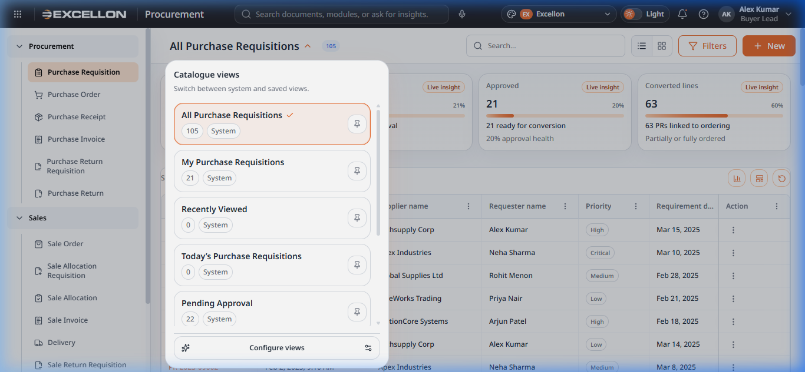
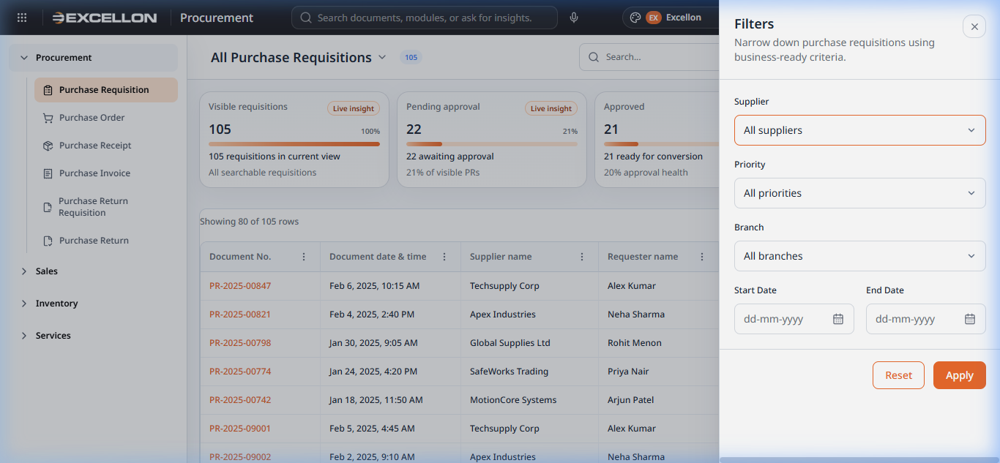

# Component 04 — Catalogue Components

> **Source Files:**  
> `src/components/common/CatalogueInsightCards.tsx` (70 lines)  
> `src/components/common/CatalogueViewSelector.tsx` (152 lines)  
> `src/components/common/CatalogueViewConfigurator.tsx` (544 lines)  
> `src/components/common/CatalogueFilterDrawer.tsx` (132 lines)

---

## 4A — Catalogue Insight Cards

### What It Is
The **Insight Cards** are the row of coloured summary tiles displayed above the data grid. They provide real-time analytical snapshots of the current data view.

### Screenshot

*(See the four coloured cards at the top of the catalogue: "Visible requisitions: 105", "Pending approval: 22", "Approved: 21", "Converted lines: 63")*

### Features
- Displays up to **4 insight cards** at once
- Each card shows: **Label**, **Value**, **Support text**, **Progress bar**, and a **"Live insight"** badge
- Cards are **clickable** — selecting a card filters the grid to show only matching records
- An **"Applied"** badge appears when a card is actively filtering data
- Colour-coded tones: primary, success, warning, neutral, accent

### User Behavior
| Action | What Happens |
|---|---|
| Click an **insight card** | Filters the grid to show only rows matching that insight |
| Click the **same card again** | Removes the filter and shows all records |

---

## 4B — Catalogue View Selector

### What It Is
The **View Selector** is a dropdown at the top of the catalogue page that allows switching between saved views (e.g., "All Purchase Requisitions", "My Purchase Requisitions", "Pending Approval").

### Screenshot

### Features
- Displays the **active view name** as the page title with a record count badge
- Dropdown lists all available views with:
  - View name
  - Record count
  - Type label (System / Custom)
  - Pin icon to set as default
  - Checkmark on the currently active view
- **"Configure views"** button at the bottom opens the View Configurator
- Views can be **pinned as default** — the pinned view loads automatically when entering the catalogue

### User Behavior
| Action | What Happens |
|---|---|
| Click the **view title** | Opens the view selector dropdown |
| Click a **view name** | Switches to that view and refreshes the grid |
| Click the **pin icon** | Pins/unpins that view as the default |
| Click **"Configure views"** | Opens the View Configurator (side drawer) |

---

## 4C — Catalogue View Configurator

### What It Is
The **View Configurator** is a wide side drawer that allows users to create, edit, pin, and delete custom catalogue views with specific filter criteria.

### Features
- **Two-panel layout:**
  - **Left panel — Available Views**: Lists all system and custom views with pin buttons
  - **Right panel — Editor**: Shows/edits the selected view's filter rules
- **For custom views, the editor includes:**
  - View name input
  - Requester scope (All / My / Specific)
  - Date window (All dates / Today / This week / This month)
  - Supplier and Branch filters
  - Status and Priority checkboxes (multi-select pill toggles)
  - Sort-by column and direction
  - Pin as default checkbox
- **System views** cannot be edited but can be pinned or copied to create a custom version
- **Summary pills** at the top show all active criteria at a glance
- Footer: Close, Delete (custom only), Save view buttons

### User Behavior
| Action | What Happens |
|---|---|
| Click a view in the **left panel** | Loads its details in the right panel |
| Click **"New view"** | Creates a blank custom view (or copies the current) |
| Adjust filters and click **"Save view"** | Saves the view with the configured rules |
| Click **"Delete"** | Removes the custom view |
| Toggle **"Pin as default"** | Sets this view to load automatically |

---

## 4D — Catalogue Filter Drawer

### What It Is
The **Filter Drawer** is a narrow side panel that allows users to quickly filter the catalogue by common criteria like supplier, priority, branch, and date range.

### Screenshot

### Features
- **Filter fields:** Supplier dropdown, Priority dropdown, Branch dropdown, Start Date, End Date
- **Date range validation** — prevents invalid date combinations
- **Reset button** — clears all filters back to defaults
- **Apply button** — applies the selected filters to the grid
- Opens from the right side of the screen when the "Filters" button is clicked

### User Behavior
| Action | What Happens |
|---|---|
| Click **"Filters"** button | Opens the filter drawer from the right |
| Select filter values | Prepares filter criteria (not applied yet) |
| Click **"Apply"** | Filters the data grid based on selected criteria |
| Click **"Reset"** | Clears all filter selections |
| Click **✕ (close)** | Closes the drawer without applying changes |
