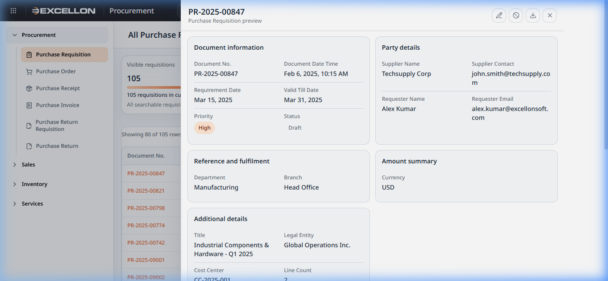
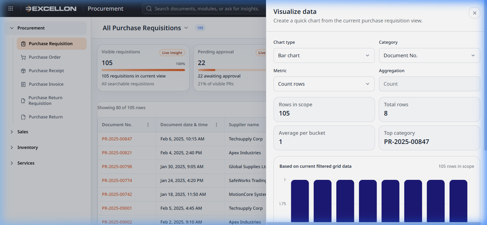
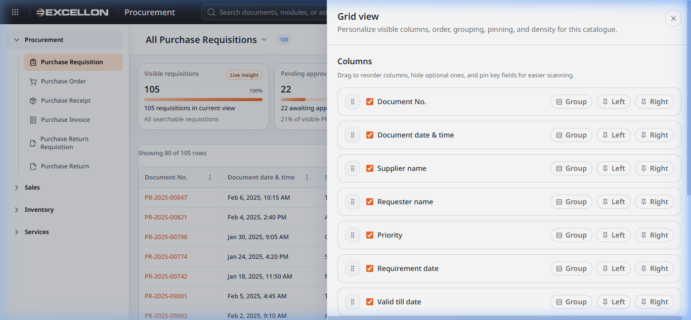

# Component 05 — Drawers (Side Panels)

> **Source Files:**  
> `src/components/common/SideDrawer.tsx` (90 lines)  
> `src/components/common/DocumentPreviewDrawer.tsx` (362 lines)  
> `src/components/common/PurchaseRequisitionPreviewDrawer.tsx` (38 lines)  
> `src/components/common/AmountBreakdownDrawer.tsx` (149 lines)  
> `src/components/common/DataGridChartDrawer.tsx` (443 lines)  
> `src/components/common/DataGridConfigurator.tsx` (238 lines)

---

## 5A — Side Drawer (Base Component)

### What It Is
The **Side Drawer** is the foundational slide-out panel used by many other components. It slides in from the right edge of the screen to display detailed content, forms, or configuration options without navigating away from the current page.

### Features
- **Title and subtitle** in the header area
- **Close button (✕)** to dismiss the drawer
- Optional **header action buttons** (e.g., Edit, New view)
- **Scrollable content area** in the middle
- Optional **footer** with action buttons (e.g., Apply, Reset, Close)
- **Width options:** narrow, standard, wide, chart-specific
- **Backdrop overlay** — clicking outside the drawer closes it
- **Focus management** — keyboard focus is trapped inside the drawer for accessibility

---

## 5B — Document Preview Drawer

### What It Is
The **Document Preview Drawer** displays a read-only summary of any document (Purchase Requisition, Purchase Order, etc.) in a structured, card-based layout.

### Screenshot

### Features
- **Header:** Document number, subtitle, and action icons (Edit ✏️, Cancel 🚫, Download ⬇️)
- **Auto-organized sections** — Fields are automatically grouped into:
  - Document Information (number, date, status, priority)
  - Party Details (supplier, requester, contacts)
  - Reference and Fulfilment (department, branch, delivery details)
  - Amount Summary (amounts, tax, discounts, currency)
  - Additional Details (any remaining fields)
- **Status badges** — Status and Priority fields display as coloured badges
- **Date formatting** — ISO dates are automatically formatted to human-readable form
- **Line items table** — If the document has line items (products), they display in a scrollable table
- **Action buttons** adapt based on document status (e.g., "Edit" is disabled for cancelled documents)

### User Behavior
| Action | What Happens |
|---|---|
| Click a **document row** in the grid | Opens the preview drawer for that document |
| Click the **Edit** icon (✏️) | Navigates to the edit form for this document |
| Click the **Cancel** icon (🚫) | Opens the Cancel Document dialog |
| Click the **Download** icon (⬇️) | Downloads the document data as a JSON file |
| Click **✕** or click outside | Closes the preview drawer |

---

## 5C — Amount Breakdown Drawer

### What It Is
A narrow side drawer that displays a detailed financial breakdown of a document — showing individual line amounts, taxes, discounts, and a grand total.

### Features
- **Amount breakdown section** — Lists each line item with label, value, and optional hint text
- **Document-wise breakdown** — Collapsible groups showing per-document details
- **Total footer** — A prominent total amount displayed at the bottom
- **Accent/muted tones** — Values can be highlighted or dimmed for emphasis
- **Optional notes** — Additional text below the breakdown

---

## 5D — Data Grid Chart Drawer

### What It Is
The **Chart Drawer** creates instant visual charts from the current data grid view. It turns tabular data into bar charts, line charts, area charts, donut charts, or stacked bar charts.

### Screenshot

### Features
- **Chart type selector:** Bar, Line, Area, Donut, Stacked Bar
- **Category selector:** Choose which column to group data by
- **Metric selector:** Choose the numeric value to chart (or "Count rows")
- **Aggregation selector:** Count, Sum, Average, Minimum, Maximum
- **Series selector** (stacked bar only): Split bars by a secondary column
- **Summary stats:** Rows in scope, Total value, Average per bucket, Top category
- **Interactive chart** — Hover over chart elements for tooltips
- **Based on current view** — Uses only the currently filtered/visible data

### User Behavior
| Action | What Happens |
|---|---|
| Click the **chart icon** (📊) in the toolbar | Opens the chart drawer |
| Change **Chart type** | Switches between different chart visualizations |
| Change **Category** | Re-groups the data by a different column |
| Change **Metric/Aggregation** | Changes what value is being measured and how |
| Click **Apply** | Saves the chart configuration |

---

## 5E — Data Grid Configurator

### What It Is
The **Grid Configurator** is a wide side drawer for personalizing the data grid's columns, ordering, grouping, pinning, and density.

### Screenshot

### Features
- **Column list** with drag handles for reordering
- **Visibility checkboxes** — Show/hide each column (locked columns cannot be hidden)
- **Group by** button — Group data rows by a specific column's values
- **Pin Left / Pin Right** — Freeze a column to the left or right edge
- **Unpin** — Remove a pinned column from its fixed position
- **Locked indicator** — Shows which columns are mandatory and cannot be hidden
- **Density controls:** Compact vs. Comfortable modes with descriptions
- **Reset view** — Restores all customizations to the system default
- **Apply** — Saves and applies the configured grid layout

### User Behavior
| Action | What Happens |
|---|---|
| **Drag** a column row | Reorders the column position in the grid |
| **Uncheck** a column | Hides that column from the data grid |
| Click **"Group"** | Groups all rows by that column's value |
| Click **"Left"** or **"Right"** | Pins the column to that side of the grid |
| Select **Compact / Comfortable** | Changes the row height density |
| Click **"Reset view"** | Restores default column layout |
