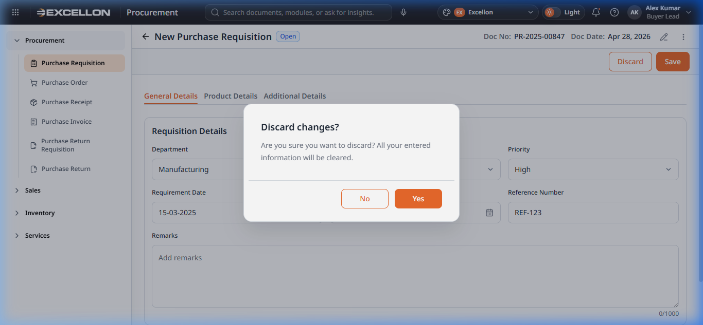
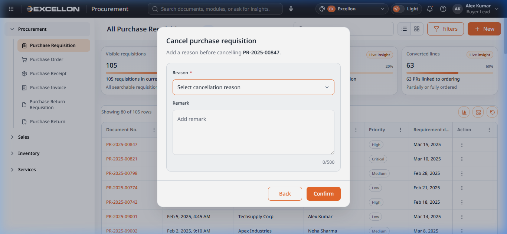
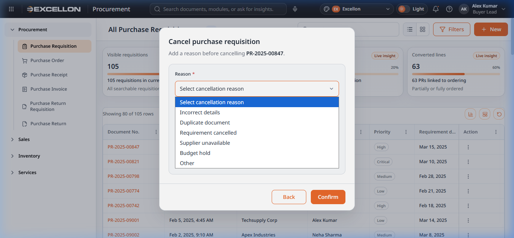
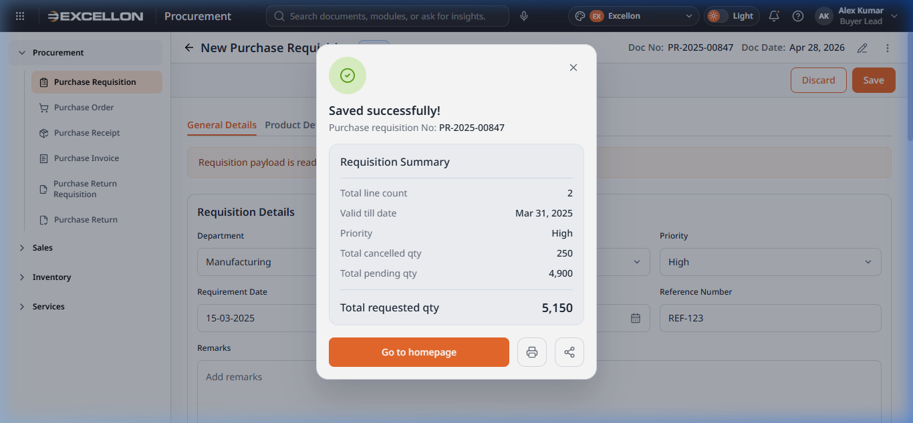

# Component 06 — Dialogs & User Feedback

> **Source Files:**  
> `src/components/common/ConfirmationDialog.tsx` (63 lines)  
> `src/components/common/CancelDocumentDialog.tsx` (163 lines)  
> `src/components/common/CompactFormDialog.tsx` (100 lines)  
> `src/components/common/SuccessSummaryDialog.tsx` (158 lines)  
> `src/components/common/GuidedTour.tsx` (153 lines)  
> `src/components/common/TourInvitePopup.tsx` (37 lines)  
> `src/components/app/AppDialog.tsx` (129 lines)

---

## 6A — Confirmation Dialog

### What It Is
A simple pop-up box that asks the user to confirm or cancel an important action (e.g., deleting a document, discarding changes).

### Screenshot

### Features
- **Title** — Describes the action (e.g., "Discard changes?")
- **Description** — Additional context about the consequences
- **Two buttons:** A "Cancel" (outline) button and a "Confirm" (primary) button
- **Backdrop** — Clicking outside closes the dialog
- **Keyboard accessible** — Escape key closes; focus is trapped inside the dialog

### When It Appears
- Before deleting a record
- Before discarding unsaved changes
- Before any destructive or irreversible operation

---

## 6B — Cancel Document Dialog

### What It Is
A specialized dialog shown when a user chooses to cancel a document (e.g., cancel a Purchase Requisition). It requires the user to provide a **reason** before confirming.

### Screenshots

### Features
- **Title:** "Cancel [Document Type]"
- **Document number display** — Shows which document is being cancelled
- **Reason dropdown** (required) — Pre-defined reasons:
  - Incorrect details
  - Duplicate document
  - Requirement cancelled
  - Supplier unavailable
  - Budget hold
  - Other
- **Remarks text area** (optional) — Up to 500 characters with a character counter
- **Validation** — Cannot confirm without selecting a reason
- **Two buttons:** "Back" (returns without cancelling) and "Confirm"
- **Focus trap** — Keyboard focus stays within the dialog

### User Behavior
| Action | What Happens |
|---|---|
| Select a **reason** | Enables the Confirm button |
| Type optional **remarks** | Character counter updates (e.g., "150/500") |
| Click **"Confirm"** without reason | Error message: "Please select a cancellation reason" |
| Click **"Back"** | Closes the dialog without cancelling the document |

---

## 6C — Compact Form Dialog

### What It Is
A small, focused dialog with a **single input field** for quick data entry — typically used for renaming tabs/sections or entering a short value.

### Features
- **Title and description** — Explains what the user is entering
- **Single text input** with a label and placeholder
- **Auto-focus** — The input field is automatically focused when the dialog opens
- **"Save" and "Discard" buttons** — Save is disabled when the field is empty
- **Form submission** — Pressing Enter in the input field triggers Save

### When It Appears
- Renaming a tab in the Form Layout Editor
- Renaming a section in the Form Layout Editor
- Creating a new tab or section

---

## 6D — Success Summary Dialog

### What It Is
A celebratory pop-up displayed after a successful document operation (e.g., after submitting a Purchase Requisition). It confirms the action and shows a financial summary.

### Screenshot

### Features
- **Green checkmark icon** — Visual success indicator
- **Title** — (e.g., "Purchase Requisition submitted successfully")
- **Document reference** — Shows the generated document number
- **Financial summary section:**
  - Individual line items (label + value)
  - Emphasis on key amounts
  - Total line at the bottom with bold formatting
- **Primary action button** — (e.g., "View in catalogue", "Create another")
- **Icon actions:** Print 🖨️ and Share 🔗 buttons for the summary
- **Focus trap** — Keyboard focus stays within the dialog

---

## 6E — Guided Tour

### What It Is
An **interactive step-by-step walkthrough** that highlights specific UI elements and explains their functionality to new users.

### Features
- **Step indicator** — "Step 1 of 5" with progress dots
- **Spotlight effect** — A dark overlay covers the entire page except the target element, which is brightly highlighted
- **Popover card** — Positioned near the target element with:
  - Step title
  - Descriptive body text
  - Progress dots
  - Back / Next / Skip buttons
- **Auto-scroll** — The page scrolls to bring the target element into view
- **Window-aware positioning** — The popover adjusts its position to stay visible
- **Keyboard navigable** — Users can navigate steps with keyboard

### User Behavior
| Action | What Happens |
|---|---|
| Click **"Next"** | Advances to the next tour step |
| Click **"Back"** | Returns to the previous step |
| Click **"Skip"** | Ends the tour immediately |
| Click **"Finish"** (last step) | Completes and closes the tour |
| Click the **backdrop** | Ends the tour |

---

## 6F — Tour Invite Popup

### What It Is
A small notification card that appears in the bottom-left corner inviting new users to take a guided tour of the current module.

### Features
- **Sparkle icon** (✨) — Draws attention
- **Title** — (e.g., "Purchase Requisition")
- **Description** — Brief explanation of the module
- **Two buttons:** "Take a Tour" (primary) and "Skip" (ghost)
- Appears automatically for first-time visitors to a module

---

## 6G — App Dialog (Foundation)

### What It Is
The base dialog wrapper built on Material UI's Dialog component. It provides consistent styling for all dialogs in the application.

### Features
- **Configurable width** (default: 420px)
- **Optional close button** (✕) in the top-right
- **Title and description** areas with proper typography
- **Content area** — Scrollable body for any content
- **Actions area** — Footer with buttons
- **Rounded corners** (16px border radius) and subtle shadow
- **Backdrop overlay** — Semi-transparent dark background

---

## Related File(s)

| File | Role |
|---|---|
| `src/components/common/ConfirmationDialog.tsx` | Simple confirm/cancel dialog |
| `src/components/common/CancelDocumentDialog.tsx` | Document cancellation with reason and remarks |
| `src/components/common/CompactFormDialog.tsx` | Single-input quick form dialog |
| `src/components/common/SuccessSummaryDialog.tsx` | Post-action success summary with financials |
| `src/components/common/GuidedTour.tsx` | Step-by-step interactive walkthrough |
| `src/components/common/TourInvitePopup.tsx` | Tour invitation notification card |
| `src/components/app/AppDialog.tsx` | Foundation MUI Dialog wrapper |
