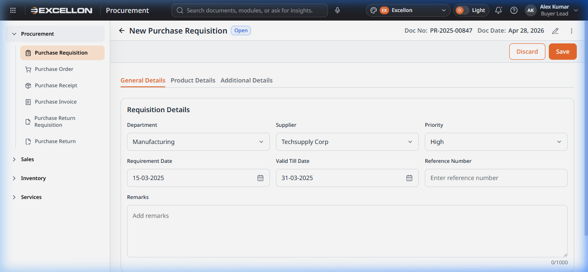
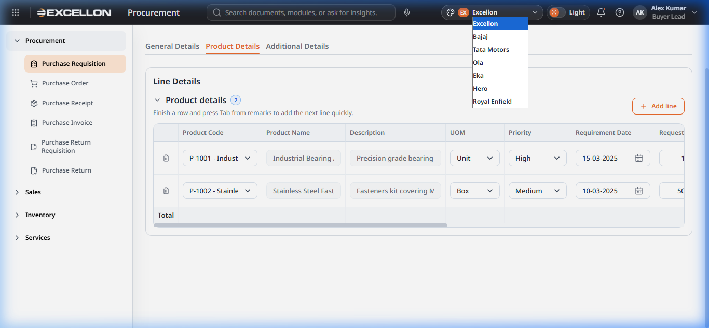

# Component 07 — Form Controls, Status Badge & Theme

> **Source Files:**  
> `src/components/common/FormControls.tsx` (119 lines)  
> `src/components/common/DatePicker.tsx` (333 lines)  
> `src/components/common/StatusBadge.tsx` (65 lines)  
> `src/components/common/ThemeSwitcher.tsx` (55 lines)  
> `src/components/app/AppButton.tsx` (119 lines)  
> `src/components/app/AppDrawer.tsx` (50 lines)  
> `src/components/app/AppFormPrimitives.tsx` (71 lines)

---

## 7A — Form Controls (Input, Select, Textarea)

### What They Are
The **Form Controls** are the standard input elements used across all forms in the application. They ensure a consistent look and behavior everywhere a user enters data.

### Screenshot

### Components

#### Input (Text Field)
- Standard single-line text input
- Supports all HTML input types (text, number, email, etc.)
- **Error state** — Red border and error message when validation fails
- **Read-only mode** — Displays value without allowing edits
- **Disabled mode** — Greyed out and non-interactive
- When `type="date"` is used, it automatically renders as the **DatePicker** component

#### Select (Dropdown)
- Standard dropdown selection list
- Accepts a list of options with value/label pairs
- **Custom styled arrow** — Consistent chevron icon across all browsers
- **Error state** — Red border for validation failures
- **Placeholder option** — First option serves as a placeholder (e.g., "Select supplier")

#### Textarea (Multi-line Text)
- Multi-line text input for longer content (e.g., remarks, descriptions)
- **Resizable** — Users can drag the corner to expand vertically
- **Error state** — Same red border pattern as other controls
- Minimum height of 96px for comfortable input

#### FormField (Label Wrapper)
- Wraps any form control with a **label** and optional **required indicator** (*)
- Optional **help text** appears below the field
- Ensures consistent spacing between label and input

---

## 7B — Date Picker

### What It Is
A custom **date picker** component that displays dates in `dd-mm-yyyy` format and opens a calendar popover for date selection.

### Features
- **Display format:** `dd-mm-yyyy` (Indian date format standard)
- **Calendar popover** — Click the calendar icon (📅) to open a visual month calendar
- **Month/year navigation** — Arrow buttons to move between months
- **Min/Max date constraints** — Prevents selection of dates outside allowed range
- **Keyboard input** — Users can type dates directly
- **Clear button** — Reset the selected date
- **Click-outside to close** — Clicking anywhere outside the calendar closes it

---

## 7C — Status Badge

### What It Is
The **Status Badge** is a small coloured label that visually represents the status of a document or the priority level of a task.

### Supported Values

#### Document Status Badges
| Status | Colour |
|---|---|
| Draft | Grey |
| Pending Approval | Amber/Orange |
| Approved | Green |
| Rejected | Red |
| Cancelled | Dark Grey |

#### Line Status Badges
| Status | Colour |
|---|---|
| Open | Blue |
| Partially Ordered | Amber |
| Fully Ordered | Green |
| Partially Cancelled | Orange |
| Cancelled | Dark Grey |

#### Priority Badges
| Priority | Colour |
|---|---|
| Low | Blue |
| Medium | Amber |
| High | Orange |
| Critical | Red |

### Where It Appears
- In the **Data Grid** columns (Status, Priority)
- In the **Document Preview Drawer** (Status, Priority fields)
- In the **Create/Edit forms** (document status header)

---

## 7D — Theme Switcher

### What It Is
The **Theme Switcher** is a control group in the top header bar that allows changing the brand theme and toggling between light and dark modes.

### Screenshot

### Features

#### Brand Theme Dropdown
- Displays the current brand icon and short label (e.g., "EX Excellon")
- Dropdown options include: **Excellon, Bajaj, Tata Motors, Ola, Eka, Hero, Royal Enfield**
- Changing the brand updates the colour palette across the entire application

#### Appearance Toggle (Light/Dark)
- Toggle switch with Sun ☀️ (light) and Moon 🌙 (dark) icons
- Label shows current mode ("Light" or "Dark")
- Switching mode changes the background, text, and border colours application-wide

---

## 7E — App Button

### What It Is
The **App Button** is a themed, consistent button component used throughout the application. Built on Material UI's Button, it supports multiple visual styles.

### Button Tones (Styles)

| Tone | Appearance | Usage |
|---|---|---|
| **Primary** | Filled with brand colour, white text | Main actions (Save, Submit, Publish) |
| **Secondary** | Bordered, paper background | Alternative actions |
| **Outline** | Brand-colour border, transparent | Secondary actions (Discard, Reset, Back) |
| **Ghost** | No border, transparent | Tertiary actions (Skip, Cancel) |

### Button Sizes
- **md** (Medium) — Standard size for most actions
- **sm** (Small) — Compact size for toolbars and inline actions

---

## 7F — App Drawer (Foundation)

### What It Is
The base slide-out drawer component built on Material UI's Drawer. It provides the foundation for all side panels in the application.

### Features
- Slides in from the **right edge** of the screen
- Configurable **width** (default: 960px, max: full viewport width)
- **Backdrop overlay** — Semi-transparent background that closes the drawer on click
- **Persistent mount** — Keeps content mounted for performance
- Subtle **border and shadow** for depth

---

## 7G — App Form Primitives

### What It Is
The **styled foundation** for all form controls. These MUI-styled components define the consistent visual appearance (border, padding, focus states, error states) used by Input, Select, and Textarea.

### Shared Styling
- **Border:** 1px solid border using theme divider colour
- **Border radius:** Matches the theme's border radius setting
- **Focus:** Brand colour border on focus (red border on error + focus)
- **Hover:** Slightly darker border on hover
- **Disabled:** Muted background and "not-allowed" cursor
- **Placeholder:** Theme secondary text colour
- **Transitions:** Smooth 200ms transitions on border and background changes
