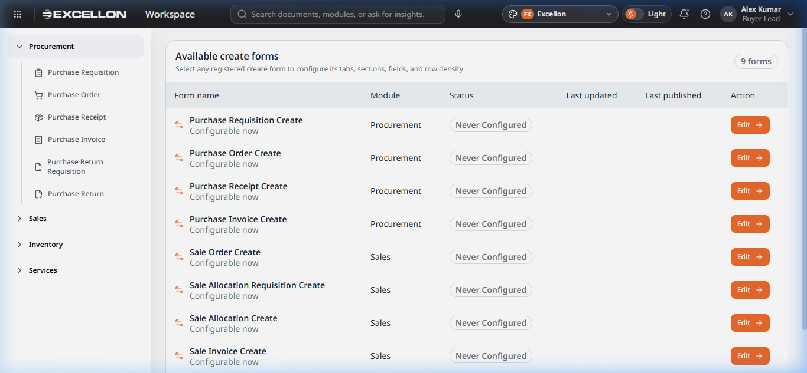
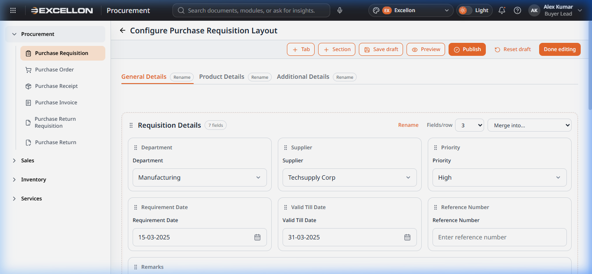
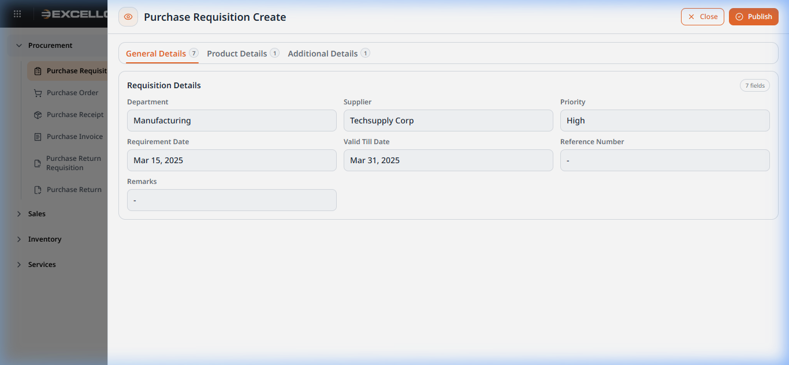
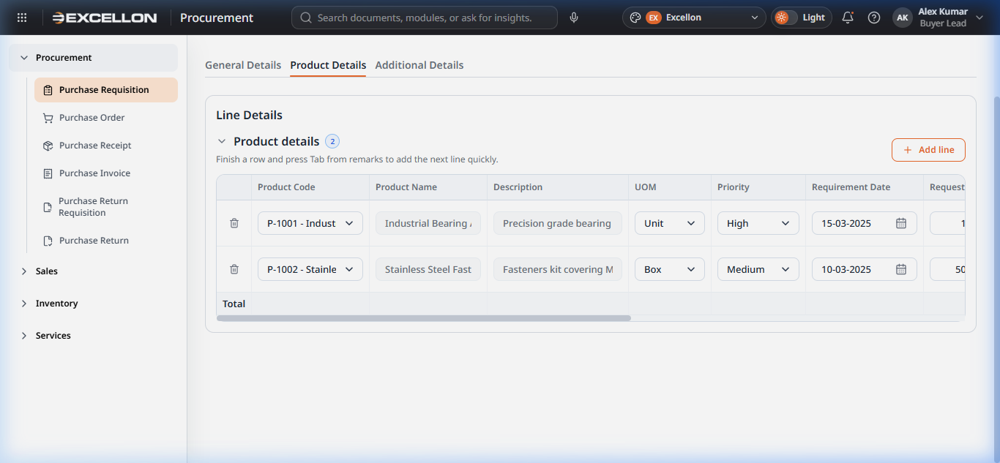

# Section B — Form Layout System

> **Source Files:**  
> `src/pages/form-layout/FormLayoutSettings.tsx` (122 lines)  
> `src/pages/form-layout/FormLayoutEditor.tsx` (534 lines)  
> `src/components/common/FormLayoutPreviewOverlay.tsx` (231 lines)  
> `src/components/common/GridColumnConfigurator.tsx` (125 lines)  
> `src/components/common/CompactFormDialog.tsx` (100 lines)

---

## Overview

The **Form Layout** system allows administrators to customize how "Create" forms (e.g., Create Purchase Requisition) are visually structured. This includes:

- Which **tabs** appear on the form
- How **sections** are arranged within each tab
- Which **fields** belong to each section
- How many **fields per row** each section displays
- Which **grid columns** are visible in line-item tables
- The ability to **preview** and **publish** layouts

This is an administrative feature — end users see the published layout when creating documents, while administrators can configure and customize it.

---

## B1 — Form Layout Settings (List Page)

### What It Is
The entry point for the Form Layout feature. It shows a table of all registered create forms with their configuration status.

### Screenshot


### How to Access
Navigate via the user profile menu → "Form Layout" or via URL `#/profile/form-layout`

### Table Columns

| Column | Description |
|---|---|
| **Form name** | The name of the create form (e.g., "Purchase Requisition Create") with configurability status |
| **Module** | Which business module it belongs to (Procurement, Sales, etc.) |
| **Status** | Current configuration state: "Never Configured", "Draft", or "Published" |
| **Last updated** | Timestamp of the most recent draft save |
| **Last published** | Timestamp of the most recent publish |
| **Action** | "Edit →" button to enter the Form Layout Editor |

### Available Forms (9 Total)

| Form | Module |
|---|---|
| Purchase Requisition Create | Procurement |
| Purchase Order Create | Procurement |
| Purchase Receipt Create | Procurement |
| Purchase Invoice Create | Procurement |
| Sale Order Create | Sales |
| Sale Allocation Requisition Create | Sales |
| Sale Allocation Create | Sales |
| Sale Invoice Create | Sales |
| *(and additional forms)* | *(various)* |

---

## B2 — Form Layout Editor

### What It Is
The **Form Layout Editor** is a drag-and-drop interface for configuring the structure of a create form. It allows reorganizing tabs, sections, and individual fields.

### Screenshot


### Header Toolbar Actions

| Button | Description |
|---|---|
| **+ Tab** | Creates a new tab in the form |
| **+ Section** | Adds a new section to the active tab |
| **Save draft** | Saves the current layout configuration as a draft |
| **Preview** | Opens the Form Layout Preview Overlay |
| **Publish** | Publishes the layout — makes it live for all users |
| **Reset draft** | Reverts all changes back to the default layout |
| **Done editing** | Exits the editor |

### Tab Management
- **Tabs appear as horizontal buttons** at the top (e.g., "General Details", "Product Details", "Additional Details")
- Each tab has a **"Rename"** button to change its display name
- Tabs can be **dragged** to reorder their sequence
- New tabs can be created via the **"+ Tab"** button
- Dropping a section onto a tab moves it into that tab

### Section Management
Each section within a tab contains:
- **Drag handle** (⠿) — Drag to reorder sections within the tab or move to a different tab
- **Section title** with a field count badge (e.g., "Requisition Details · 7 fields")
- **"Rename"** button — Opens a dialog to change the section name
- **"Fields/row"** dropdown — Choose 1, 2, 3, or 4 fields per row for the layout grid
- **"Merge into..."** dropdown — Merge this section's fields into another section

### Field Management
Within each section:
- **Fields are displayed as draggable cards** showing the field label
- **Drag handle** (⠿) — Reorder fields within the section or drag to another section
- **Drop zones** appear between fields and at the end of the section for precise placement

### Drag-and-Drop Rules
| Drag Source | Valid Drop Targets |
|---|---|
| **Tab** | Between other tabs (reorder) |
| **Section** | Between sections in same tab, onto a different tab |
| **Field** | Between fields in same section, onto a different section |

---

## B3 — Form Layout Preview Overlay

### What It Is
A full-screen overlay that shows how the form will appear to end users once the layout is published. It displays sample data to illustrate the visual structure.

### Screenshot


### Features
- **Header:** Form name, Close button, and Publish button
- **Tab navigation** — Shows all configured tabs with field count badges
- **Section rendering** — Each section displays its fields in the configured column layout (1–4 fields per row)
- **Sample field values** — "Configured field" placeholder text or actual sample data
- **Grid preview** — If a section contains a grid (line-item table), it shows:
  - Grid label and visible column count
  - Column headers matching the published configuration
  - Two sample data rows with realistic-looking values
  - "Read only" badge
- **Publish from preview** — The Publish button allows publishing directly from the preview

---

## B4 — Grid Column Configurator

### What It Is
Within the Form Layout Editor, the **Grid Column Configurator** is a section that allows managing the columns of line-item tables (grids) within the form.

### Features
- Appears below the tab/section editor when the form has grids
- **Header:** "Grid columns" with description
- **Per-grid management:** Each grid (e.g., "Product details") is listed separately
- **Column list** with:
  - **Drag handle** (⠿) — Reorder columns within the grid
  - **Visibility checkbox** — Show/hide columns (locked columns cannot be hidden)
  - **"Locked" badge** — Indicates mandatory columns that must stay visible
- Shows count of visible columns per grid

---

## How Forms Are Visually Structured

### Anatomy of a Create Form




### Structural Hierarchy

```
Form
├── Header (Back button, Title, Status badge, Doc No, Date, Actions)
├── Tab Bar (General Details | Product Details | Additional Details)
└── Active Tab Content
    ├── Section 1 (e.g., "Requisition Details")
    │   ├── Field 1 (Department - Dropdown)
    │   ├── Field 2 (Supplier - Dropdown)
    │   ├── Field 3 (Priority - Dropdown)
    │   ├── Field 4 (Requirement Date - Date Picker)
    │   ├── Field 5 (Valid Till Date - Date Picker)
    │   ├── Field 6 (Reference Number - Text Input)
    │   └── Field 7 (Remarks - Textarea, full width)
    └── Section 2 (e.g., "Line Details")
        └── Product Grid (scrollable table with Add line button)
            ├── Product Code (Select)
            ├── Product Name (Read-only)
            ├── Description (Read-only)
            ├── UOM (Select)
            ├── Priority (Select)
            ├── Requirement Date (Date Picker)
            ├── Requested Qty (Number Input)
            └── ... more columns
```

### Visual Structure Features
1. **Tab-based navigation** — Forms are divided into logical tabs to avoid information overload
2. **Section grouping** — Related fields are grouped under titled sections with card-style borders
3. **Responsive grid** — Sections display 1–4 fields per row depending on configuration
4. **Full-width fields** — Some fields (like Remarks) span the entire width
5. **Line-item grids** — Product/item tables support inline editing with scrollable columns
6. **Action header** — Discard and Save buttons are always accessible at the top

---

## Related File(s)

| File | Role |
|---|---|
| `src/pages/form-layout/FormLayoutSettings.tsx` | Settings list page showing all configurable forms |
| `src/pages/form-layout/FormLayoutEditor.tsx` | Drag-and-drop layout editor |
| `src/components/common/FormLayoutPreviewOverlay.tsx` | Full-screen layout preview |
| `src/components/common/GridColumnConfigurator.tsx` | Grid column visibility and ordering |
| `src/components/common/CompactFormDialog.tsx` | Rename dialog for tabs/sections |
| `src/utils/formLayoutConfig.ts` | Layout configuration utilities and persistence |
| `src/utils/formLayoutRegistry.ts` | Registry of all forms available for layout configuration |
