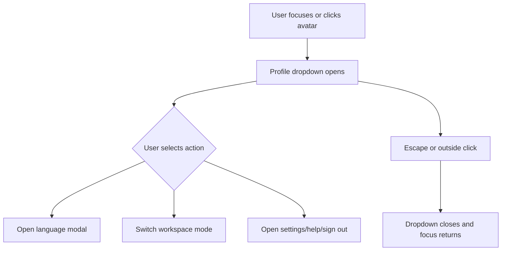
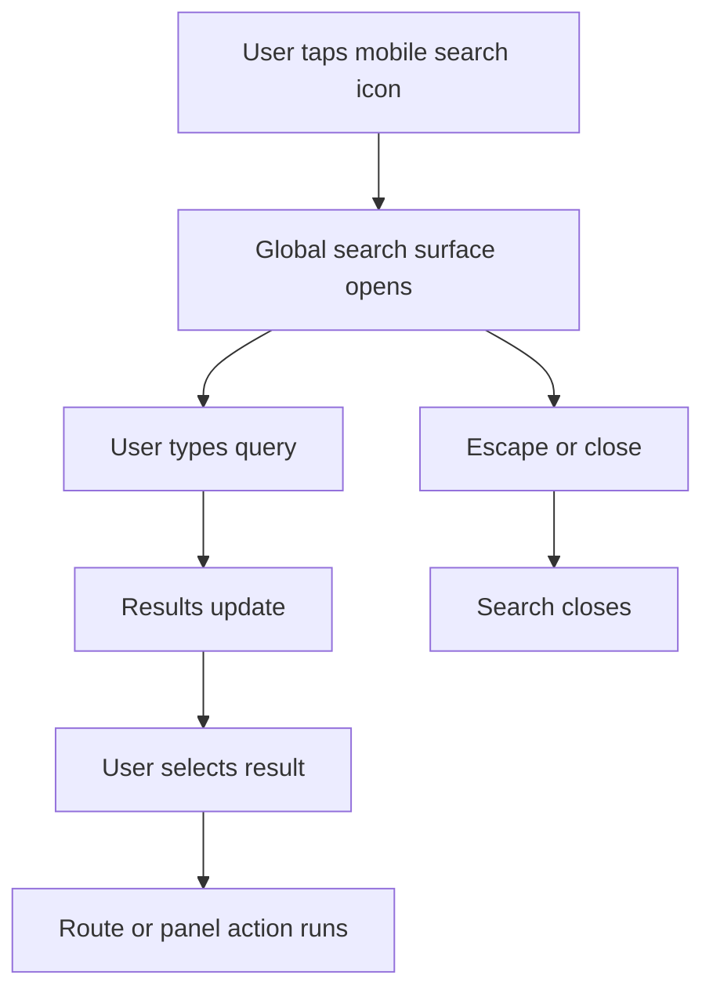

# Main Header Component Functional Requirement Document

**Version:** 1.0
**Document Type:** Component Functional Requirement Document
**Component:** `AppTopHeader`
**Scope:** Main application header component and header-owned secondary surfaces
**Audience:** Product, UX, Architecture, Engineering, QA
**Status:** Component implementation specification

---

## 1. Purpose And Business Objectives

The main header shall provide persistent global orientation and utility controls for authenticated users. The component shall preserve workspace context, expose global discovery, show alert entry, and provide account utilities without consuming page-specific space.

| Business Objective ID | Objective | Component Capability |
|---|---|---|
| BO-HDR-01 | Reduce workspace disorientation during transaction work | Brand logo, route-derived module context, menu trigger |
| BO-HDR-02 | Reduce time to locate documents, modules, and insights | Global search entry and search panel |
| BO-HDR-03 | Keep alert entry visible across authenticated pages | Notification icon and unread badge |
| BO-HDR-04 | Keep account and workspace utilities accessible without header clutter | Avatar/profile trigger and profile dropdown |
| BO-HDR-05 | Preserve header clarity on tablet and mobile | Breakpoint-specific element visibility |

This document defines component behavior only. It shall not define sidebar menu hierarchy, destination page content, transaction form behavior, or page-level catalogue controls.

---

## 2. Component Scope

| Surface | In Scope | Notes |
|---|---:|---|
| Main header bar | Yes | Persistent top app shell header |
| Global search trigger and panel | Yes | Header-owned discovery entry |
| Notification entry | Yes | Icon and badge behavior only |
| Profile trigger | Yes | Avatar, name, role, chevron visibility |
| Profile dropdown | Yes | Account utilities and workspace settings |
| Language modal opened from profile dropdown | Yes | Entry point and selection behavior |
| Mobile launcher opened from nine-dot/menu trigger | Yes | Header-owned quick-entry surface only |
| Sidebar navigation inventory | No | Governed by navigation FRD |
| Transaction page header | No | Governed by page-header component FRD |

---

## 3. Component Data Contract

| Field | Required | Type / Values | Fallback Rule | QA Pass / Fail Rule |
|---|---:|---|---|---|
| `activeLeaf` | Yes | Known route leaf key | Use `workspace` module label when unmapped | Pass when route changes update module context without reload. |
| `brand.logo` | Yes | Image asset or data URL | Use default product logo when tenant logo is unavailable | Pass when visible logo matches active theme. |
| `user.displayName` | Yes | 1-80 visible characters | Use neutral user icon when empty | Pass when empty name does not render blank avatar text. |
| `user.profileImageUrl` | No | Valid image URL or data URL | Use initials from display name when missing or image load fails | Pass when missing image shows initials. |
| `user.roleTitle` | No | 1-60 visible characters | Hide role text when unavailable | Pass when unavailable role creates no empty line. |
| `notifications.unreadCount` | No | Integer `0` or greater | Hide badge for `0`, `null`, or unavailable | Pass when no badge appears for zero count. |
| `search.query` | Yes | String | Empty string closes result intent but keeps entry available | Pass when query can be cleared. |
| `language.selectedCode` | Yes | Enabled language code | Use configured default language | Pass when selected language persists in UI state. |
| `workspaceMode` | Yes | `transactions` or `masters` | Use `transactions` when state is unavailable | Pass when selecting mode routes to the expected workspace. |

---

## 4. Element Inventory

| Element | Desktop `>=1025px` | Tablet `641px-1024px` | Mobile `<=640px` | Business Objective |
|---|---:|---:|---:|---|
| Menu / launcher trigger | Visible | Visible | Visible | BO-HDR-01 |
| Brand logo | Visible | Visible | Visible | BO-HDR-01 |
| Module label | Visible | Hidden at narrow tablet when needed; hidden on mobile | Hidden | BO-HDR-01, BO-HDR-05 |
| Global search | Inline input | Compact inline or icon depending available width | Icon only, placed before notification | BO-HDR-02 |
| Voice command | Visible when supported | Optional when space and support exist | Hidden | BO-HDR-02, BO-HDR-05 |
| Quick action `+` | Visible on desktop when enabled | Hidden when space constrained | Hidden | BO-HDR-05 |
| Help | Visible on desktop when enabled | Moved to profile/menu utilities | Moved to profile/menu utilities | BO-HDR-04 |
| Notification | Visible | Visible | Visible | BO-HDR-03 |
| Profile avatar | Visible | Visible | Visible | BO-HDR-04 |
| Profile name and role | Visible | Hidden | Hidden | BO-HDR-05 |
| Profile chevron | Visible | Optional | Hidden | BO-HDR-05 |

---

## 5. Responsive Layout Requirements

### Breakpoints

| Requirement ID | Requirement | Viewport | QA Pass / Fail Rule |
|---|---|---|---|
| HDR-RSP-001 | Header height shall be `48px`. | All | Pass when computed height is `48px`. |
| HDR-RSP-002 | Desktop layout shall apply at `>=1025px`. | Desktop | Pass when full command row is visible without wrap. |
| HDR-RSP-003 | Tablet layout shall apply from `641px` through `1024px`. | Tablet | Pass when no horizontal page scroll occurs. |
| HDR-RSP-004 | Mobile layout shall apply at `<=640px`. | Mobile | Pass when header shows only selected core controls. |

### Desktop Wireframe `>=1025px`

```text
+----------------------------------------------------------------------------------+
| [Menu] | [Brand Logo] | [Module] |        [Global Search Input]       | [+] [?] [Bell 3] [Avatar Name Role v] |
+----------------------------------------------------------------------------------+
```

### Tablet Wireframe `641px-1024px`

```text
+--------------------------------------------------------------------+
| [Menu] | [Brand Logo] | [Search compact/icon] | [Bell 3] | [Avatar] |
+--------------------------------------------------------------------+
```

### Mobile Wireframe `<=640px`

```text
+------------------------------------------------+
| [Menu] | [Brand Logo]          [Search] [Bell] [AK] |
+------------------------------------------------+
```

| Requirement ID | Requirement | Viewport | QA Pass / Fail Rule |
|---|---|---|---|
| HDR-RSP-005 | Mobile shall hide module label, user name, role, and chevron. | `<=640px` | Pass when only avatar remains for profile. |
| HDR-RSP-006 | Mobile search icon shall render immediately before notification. | `<=640px` | Pass when visual order is search, notification, avatar. |
| HDR-RSP-007 | Tablet and mobile shall remove non-primary labels before horizontal overflow occurs. | `<=1024px` | Pass when `document.body.scrollWidth <= viewport width`. |

---

## 6. Styling Requirements

| Token / Element | Desktop | Tablet | Mobile | QA Pass / Fail Rule |
|---|---|---|---|---|
| Header height | `48px` | `48px` | `48px` | Computed height matches. |
| Header background | `var(--color-topbar-bg)` or active theme equivalent | Same | Same | Color token resolves. |
| Brand logo max width | Brand-specific, Tata Motors `146px` max | Reduced as needed | Tata Motors max `112px` | Logo does not overlap controls. |
| Module label | `16px/24px`, medium | Hidden when needed | Hidden | Text not visible on mobile. |
| Icon button target | `32px x 32px` minimum | `32px x 32px` minimum | `30px-32px` visual with accessible button label | Focusable and clickable. |
| Avatar | `32px` with name/role | `28px-32px`, avatar only | `28px-32px`, avatar only | Avatar remains circular. |
| Notification badge | Red/alert fill, white text, circular | Same | Same | Badge is anchored to icon, not below it. |
| Focus ring | `0 0 0 4px var(--color-focus-ring)` | Same | Same | Keyboard focus is visible. |

---

## 7. Conditional Behavior

| Requirement ID | Requirement | Condition | QA Pass / Fail Rule |
|---|---|---|---|
| HDR-CND-001 | Avatar shall display profile image when a valid image exists. | `profileImageUrl` valid | Pass when image is shown. |
| HDR-CND-002 | Avatar shall display user initials when no profile image exists. | Missing or failed image | Pass when initials derive from display name. |
| HDR-CND-003 | Avatar shall display neutral user icon when display name is empty. | Empty name and no image | Pass when no broken initials appear. |
| HDR-CND-004 | Notification badge shall be hidden for `0`, `null`, or unavailable count. | No unread alerts | Pass when only bell icon appears. |
| HDR-CND-005 | Notification badge shall display positive counts. | Count `1` or greater | Pass when badge text is visible inside badge. |
| HDR-CND-006 | Profile dropdown shall close on Escape and outside click. | Dropdown open | Pass when focus returns to profile trigger. |
| HDR-CND-007 | Language entry shall open a centered modal with language chips/cards. | User selects Language in profile dropdown | Pass when selecting a language updates current language and closes modal. |
| HDR-CND-008 | Workspace switcher shall route to transactions or masters using existing route behavior. | User selects workspace mode | Pass when route changes to selected workspace. |

---

## 8. Accessibility Requirements

| Requirement ID | Requirement | QA Pass / Fail Rule |
|---|---|---|
| HDR-A11Y-001 | All icon-only buttons shall have an accessible name. | Pass when screen reader announces purpose, not only `button`. |
| HDR-A11Y-002 | Search input shall have an `aria-label`. | Pass when label announces global search. |
| HDR-A11Y-003 | Notification badge shall not be the only indicator of notification entry. | Pass when bell button remains labelled. |
| HDR-A11Y-004 | Profile dropdown shall be keyboard reachable. | Pass when Tab can reach visible dropdown controls. |
| HDR-A11Y-005 | Escape shall close open header-owned overlays. | Pass when search/profile/language/launcher close on Escape. |
| HDR-A11Y-006 | Hidden mobile/tablet controls shall be removed from Tab order. | Pass when keyboard cannot focus visually hidden controls. |

---

## 9. User Flows

### Open Profile Dropdown



### Mobile Search



---

## 10. Acceptance Matrix

| Requirement ID | Business Objective | Viewport | Trigger | Expected Result | Pass / Fail |
|---|---|---|---|---|---|
| HDR-ACC-001 | BO-HDR-01 | Desktop | Load authenticated route | Header displays brand, module, search, notification, profile | Pass when all render in one row. |
| HDR-ACC-002 | BO-HDR-05 | Mobile | Load authenticated route | Header hides module label and profile text | Pass when no horizontal scroll exists. |
| HDR-ACC-003 | BO-HDR-03 | All | Unread count `0` | Bell renders without badge | Pass when no badge node is visible. |
| HDR-ACC-004 | BO-HDR-03 | All | Unread count `3` | Bell renders anchored badge with `3` | Pass when badge is visually attached to bell. |
| HDR-ACC-005 | BO-HDR-04 | All | Missing profile image | Avatar shows initials | Pass when initials are visible. |
| HDR-ACC-006 | BO-HDR-02 | Mobile | Tap search icon | Search surface opens | Pass when user can type a query. |

---

## 11. Assumptions

- Existing `docs/main-header-frd.md` remains the broader product FRD.
- This file is the component implementation FRD for `AppTopHeader`.
- Header-owned launcher requirements stop at the launcher surface and do not define sidebar menu content.
- Exact theme colors resolve through existing CSS custom properties.
