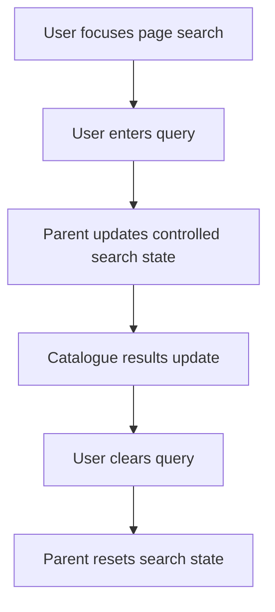
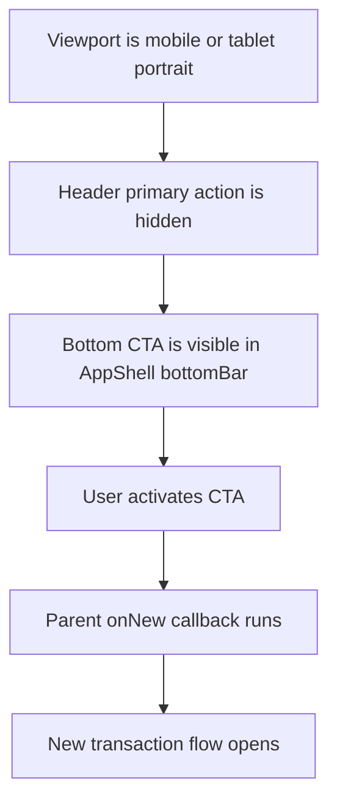

# Page Header Component Functional Requirement Document

**Version:** 1.0
**Document Type:** Component Functional Requirement Document
**Component:** `TransactionCatalogueHeader`
**Scope:** Reusable transaction catalogue page header only
**Audience:** Product, UX, Architecture, Engineering, QA
**Status:** Component implementation specification

---

## 1. Purpose And Business Objectives

The page header shall give users immediate context and primary catalogue actions for transaction list pages. It shall standardize title, view selection, count, search, view mode, filter, and primary create actions across transaction catalogues without each page designing a separate toolbar.

| Business Objective ID | Objective | Component Capability |
|---|---|---|
| BO-PHDR-01 | Reduce ambiguity about the current transaction list | Title/view selector and count |
| BO-PHDR-02 | Reduce time to narrow large transaction lists | Page-level search and filter action |
| BO-PHDR-03 | Support different catalogue working styles | View mode selector |
| BO-PHDR-04 | Keep create action reachable on touch devices | Bottom CTA for compact portrait layouts |
| BO-PHDR-05 | Reduce implementation drift across transaction pages | Controlled reusable component contract |

This document defines only the page header component. It shall not define table columns, card content, filters inside the drawer, routing internals, or transaction form behavior.

---

## 2. Component Scope

| Surface | In Scope | Notes |
|---|---:|---|
| Sticky page header bar | Yes | Transaction catalogue title/action surface |
| Catalogue view selector | Yes | Composed inside header when provided |
| Fallback title and count | Yes | Used when no view selector exists |
| Page search | Yes | Parent-controlled input state |
| View mode selector | Yes | Parent-controlled active mode |
| Filter button and active count | Yes | Opens parent-owned filter UI |
| Primary action | Yes | Usually creates a new transaction |
| Bottom CTA | Yes | Uses `AppShell bottomBar` when page opts in |
| Data grid/list/card content | No | Page-owned content below header |
| Filter drawer fields | No | Parent-owned filter implementation |

---

## 3. Component Data Contract

| Prop | Required | Type / Values | Ownership Rule | QA Pass / Fail Rule |
|---|---:|---|---|---|
| `viewSelector.items` | No | `CatalogueViewSelectorItem[]` | Parent owns catalogue views | Pass when selector renders only when supplied. |
| `viewSelector.activeViewId` | Required with selector | String | Parent owns active view | Pass when active title matches active ID. |
| `viewSelector.activeCount` | Required with selector | Number | Parent owns count | Pass when displayed count matches parent value. |
| `fallbackTitle` | No | String | Header displays when selector missing | Pass when fallback title renders. |
| `count` | No | Number | Header displays when fallback title is used | Pass when count pill renders only if numeric. |
| `search.value` | No | String | Parent owns search state | Pass when typing calls `onChange`. |
| `search.ariaLabel` | Required with search | String | Parent supplies page-specific label | Pass when input has accessible label. |
| `viewModes` | No | Array of ID, label, description, icon | Parent supplies available modes | Pass when empty array hides selector. |
| `activeViewMode` | Required with view modes | String | Parent owns active mode | Pass when selected button has `aria-pressed=true`. |
| `filter.activeCount` | No | Number | Parent owns filter count | Pass when badge appears for positive count. |
| `primaryAction` | No | Label, icon, callback, responsive flags | Parent owns callback and route | Pass when click triggers supplied callback only once. |
| `primaryAction.hideOnMobile` | No | Boolean | Hides mobile header primary button | Pass when mobile button is absent if true. |
| `primaryAction.moveToBottomBarOnCompact` | No | Boolean | Adds header hide class for compact portrait layouts | Pass when header button hides only where CSS requires it. |

---

## 4. Element Inventory

| Element | Desktop `>=1025px` | Tablet Landscape `641px-1024px` | Tablet Portrait `641px-1024px` | Mobile `<=640px` |
|---|---:|---:|---:|---:|
| Title/view selector | Visible | Visible | Visible | Visible, truncated |
| Count pill | Visible | Visible | Visible | Visible |
| Search | Inline input | Inline input | Inline compact input | Icon trigger with expandable row |
| View mode selector | Visible | Visible except hidden split mode if constrained | Reduced; split mode hidden when configured | Hidden from main row |
| Filter | Text button | Text or icon-only if constrained | Icon-only with active badge | Icon-only with active badge |
| Primary action `New` | Header button | Header button | Bottom CTA when opted in | Bottom CTA when opted in |
| Bottom CTA | Hidden | Hidden | Visible when opted in | Visible when opted in |

---

## 5. Responsive Layout Requirements

### Desktop Wireframe `>=1025px`

```text
+------------------------------------------------------------------------------------------------+
| [Title / View Selector v] [Count]                         [Search input] [Views] [Filters] [New] |
+------------------------------------------------------------------------------------------------+
```

### Tablet Landscape Wireframe `641px-1024px landscape`

```text
+--------------------------------------------------------------------------------+
| [Title / View Selector v] [Count]       [Search compact] [Views] [Filter] [New] |
+--------------------------------------------------------------------------------+
```

### Tablet Portrait Wireframe `641px-1024px portrait`

```text
+----------------------------------------------------------------+
| [Title / View Selector v] [Count]       [Search compact] [Filter] |
+----------------------------------------------------------------+
| AppShell bottomBar: [ + New Purchase Requisition ]              |
+----------------------------------------------------------------+
```

### Mobile Wireframe `<=640px`

```text
+----------------------------------------------+
| [Title truncated v] [Count]      [Search] [Filter] |
+----------------------------------------------+
| optional expanded search row                  |
+----------------------------------------------+
| AppShell bottomBar: [ + New Purchase Requisition ] |
+----------------------------------------------+
```

| Requirement ID | Requirement | Viewport | QA Pass / Fail Rule |
|---|---|---|---|
| PHDR-RSP-001 | Header shall remain a single visible command row except optional mobile expanded search row. | All | Pass when controls do not wrap into unplanned rows. |
| PHDR-RSP-002 | Desktop and tablet landscape shall keep primary action in the header. | `>=1025px`, tablet landscape | Pass when `New` is visible in header and bottom CTA is hidden. |
| PHDR-RSP-003 | Tablet portrait shall move primary action to bottom CTA when page opts in. | `641px-1024px portrait` | Pass when header `New` is hidden and bottom CTA is visible. |
| PHDR-RSP-004 | Mobile shall move primary action to bottom CTA when page opts in. | `<=640px` | Pass when header `+` is hidden and bottom CTA is visible. |
| PHDR-RSP-005 | The page shall have no horizontal scroll caused by the header. | All | Pass when body scroll width is not greater than viewport width. |

---

## 6. Styling Requirements

| Element | Desktop | Tablet Landscape | Tablet Portrait | Mobile |
|---|---|---|---|---|
| Header background | `var(--color-surface)` | Same | Same | Same |
| Header border | Bottom `1px solid var(--color-border)` | Same | Same | Same |
| Header min height | `56px-64px` | `60px` | `60px` | `60px` collapsed, taller only when search row opens |
| Header padding | `16px-32px` by width | `10px-14px` | `10px-12px` | `10px-12px` |
| Title font | `18px/24px`, `600` | `16px/24px`, `600` | `16px/24px`, `600` | `16px/20px`, `600` |
| Count pill | `10px-12px`, semibold, rounded | Same | Same | Same |
| Search width | `280px-380px` | `170px-360px` | `140px-320px` | Full width only in expanded row |
| Search height | `36px` | `36px` | `36px` | `40px` expanded |
| View mode button | `36px x 36px` | `34px x 34px` | `34px x 34px` when visible | Hidden from main row |
| Filter button | `36px` height, text + icon | `36px` | `36px`, icon-only allowed | `40px x 40px`, icon-only |
| Header primary button | `36px`, text + icon | `36px`, text + icon | Hidden when opted in | Hidden when opted in |
| Bottom CTA | Hidden | Hidden | `48px` min height | `44px` min height |
| Bottom CTA container | Hidden | Hidden | Surface background, top border, safe area | Surface background, top border, safe area |

---

## 7. Conditional Behavior

| Requirement ID | Requirement | Condition | QA Pass / Fail Rule |
|---|---|---|---|
| PHDR-CND-001 | View selector shall render when `viewSelector` exists. | Selector prop provided | Pass when title dropdown is visible. |
| PHDR-CND-002 | Fallback title shall render when `viewSelector` is absent. | Selector prop missing | Pass when fallback title is visible. |
| PHDR-CND-003 | Search clear button shall appear only when search has text. | `search.value.length > 0` | Pass when clear button removes query. |
| PHDR-CND-004 | Filter badge shall appear only when `activeCount > 0`. | Active filters exist | Pass when badge is hidden for `0`. |
| PHDR-CND-005 | Bottom CTA shall reuse the same callback as primary action. | Page opts in | Pass when CTA opens same new flow as header button. |
| PHDR-CND-006 | Bottom CTA shall never duplicate visible header primary action in the same viewport. | Compact portrait/mobile | Pass when only one primary create action is visible. |

---

## 8. Accessibility Requirements

| Requirement ID | Requirement | QA Pass / Fail Rule |
|---|---|---|
| PHDR-A11Y-001 | Search input shall expose page-specific `aria-label`. | Pass when screen reader announces target page search. |
| PHDR-A11Y-002 | View mode group shall use `role="group"`. | Pass when group label is announced. |
| PHDR-A11Y-003 | View mode buttons shall expose `aria-pressed`. | Pass when active mode is announced as pressed. |
| PHDR-A11Y-004 | Filter button label shall include active filter count when filters exist. | Pass when count is announced. |
| PHDR-A11Y-005 | Mobile icon-only controls shall have accessible names. | Pass when search and filter buttons are announced by purpose. |
| PHDR-A11Y-006 | Escape in mobile search shall clear query first, then close search if query is empty. | Pass when behavior follows this sequence. |
| PHDR-A11Y-007 | Bottom CTA shall be keyboard reachable and show focus ring. | Pass when Tab reaches CTA and focus is visible. |

---

## 9. User Flows

### Search A Catalogue



### Create Transaction From Compact CTA



---

## 10. Acceptance Matrix

| Requirement ID | Business Objective | Viewport | Trigger | Expected Result | Pass / Fail |
|---|---|---|---|---|---|
| PHDR-ACC-001 | BO-PHDR-01 | Desktop | Load catalogue | Title/view selector and count render | Pass when title and count match parent data. |
| PHDR-ACC-002 | BO-PHDR-02 | All | Type search | Parent `onChange` receives value | Pass when result filtering updates. |
| PHDR-ACC-003 | BO-PHDR-03 | Desktop/tablet landscape | Click view mode | Active view mode changes | Pass when `aria-pressed` updates. |
| PHDR-ACC-004 | BO-PHDR-02 | All | Click filter | Parent filter callback runs | Pass when filter drawer opens. |
| PHDR-ACC-005 | BO-PHDR-04 | Mobile | Load opted-in page | Bottom CTA visible, header primary hidden | Pass when no duplicate create action appears. |
| PHDR-ACC-006 | BO-PHDR-04 | Tablet portrait | Load opted-in page | Bottom CTA visible, header primary hidden | Pass when CTA stays visible during scroll. |
| PHDR-ACC-007 | BO-PHDR-05 | Other transaction page | Load page not migrated | Existing header remains unchanged | Pass when no new CTA appears. |

---

## 11. Assumptions

- Existing page content owns data, filters, routes, and callbacks.
- `TransactionCatalogueHeader` is controlled and shall not own business state.
- Purchase requisition is the first rollout example, not the only supported transaction page.
- Bottom CTA uses `AppShell bottomBar`; raw page-level fixed positioning is prohibited.
