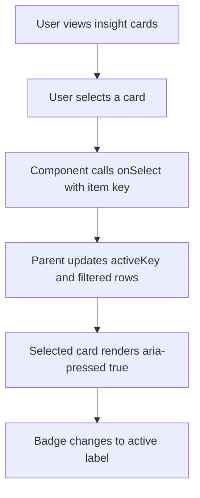
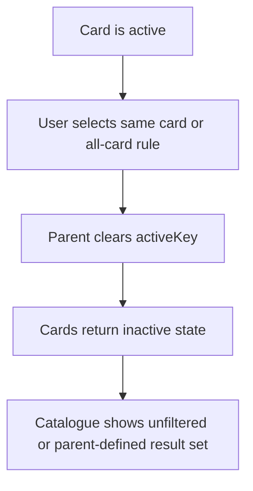

# Transaction Insight Cards Component Functional Requirement Document

**Version:** 1.0
**Document Type:** Component Functional Requirement Document
**Component:** `CatalogueInsightCards`
**Scope:** Reusable transaction catalogue insight card strip
**Audience:** Product, UX, Architecture, Engineering, QA
**Status:** Component implementation specification

---

## 1. Purpose And Business Objectives

The transaction insight cards shall summarize high-value transaction metrics at the top of catalogue pages and allow users to apply a parent-owned quick filter by selecting a card. The component shall be reusable across transaction pages while allowing each module to define its own metric meaning.

| Business Objective ID | Objective | Component Capability |
|---|---|---|
| BO-INS-01 | Reduce time needed to understand catalogue health | Compact metric cards with value, support text, hint, and progress |
| BO-INS-02 | Reduce repeated filtering actions | Clickable insight cards that call parent-owned filter logic |
| BO-INS-03 | Preserve consistency across transaction modules | Shared component contract and styling variants |
| BO-INS-04 | Avoid regressions during design upgrades | Classic default and opt-in enterprise variant |
| BO-INS-05 | Preserve readability across devices | Responsive grid and breakpoint-specific typography |

This document defines the insight card component only. It shall not define how each transaction module calculates metrics or how table rows are filtered internally.

---

## 2. Component Scope

| Surface | In Scope | Notes |
|---|---:|---|
| Insight card strip container | Yes | Grid layout and responsive behavior |
| Insight card button | Yes | Click, active, focus, hover states |
| Label | Yes | Short metric name |
| Badge/eyebrow | Yes | Default and active badge labels |
| Value | Yes | Primary metric value |
| Progress percentage text | Yes | Visible when `progress` exists |
| Progress bar | Yes | Visual percentage indicator |
| Support text | Yes | Strong explanation of value |
| Hint text | Yes | Secondary explanation |
| Metric calculations | No | Parent module responsibility |
| Parent filtering | No | Triggered through `onSelect`, owned by parent |

---

## 3. Component Data Contract

| Prop / Field | Required | Type / Values | Default / Fallback | QA Pass / Fail Rule |
|---|---:|---|---|---|
| `items` | Yes | `CatalogueInsightItem[]` | Empty array renders no cards | Pass when rendered cards match visible slice. |
| `items[].key` | Yes | Stable string | No fallback | Pass when each rendered button has unique key. |
| `items[].label` | Yes | 1-40 visible characters | No fallback | Pass when label is visible or safely truncated. |
| `items[].value` | Yes | String metric value | No fallback | Pass when value is visually dominant. |
| `items[].support` | Yes | Short explanatory string | No fallback | Pass when support text renders below progress. |
| `items[].hint` | No | Secondary explanatory string | Hide when absent | Pass when absent hint does not create blank space. |
| `items[].progress` | No | Number `0-100` preferred | Hide progress when absent | Pass when progress bar appears only when provided. |
| `items[].tone` | No | `primary`, `success`, `warning`, `neutral`, `accent` | `neutral` | Pass when missing tone uses neutral class. |
| `activeKey` | Yes | String or `null` | `null` means no active card | Pass when active card has `aria-pressed=true`. |
| `ariaLabel` | Yes | Accessible section label | No fallback | Pass when container has label. |
| `onSelect` | Yes | Function `(key) => void` | No fallback | Pass when click calls parent with selected key. |
| `variant` | No | `classic` or `enterprise` | `classic` | Pass when other pages remain classic by default. |
| `density` | No | `compact` or `comfortable` | `compact` | Pass when class is applied. |
| `maxVisibleItems` | No | Positive integer | `4` | Pass when component renders no more than max. |
| `badgeLabel` | No | String | `Live insight` | Pass when inactive card shows configured label. |
| `activeBadgeLabel` | No | String | `Applied` | Pass when active card shows configured label. |

---

## 4. Element Inventory

| Element | Purpose | Styling Priority | QA Pass / Fail Rule |
|---|---|---|---|
| Card container | Layout cards across viewport | Must prevent horizontal overflow | Pass when no horizontal page scroll occurs. |
| Card button | Select insight/filter | Must be keyboard focusable | Pass when Tab reaches each card. |
| Label | Names the metric | Secondary text | Pass when label does not collide with badge. |
| Badge | Shows live/applied state | Tertiary control-state cue | Pass when active card label changes to active badge. |
| Value | Main metric | Strongest visual element | Pass when value is largest/strongest text. |
| Progress text | Numeric percentage | Secondary metric | Pass when it appears only with progress. |
| Progress bar | Quick status visualization | Compact, non-interactive | Pass when width maps to clamped progress. |
| Support | Explains value | Strong supporting copy | Pass when support is readable at mobile width. |
| Hint | Additional context | Muted secondary copy | Pass when hint is less visually prominent than support. |

---

## 5. Responsive Layout Requirements

### Desktop / Large Desktop Wireframe

```text
+-------------------+ +-------------------+ +-------------------+ +-------------------+
| Label     Badge   | | Label     Badge   | | Label     Badge   | | Label     Badge   |
| 105          100% | | 22            21% | | 21            20% | | 63            60% |
| =======           | | ===               | | ===               | | =====             |
| Support           | | Support           | | Support           | | Support           |
| Hint              | | Hint              | | Hint              | | Hint              |
+-------------------+ +-------------------+ +-------------------+ +-------------------+
```

### Tablet Portrait / Mobile Wireframe

```text
+-------------------+ +-------------------+
| Label     Badge   | | Label     Badge   |
| 105          100% | | 22            21% |
| =======           | | ===               |
| Support           | | Support           |
| Hint              | | Hint              |
+-------------------+ +-------------------+
+-------------------+ +-------------------+
| Label     Badge   | | Label     Badge   |
| 21            20% | | 63            60% |
| ===               | | =====             |
| Support           | | Support           |
| Hint              | | Hint              |
+-------------------+ +-------------------+
```

| Requirement ID | Requirement | Viewport | QA Pass / Fail Rule |
|---|---|---|---|
| INS-RSP-001 | Enterprise desktop shall render four cards in one row. | `>=1025px` | Pass when four cards fit without wrapping. |
| INS-RSP-002 | Enterprise tablet landscape shall keep four cards when space allows. | `900px-1024px` | Pass when four cards fit without horizontal scroll. |
| INS-RSP-003 | Enterprise tablet portrait shall render a two-column grid. | `641px-899px` | Pass when cards render `2x2` for four items. |
| INS-RSP-004 | Enterprise mobile shall render a two-column compact grid. | `<=640px` | Pass when cards render in two columns without horizontal scroll. |
| INS-RSP-005 | Classic variant shall preserve existing auto-fit grid behavior. | All | Pass when pages without `variant="enterprise"` remain visually unchanged. |

---

## 6. Styling Requirements

| Element | Classic Default | Enterprise Desktop | Enterprise Tablet | Enterprise Mobile |
|---|---|---|---|---|
| Container grid | `repeat(auto-fit, minmax(200px, 1fr))` | `repeat(4, minmax(0, 1fr))` | 4 columns landscape; 2 columns portrait | 2 columns |
| Gap | `10px` | `10px-12px` | `8px-10px` | `8px` |
| Card border | `1px solid var(--color-border)` | Same | Same | Same |
| Card radius | `14px` or `var(--radius-lg, 14px)` | Same | Same | Same |
| Card padding | `12px` | `12px-14px` compact | `10px-14px` | `10px` |
| Card background | Surface gradient | Surface gradient | Same | Same |
| Label | `12px/16px`, `500`, muted | `12px/16px`, `500` | `11px/16px`, `500` | `11px/16px`, `500` |
| Badge | `10px/16px`, `600`, pill | `10px`, pill | `9px`, compact pill | `9px`, compact pill |
| Value | `18px/24px`, `600` | XL `20px/24px`, desktop `18px/24px` | `18px/22px` | `18px/22px` |
| Progress text | `10px/16px`, `600` | Same | `9px` | `9px` |
| Progress track | `6px` height | `6px` | `6px` | `5px` |
| Support | `12px/16px`, `500` | Same | Same | Same |
| Hint | `12px/16px`, regular, muted | Same | `11px/16px` | `11px/16px` |
| Focus ring | `0 0 0 4px var(--color-focus-ring)` | Same | Same | Same |
| Hover lift | Enabled | Pointer-capable devices only | Pointer-capable devices only | Disabled on coarse/touch pointers |

---

## 7. Conditional Behavior

| Requirement ID | Requirement | Condition | QA Pass / Fail Rule |
|---|---|---|---|
| INS-CND-001 | Component shall render up to `maxVisibleItems`. | Items exceed max | Pass when only the first max items render. |
| INS-CND-002 | Progress bar shall render only when `progress` is defined. | Missing progress | Pass when no empty progress row appears. |
| INS-CND-003 | Progress value shall be clamped between `8` and `100` for visible bar width. | Progress below 8 or above 100 | Pass when width stays visible and bounded. |
| INS-CND-004 | Active card shall show active badge label. | `activeKey === item.key` | Pass when badge changes to `Applied` by default. |
| INS-CND-005 | Inactive card shall show inactive badge label. | `activeKey !== item.key` | Pass when badge shows `Live insight` by default. |
| INS-CND-006 | Missing hint shall not reserve vertical space. | `hint` absent | Pass when card layout remains compact. |
| INS-CND-007 | Long label/support/hint shall truncate or wrap safely without horizontal scroll. | Long text | Pass when page width remains stable. |

---

## 8. Accessibility Requirements

| Requirement ID | Requirement | QA Pass / Fail Rule |
|---|---|---|
| INS-A11Y-001 | Container shall expose `aria-label`. | Pass when assistive technology announces the section purpose. |
| INS-A11Y-002 | Each card shall be a keyboard-focusable button. | Pass when Tab reaches every card. |
| INS-A11Y-003 | Each card shall expose `aria-pressed`. | Pass when active state is announced. |
| INS-A11Y-004 | Progress bar shall be decorative unless numeric progress semantics are explicitly added. | Pass when progress track has `aria-hidden="true"`. |
| INS-A11Y-005 | Focus ring shall be visible against the card background. | Pass when keyboard focus is visible at all viewports. |
| INS-A11Y-006 | Hover-only lift shall not be required to understand state. | Pass when active and focus states are visible without hover. |

---

## 9. User Flows

### Apply Insight Filter



### Clear Active Insight



---

## 10. Acceptance Matrix

| Requirement ID | Business Objective | Viewport | Trigger | Expected Result | Pass / Fail |
|---|---|---|---|---|---|
| INS-ACC-001 | BO-INS-03 | Other transaction page | Render classic usage | Classic layout remains unchanged | Pass when no enterprise class is applied. |
| INS-ACC-002 | BO-INS-05 | Desktop | Render enterprise usage | Four cards render in one row | Pass when no wrap occurs at desktop width. |
| INS-ACC-003 | BO-INS-05 | Mobile | Render enterprise usage | Two-column grid renders without horizontal scroll | Pass when body width remains stable. |
| INS-ACC-004 | BO-INS-01 | All | Render progress item | Value is strongest text and progress is visible | Pass when hierarchy is clear. |
| INS-ACC-005 | BO-INS-02 | All | Click card | Parent receives selected key | Pass when filter behavior changes through parent state. |
| INS-ACC-006 | BO-INS-04 | All | Set `maxVisibleItems={4}` with more items | Only four cards render | Pass when fifth item is absent. |
| INS-ACC-007 | BO-INS-05 | Tablet/mobile | Render long labels | Text does not force horizontal scroll | Pass when text truncates or wraps safely. |

---

## 11. Assumptions

- `CatalogueInsightCards` remains a presentational and interaction component; parent pages own metric calculations.
- `classic` remains the default variant for backward compatibility.
- `enterprise` is opt-in and currently demonstrated first on purchase requisition.
- Four cards are the recommended first-screen maximum for transaction catalogue insight strips.
