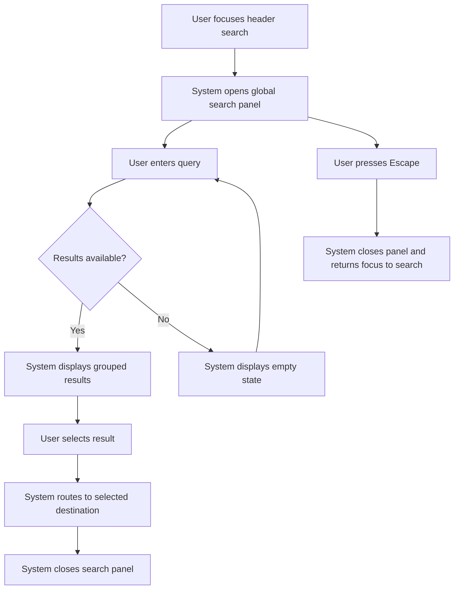
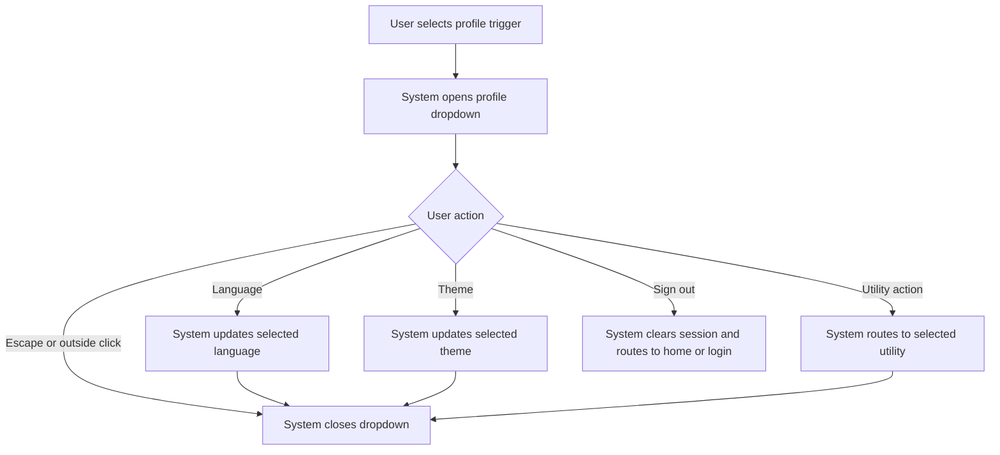
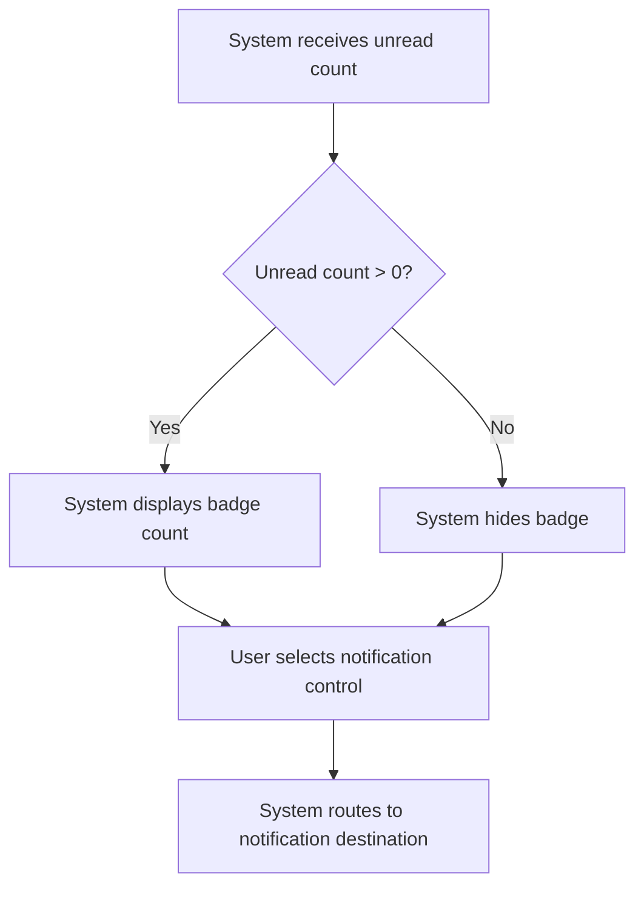
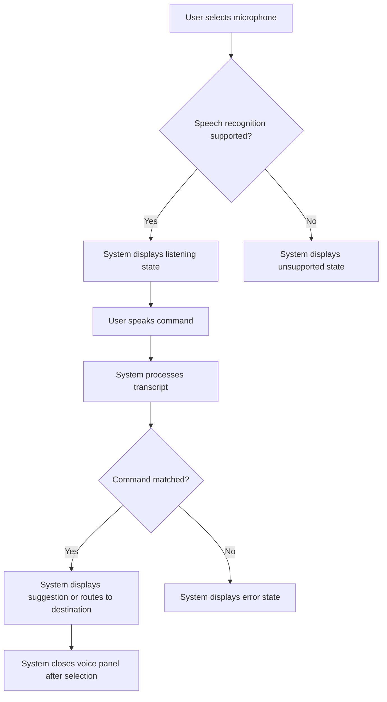
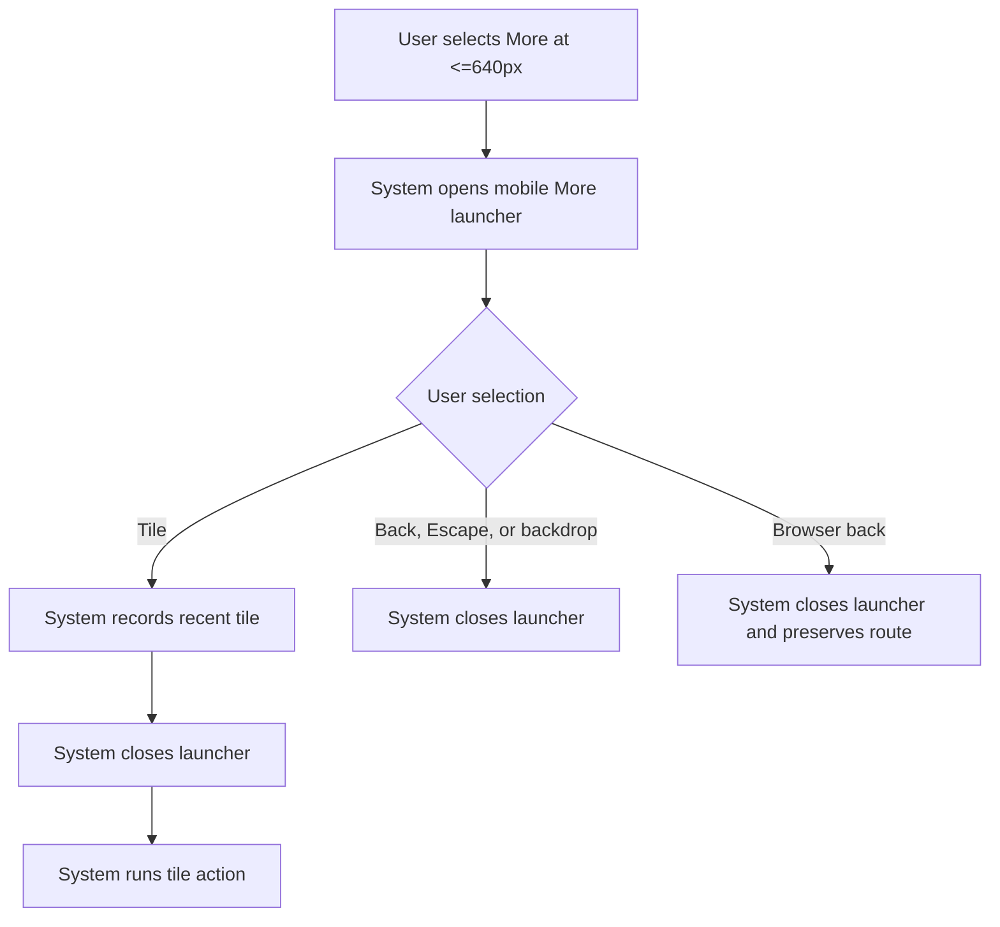

# Main Header Functional Requirement Document

**Version:** 1.1  
**Document Type:** Functional Requirement Document  
**Scope:** Main application header only  
**Audience:** Product, UX, Engineering, QA, and Implementation Review  
**Status:** Target behavior specification with red-team v1.1 clarifications  

---

## 1. Purpose And Business Objectives

The main header shall provide persistent global controls for all authenticated users across desktop, tablet, and mobile viewports. It shall help users identify the active workspace, search business records, receive alert entry points, access account actions, and open header-owned utility surfaces without depending on page-level controls.

| Business Objective ID | Objective | Header Capability |
|---|---|---|
| BO-01 | Reduce loss of workspace context during transaction work | Brand logo and active module label |
| BO-02 | Reduce time spent locating documents, modules, and insights | Global search, search scope selector, and search results panel |
| BO-03 | Keep account and utility controls present on every authenticated page | Profile trigger and profile dropdown |
| BO-04 | Expose unread work alerts without opening a separate page | Notification entry point and unread badge |
| BO-05 | Preserve core actions on narrow screens without crowding the header | Mobile More launcher |
| BO-06 | Support hands-free lookup and navigation where browser support exists | Voice command entry point and voice panel |

This FRD shall not define sidebar hierarchy, navigation menu item inventory, page-specific content, transaction form behavior, or module catalogue behavior.

---

## 2. Header-Owned Surfaces

| Surface | Included In Scope | Purpose | Excluded Detail |
|---|---:|---|---|
| Main header bar | Yes | Persistent top-level controls | Page content below the header |
| Global search panel | Yes | Header-triggered document, module, and insight discovery | Search ranking algorithm internals |
| Voice panel | Yes | Header-triggered speech command feedback | Speech model internals |
| Profile dropdown | Yes | Account, language, appearance, and utility actions | Full destination page requirements |
| Notification entry point | Yes | Alert visibility and route entry | Notification centre page design |
| Mobile More launcher | Yes | Mobile header-owned action grid | Sidebar menu hierarchy and full module inventory |
| Sidebar / navigation menu | No | Not part of the main header FRD | All menu item details |

The mobile header bar and the mobile More launcher are separate surfaces. Requirements that refer to the mobile header bar do not apply to the mobile More launcher unless the requirement explicitly names the launcher.

---

## 3. Header Data Contract

The header shall consume the following data. If a value is unavailable, the fallback requirement in the table shall apply.

| Data Field | Required | Source Type | Valid Values | Fallback Requirement | Related Requirement |
|---|---:|---|---|---|---|
| `user.displayName` | Yes | Authenticated user profile | 1-80 visible characters | Use neutral user icon when name is empty or whitespace | HDR-COND-001 |
| `user.profileImageUrl` | No | Authenticated user profile | HTTPS image URL or data URL | Use initials when missing or image load fails | HDR-COND-001 |
| `user.roleTitle` | No | Authenticated user profile | 1-60 visible characters | Hide role text when unavailable | HDR-COND-002 |
| `notifications.unreadCount` | No | Notification service | Integer `0` or greater | Hide badge when value is `0`, `null`, or unavailable | HDR-COND-003 |
| `notifications.destinationRoute` | Required when notification entry is visible | App route registry | Valid in-app route string | Hide notification entry when route is missing | HDR-NOTIF-001 |
| `activeModule.label` | Yes | App shell route context | 1-24 visible characters | Display `Workspace` when route is unmapped | HDR-BASE-003 |
| `brand.logo` | Yes | Theme or tenant config | Image asset or data URL | Display default product logo when tenant logo is unavailable | HDR-BASE-002 |
| `language.selectedCode` | Yes | Localization state | Enabled language code | Use configured default language | HDR-PROF-003 |
| `theme.selectedKey` | Yes | Theme state | Enabled theme key | Use configured default theme | HDR-PROF-004 |
| `header.utilityActions` | Yes | App shell configuration | Action list with `actionId`, label, icon, authorization state, and route or callback | Hide actions that are not authorized or lack an executable route/callback | HDR-PROF-005 |

---

## 4. Header Inventory Requirements

| Requirement ID | Requirement | Business Objective | QA Pass / Fail Test |
|---|---|---|---|
| HDR-BASE-001 | The system shall display one persistent main header on every authenticated route. | BO-01 | Pass when authenticated pages render exactly one header at the top edge; fail when no header or more than one header appears. |
| HDR-BASE-002 | The system shall display the active brand logo in the left header area. | BO-01 | Pass when the logo matches the active brand/theme; fail when the logo is missing or uses another tenant brand. |
| HDR-BASE-003 | The system shall display the active module label beside the brand logo on desktop and tablet widths from `768px` through `1024px`. | BO-01 | Pass when the label matches route context; fail when the label is stale after route change. |
| HDR-BASE-004 | The system shall provide one global search icon entry point in the header. | BO-02 | Pass when users can focus search from the header and open the search panel; fail when search cannot receive focus. |
| HDR-BASE-005 | The system shall provide one profile trigger in the header. | BO-03 | Pass when selecting the avatar/name trigger opens the profile dropdown; fail when it does not open. |
| HDR-BASE-006 | The system shall provide one notification entry point in the desktop, tablet, and mobile header bars when `notifications.destinationRoute` exists. | BO-04 | Pass when the notification control is visible on desktop, tablet, and mobile header bars for valid destination data; fail when it is visible without destination data. |
| HDR-BASE-007 | The system shall provide one mobile More launcher entry point at `<=640px`. | BO-05 | Pass when the nine-dot trigger opens the mobile More launcher at `<=640px`; fail when it opens the desktop sidebar behavior at mobile width. |
| HDR-BASE-008 | The system shall provide voice command entry on desktop and tablet widths from `768px` through `1024px` when the browser exposes speech recognition support. | BO-06 | Pass when supported browsers show and activate voice command; fail when unsupported browsers show an unusable active control. |

---

## 5. Responsive Layout Requirements

### 5.1 Breakpoints And Dimensions

| Requirement ID | Viewport | Exact Rule | Business Objective | QA Pass / Fail Test |
|---|---|---|---|---|
| HDR-RESP-001 | All | Header height shall be `48px`. | BO-01 | Pass when computed header height is `48px`; fail when height differs without approved FRD revision. |
| HDR-RESP-002 | Desktop | Desktop layout shall apply at viewport width `>=1025px`. | BO-01 | Pass when desktop controls match Section 5.2 at `1025px` and above. |
| HDR-RESP-003 | Tablet | Tablet layout shall apply from `641px` through `1024px`. | BO-05 | Pass when tablet controls match Section 5.3 within the full range. |
| HDR-RESP-004 | Mobile | Mobile layout shall apply at viewport width `<=640px`. | BO-05 | Pass when mobile controls match Section 5.4 at `640px` and below. |
| HDR-RESP-005 | All interactive controls | Header controls shall provide a pointer target of at least `32px x 32px`; mobile launcher tiles shall provide at least `72px x 72px`. | BO-03 | Pass when computed hit areas meet the stated minimums. |

### 5.2 Desktop Layout `>=1025px`

```text
+--------------------------------------------------------------------------------+
| [Menu] | [Brand Logo] | [Module] |      [Search input + scope]      | [Mic] [Bell] [Avatar Name Role v] |
+--------------------------------------------------------------------------------+
```

| Requirement ID | Requirement | Business Objective | QA Pass / Fail Test |
|---|---|---|---|
| HDR-DESK-001 | Desktop shall display menu/sidebar toggle, brand logo, module label, search, voice command, notification, and profile trigger in one `48px` header row. | BO-01 | Pass when all listed controls are visible at `1366px`; fail when any listed control is absent. |
| HDR-DESK-002 | Desktop search shall display as an inline input and expand the search panel when focused or edited. | BO-02 | Pass when focus opens the panel; fail when panel requires a page-level action. |
| HDR-DESK-003 | Desktop profile trigger shall display avatar, user display name, role when available, and chevron. | BO-03 | Pass when all available profile fields appear; fail when missing available name or role. |
| HDR-DESK-004 | Desktop notification badge shall display only when unread count is greater than `0`. | BO-04 | Pass when badge is hidden for `0` and visible for `1`; fail when badge appears for `0`. |

### 5.3 Tablet Layout `641px-1024px`

```text
+----------------------------------------------------------------------------+
| [Menu] | [Brand Logo] | [Module at 768-1024] | [Search compact] | [Mic at 768-1024] [Bell] [Avatar] |
+----------------------------------------------------------------------------+
```

| Requirement ID | Requirement | Business Objective | QA Pass / Fail Test |
|---|---|---|---|
| HDR-TAB-001 | Tablet shall retain menu/sidebar toggle, brand logo, search, notification, and profile trigger. | BO-05 | Pass when these controls are visible from `641px` to `1024px`. |
| HDR-TAB-002 | Tablet shall hide non-primary text labels before causing horizontal overflow. | BO-05 | Pass when the header has no horizontal scrollbar at `641px`; fail when horizontal scrolling appears. |
| HDR-TAB-003 | Tablet shall keep search available as an inline compact search control. | BO-02 | Pass when users can focus search without opening mobile More launcher. |
| HDR-TAB-004 | Tablet profile trigger shall display avatar only from `641px` through `1024px`. | BO-03 | Pass when avatar remains visible and opens the dropdown. |

### 5.4 Mobile Header Bar And Mobile More Launcher `<=640px`

```text
+------------------------------------------------+
| [More] | [Brand Logo] |          [Search Icon] [Bell] [Avatar] |
+------------------------------------------------+

Mobile More launcher
+----------------------------------------------+
| [Back] More                                  |
| QUICK                                        |
| [Tile] [Tile] [Tile]                         |
| RECENT                                       |
| [Recent tile / Empty state]                  |
| BROWSE                                       |
| [Tile] [Tile] [Tile]                         |
| UTILITIES                                    |
| [Tile] [Tile] [Tile]                         |
+----------------------------------------------+
```

| Requirement ID | Requirement | Business Objective | QA Pass / Fail Test |
|---|---|---|---|
| HDR-MOB-001 | Mobile header bar shall display only core controls: More launcher trigger, brand logo, search icon entry immediately before notification entry, and profile avatar entry; it shall not display an inline search bar. | BO-05 | Pass when only these core controls appear in the mobile header bar. |
| HDR-MOB-002 | Mobile More launcher shall open from the nine-dot trigger only at `<=640px`. | BO-05 | Pass when trigger opens the launcher at `640px`; fail when it opens at `641px` or above. |
| HDR-MOB-003 | Mobile More launcher shall use a three-column tile grid for action groups. | BO-05 | Pass when each launcher row displays three tiles where three or more tiles exist; fail when two-column layout appears for eligible groups. |
| HDR-MOB-004 | Mobile More launcher header shall contain Back control and title text `More` only; notification icon and user detail card shall not appear in the launcher header. | BO-05 | Pass when launcher header contains back control and title only. |
| HDR-MOB-005 | Mobile launcher tiles shall clamp labels to two lines and prevent horizontal scrolling. | BO-05 | Pass when no launcher content creates horizontal scroll at `360px` width. |
| HDR-MOB-006 | Mobile More launcher shall close after selecting a tile, pressing Escape, tapping the backdrop, or using browser back. | BO-05 | Pass when all four close paths dismiss the launcher. |

---

## 6. Conditional Requirements

| Requirement ID | Condition | Required Behavior | Business Objective | QA Pass / Fail Test |
|---|---|---|---|---|
| HDR-COND-001 | Profile image is unavailable or fails to load | Display uppercase initials from `user.displayName`; use first letter for one-word names and first letters of first and last words for multi-word names. | BO-03 | Pass when `Alex Kumar` displays `AK`; fail when empty avatar appears. |
| HDR-COND-002 | User role/title is unavailable | Hide role/title text and preserve profile trigger alignment. | BO-03 | Pass when no blank line is rendered. |
| HDR-COND-003 | Notification unread count is `0`, `null`, or unavailable | Hide badge and badge animation. | BO-04 | Pass when bell has no badge or animation. |
| HDR-COND-004 | Notification unread count is between `1` and `99` | Display the exact integer in the badge. | BO-04 | Pass when count `3` displays `3`. |
| HDR-COND-005 | Notification unread count is greater than `99` | Display `99+` in the badge. | BO-04 | Pass when count `124` displays `99+`. |
| HDR-COND-006 | Search query has no results | Display a search empty state inside the search panel and keep the query editable. | BO-02 | Pass when users can revise the query without closing the panel. |
| HDR-COND-007 | Voice command is unsupported by browser | Display inactive or unavailable voice state and prevent recording attempt. | BO-06 | Pass when clicking does not start recording and user receives clear unavailable state. |
| HDR-COND-008 | Mobile launcher has no recent items | Display one empty-state row in the Recent section. | BO-05 | Pass when Recent section shows one empty message and no blank grid cells. |
| HDR-COND-009 | Header action is not authorized for the user | Hide the unavailable action from header-owned surfaces. | BO-03 | Pass when unauthorized actions are absent and keyboard focus skips them. |

---

## 7. Header-Owned Surface Requirements

| Requirement ID | Surface | Requirement | Business Objective | QA Pass / Fail Test |
|---|---|---|---|---|
| HDR-SRCH-001 | Global search panel | Opening search shall display recent searches, module shortcuts, result groups, and insight or command preview when data exists. | BO-02 | Pass when populated sections render from available search data. |
| HDR-SRCH-002 | Global search panel | Pressing Escape shall close the panel and return focus to the search icon entry. | BO-02 | Pass when focus returns to search after Escape. |
| HDR-SRCH-003 | Global search panel | Selecting a search result shall navigate to the result route and close the panel. | BO-02 | Pass when route changes and panel closes. |
| HDR-VOICE-001 | Voice panel | Activating voice command shall show listening, processing, success, error, or unsupported state. | BO-06 | Pass when each state renders with distinct text and visual state. |
| HDR-VOICE-002 | Voice panel | Selecting a voice suggestion shall navigate to the suggestion route and close the panel. | BO-06 | Pass when route changes and panel closes. |
| HDR-NOTIF-001 | Notification entry | Selecting the notification control shall route to `notifications.destinationRoute`. | BO-04 | Pass when the route changes to the supplied destination. |
| HDR-PROF-001 | Profile dropdown | Selecting profile trigger shall open a menu with account and utility actions authorized for the user. | BO-03 | Pass when menu opens and authorized actions are keyboard reachable. |
| HDR-PROF-002 | Profile dropdown | Selecting outside the dropdown or pressing Escape shall close the dropdown. | BO-03 | Pass when both close paths work. |
| HDR-PROF-003 | Profile dropdown | Selecting a language shall update `language.selectedCode` and mark the selected language. | BO-03 | Pass when selected language state updates and selected item is indicated. |
| HDR-PROF-004 | Profile dropdown | Selecting a theme shall update `theme.selectedKey` and preserve the current route. | BO-03 | Pass when visual theme changes without route change. |
| HDR-PROF-005 | Profile dropdown | Selecting sign out shall clear authenticated session state and route to the configured home or login destination. | BO-03 | Pass when protected route access ends after sign out. |
| HDR-LAUNCH-001 | Mobile More launcher | Selecting Search shall close the launcher and open global search. | BO-02 | Pass when launcher closes and search panel opens. |
| HDR-LAUNCH-002 | Mobile More launcher | Selecting Browse Modules shall invoke the existing navigation entry path without listing menu items in this FRD. | BO-05 | Pass when navigation access opens without duplicating menu hierarchy in the launcher spec. |
| HDR-LAUNCH-003 | Mobile More launcher | Selecting a utility tile shall route to or invoke the tile action from `header.utilityActions`. | BO-03 | Pass when each visible tile completes its declared action. |

---

## 8. Accessibility Requirements

| Requirement ID | Requirement | Business Objective | QA Pass / Fail Test |
|---|---|---|---|
| HDR-A11Y-001 | Every interactive header control shall have an accessible name. | BO-03 | Pass when screen reader inspection exposes a meaningful name for each control. |
| HDR-A11Y-002 | Keyboard Tab order shall follow visual order from left to right on desktop and tablet. | BO-03 | Pass when Tab sequence matches visual placement. |
| HDR-A11Y-003 | Mobile More launcher shall use dialog semantics and trap focus while open. | BO-05 | Pass when focus remains inside launcher until it closes. |
| HDR-A11Y-004 | Closing a dropdown, panel, or launcher shall return focus to the control that opened it. | BO-03 | Pass when focus returns to the triggering control after close. |
| HDR-A11Y-005 | Notification badge count shall be available to assistive technology through the notification control name or live status text. | BO-04 | Pass when screen reader can identify unread count without reading decorative animation. |
| HDR-A11Y-006 | Decorative icons and badge animation elements shall be hidden from assistive technology. | BO-03 | Pass when decorative elements do not appear as separate screen reader stops. |
| HDR-A11Y-007 | Visible focus state shall appear on every keyboard-focusable header control. | BO-03 | Pass when each focused control displays a visible outline or equivalent focus styling. |

---

## 9. Low-Fidelity Wireframes

### 9.1 Desktop

```text
Viewport: >=1025px
Height: 48px

+----------------------------------------------------------------------------------------------+
| [Sidebar Toggle] | [Brand Logo] | [Module Label] | [Global Search + Scope] | [Mic] [Bell] [AK Alex Kumar Buyer Lead v] |
+----------------------------------------------------------------------------------------------+
```

### 9.2 Tablet

```text
Viewport: 641px-1024px
Height: 48px

+----------------------------------------------------------------------------+
| [Sidebar Toggle] | [Brand Logo] | [Module] | [Compact Search] | [Mic] [Bell] [AK] |
+----------------------------------------------------------------------------+
```

### 9.3 Mobile

```text
Viewport: <=640px
Height: 48px

+--------------------------------------------------+
| [More] | [Brand Logo] |          [Search Icon] [Bell] [AK] |
+--------------------------------------------------+
```

### 9.4 Mobile More Launcher

```text
Viewport: <=640px

+----------------------------------------------+
| [Back] More                                  |
+----------------------------------------------+
| QUICK                                        |
| [Current]       [New]          [Search]      |
| [Browse]                                     |
| RECENT                                       |
| [Recent item]   [Recent item]  [Recent item] |
| BROWSE                                       |
| [Module]        [Module]       [Module]      |
| UTILITIES                                    |
| [Language]      [Theme]        [Profile]     |
+----------------------------------------------+
```

---

## 10. User Flow Diagrams

### 10.1 Global Search Flow



### 10.2 Profile Dropdown Flow



### 10.3 Notification Flow



### 10.4 Voice Command Flow



### 10.5 Mobile More Launcher Flow



---

## 11. Acceptance Matrix

| Requirement ID | Viewport | Data Condition | Trigger | Expected Result | Pass / Fail Rule |
|---|---|---|---|---|---|
| HDR-QA-001 | Desktop | Authenticated session | Load page | Header renders at top with `48px` height | Pass when computed height is `48px`. |
| HDR-QA-002 | Desktop | User has image | Load page | Avatar displays profile image | Pass when image appears and initials are hidden. |
| HDR-QA-003 | Desktop | User image missing | Load page | Avatar displays initials | Pass when initials derive from display name. |
| HDR-QA-004 | Desktop | Unread count `0` | Load page | Notification badge hidden | Pass when no badge element is visible. |
| HDR-QA-005 | Desktop | Unread count `3` | Load page | Notification badge displays `3` | Pass when visible badge text is `3`. |
| HDR-QA-006 | Desktop | Unread count `124` | Load page | Notification badge displays `99+` | Pass when visible badge text is `99+`. |
| HDR-QA-007 | Tablet | Width `641px` | Load page | Header has no horizontal scrollbar | Pass when document width equals viewport width. |
| HDR-QA-008 | Mobile | Width `640px` | Select More | Mobile launcher opens | Pass when launcher dialog appears. |
| HDR-QA-009 | Mobile | Width `640px` | Open More launcher | Launcher header has Back and More title only | Pass when notification icon and user detail card are absent. |
| HDR-QA-010 | Mobile | Width `360px` | Open More launcher | Action groups use three-column tiles and no horizontal scroll | Pass when three eligible tiles fit in one row. |
| HDR-QA-011 | All | Search available | Focus search | Search panel opens | Pass when panel is visible and keyboard focus remains usable. |
| HDR-QA-012 | All | Profile available | Select profile trigger | Profile dropdown opens | Pass when menu appears and first item is keyboard reachable. |
| HDR-QA-013 | All | Any panel open | Press Escape | Active panel closes and focus returns to trigger | Pass when panel closes and focus target is correct. |
| HDR-QA-014 | All | Unauthorized utility action | Open profile or launcher | Unauthorized action hidden | Pass when hidden action is not visible and not keyboard reachable. |

---

## 12. Current Implementation Notes

The current codebase contains a shared header implementation in `src/components/common/AppTopHeader.tsx` and shared styling in `src/styles/excellon-brand-guidelines.css`. Some visible values in the implementation are mocked or hardcoded, including example user initials, user display text, and notification count. This FRD defines the target product behavior and shall not treat mocked values as final business rules.

The current mobile More launcher is a header-owned surface. Its tile labels and utility actions are sourced from existing routes and shell callbacks. This FRD shall not list or govern the full navigation menu hierarchy.

---

## 13. Requirement Wording Guardrail

The FRD shall use measurable verbs and observable results. Requirements shall not use vague speed claims, vague ease-of-use claims, vague productivity claims, or imprecise measurement claims.

Acceptable verbs include:

- `display`
- `hide`
- `open`
- `close`
- `route`
- `retain`
- `announce`
- `disable`
- `return focus`
- `prevent horizontal scroll`


---

## 14. Red-Team v1.1 Clarifications And Superseding Rules

This section supersedes any earlier requirement text that conflicts with it. The purpose, scope, and business objectives of this FRD remain unchanged.

### 14.1 Requirement Status Legend

| Status | Meaning | QA Use |
|---|---|---|
| Implemented | Current implementation is expected to satisfy the requirement. | QA can test the requirement against the current build. |
| Partial | Current implementation satisfies part of the requirement or uses hardcoded data. | QA shall test visible behavior and log data-integration gaps separately. |
| Target | Requirement defines intended product behavior not guaranteed by the current implementation. | QA shall use the requirement for future acceptance and gap tracking. |

| Requirement Area | Status | Notes |
|---|---|---|
| Persistent header shell, brand logo, module label, search icon entry, voice entry, notification entry, profile trigger | Partial | Current header exists; some values are mocked or hardcoded. |
| Dynamic profile image, initials fallback, role fallback | Target | Current visible initials/user text shall not be treated as final data integration. |
| Dynamic notification count, no-badge state, `99+` cap | Target | Current badge value shall not be treated as final notification behavior. |
| Mobile More launcher without notification icon and user detail card | Implemented | Launcher header shall contain Back and More title only. |
| Three-column mobile launcher tile grid | Implemented | Applies to launcher groups with three or more tiles. |
| Exact tablet behavior at `1024px`, `768px`, and `641px` | Target | This FRD defines deterministic tablet behavior for implementation and QA. |
| Focus return, dialog focus containment, screen-reader names | Target | Accessibility behavior shall be validated before production acceptance. |

### 14.2 Header Action Contract

| Action ID | Control | Viewport | Trigger | Required Action | Close / Focus Rule | Business Objective |
|---|---|---|---|---|---|---|
| ACT-001 | Sidebar toggle / More trigger | Desktop `>=1025px` | Select menu button | Invoke existing sidebar collapse/expand callback. | Focus remains on trigger. | BO-01 |
| ACT-002 | Sidebar toggle / More trigger | Tablet `641px-1024px` | Select menu button | Invoke existing sidebar/mobile navigation callback. | Focus remains on trigger. | BO-05 |
| ACT-003 | Mobile More trigger | Mobile `<=640px` | Select nine-dot button | Open mobile More launcher. | Move focus to launcher Back button. | BO-05 |
| ACT-004 | Brand logo | All | Load header | Display active brand; no click action is required by this FRD. | Not focusable unless product assigns a route later. | BO-01 |
| ACT-005 | Global search | Desktop and tablet | Focus or type in search field | Open global search panel. | Escape closes panel and returns focus to search. | BO-02 |
| ACT-006 | Mobile search icon entry | Mobile | Select search control | Open global search panel or mobile search overlay using the same search data source. | Escape or Back closes search and returns focus to search trigger. | BO-02 |
| ACT-007 | Voice command | Desktop and tablet `768px-1024px` and `>=1025px` | Select microphone | Start speech recognition when supported; show unsupported state when not supported. | Escape closes voice panel and returns focus to microphone. | BO-06 |
| ACT-008 | Notification | All viewports where visible | Select bell | Route to `notifications.destinationRoute`. | If a panel opens, Escape closes it and returns focus to bell. | BO-04 |
| ACT-009 | Profile trigger | All | Select avatar/profile trigger | Open profile dropdown. | Escape or outside click closes dropdown and returns focus to trigger. | BO-03 |
| ACT-010 | Language item | Profile dropdown | Select language | Update `language.selectedCode` and mark selected language. | Dropdown closes after selection. | BO-03 |
| ACT-011 | Theme item | Profile dropdown | Select theme | Update `theme.selectedKey` and keep current route. | Dropdown closes after selection. | BO-03 |
| ACT-012 | Utility item | Profile dropdown or mobile launcher | Select utility action | Execute the utility action route/callback from `header.utilityActions`. | Surface closes before route/callback execution. | BO-03 |
| ACT-013 | Sign out | Profile dropdown or mobile launcher | Select sign out | Clear authenticated session state and route to the signed-out destination. | Header no longer appears on protected routes. | BO-03 |
| ACT-014 | Mobile launcher tile | Mobile launcher | Select tile | Record selected tile in launcher recents and run tile action. | Launcher closes before action execution. | BO-05 |

### 14.3 Deterministic Tablet And Mobile Rules

| Viewport | Required Header Bar Controls | Hidden From Header Bar | Business Objective |
|---|---|---|---|
| Desktop `>=1025px` | Sidebar toggle, brand logo, module label, global search, voice command, notification, profile trigger with text | None from the listed desktop set | BO-01 |
| Tablet `768px-1024px` | Sidebar toggle, brand logo, module label, compact search, voice command, notification, avatar-only profile trigger | Profile name and role text | BO-05 |
| Tablet `641px-767px` | Sidebar toggle, brand logo, compact search, notification, avatar-only profile trigger | Module label, voice command, profile name and role text | BO-05 |
| Mobile `<=640px` | More trigger, brand logo, search icon entry immediately before notification entry, profile avatar entry | Module label, voice command, profile name and role text | BO-05 |
| Mobile More launcher `<=640px` | Back control, `More` title, action tiles | Notification icon and user detail card | BO-05 |

### 14.4 Focus Order

| Viewport | Closed Header Focus Order | Open Surface Focus Order |
|---|---|---|
| Desktop `>=1025px` | Sidebar toggle, search input, microphone, notification, profile trigger | Active surface first focusable item, then remaining focusable items in visual order |
| Tablet `768px-1024px` | Sidebar toggle, search input, microphone, notification, profile avatar | Active surface first focusable item, then remaining focusable items in visual order |
| Tablet `641px-767px` | Sidebar toggle, search input, notification, profile avatar | Active surface first focusable item, then remaining focusable items in visual order |
| Mobile `<=640px` | More trigger, search icon trigger, notification, profile avatar | Mobile launcher: Back, Quick tiles, Recent tiles or empty state if focusable, Browse tiles, Utility tiles |

### 14.5 Additional Accessibility Requirements

| Requirement ID | Requirement | Business Objective | QA Pass / Fail Test |
|---|---|---|---|
| HDR-A11Y-008 | Notification badge wave animation shall stop when the user has enabled reduced motion at operating-system level. | BO-04 | Pass when reduced-motion mode disables wave animation while preserving badge text. |
| HDR-A11Y-009 | When more than one header-owned surface is open, Escape shall close the most recently opened surface first. | BO-03 | Pass when close order follows last-opened order. |
| HDR-A11Y-010 | Actions hidden by authorization or missing route/callback shall not appear in keyboard focus order. | BO-03 | Pass when hidden actions are absent from Tab sequence. |

### 14.6 Expanded QA Acceptance Cases

| Requirement ID | Viewport | Data Condition | Trigger | Expected Result | Pass / Fail Rule |
|---|---|---|---|---|---|
| HDR-QA-015 | Desktop | Search has results | Select result | Result route opens and panel closes | Pass when route changes and search panel closes. |
| HDR-QA-016 | Desktop | Search has no results | Enter unmatched query | Empty state appears and query remains editable | Pass when input remains focused or keyboard reachable. |
| HDR-QA-017 | Desktop | Speech unsupported | Select microphone | Voice unavailable state appears and recording does not start | Pass when browser permission prompt does not appear. |
| HDR-QA-018 | Tablet | Width `1024px` | Load page | Tablet high-width control set appears | Pass when controls match Section 14.3. |
| HDR-QA-019 | Tablet | Width `768px` | Load page | Tablet high-width control set appears | Pass when controls match Section 14.3. |
| HDR-QA-020 | Tablet | Width `641px` | Load page | Module label and microphone are hidden; no horizontal scroll appears | Pass when controls match Section 14.3 and document width equals viewport width. |
| HDR-QA-021 | Mobile | No recent launcher items | Open More launcher | Recent empty state appears | Pass when one empty message appears. |
| HDR-QA-022 | Mobile | Launcher open | Press browser Back | Launcher closes and route remains unchanged | Pass when URL route remains the same after close. |
| HDR-QA-023 | Mobile | Launcher open | Tap backdrop | Launcher closes and focus returns to More trigger | Pass when launcher is absent and focus is restored. |
| HDR-QA-024 | All | Language list exists | Select language | Selected language updates and selected state is indicated | Pass when selected language code changes. |
| HDR-QA-025 | All | Theme list exists | Select theme | Theme updates and route does not change | Pass when route before and after theme selection is identical. |
| HDR-QA-026 | All | Any header-owned surface open | Press Escape | Most recently opened surface closes first | Pass when close order follows Section 14.5. |
| HDR-QA-027 | All | Reduced motion enabled | Load notification badge | Badge text remains and wave animation is disabled | Pass when animation is not running. |
| HDR-QA-028 | All | Required action route/callback missing | Load header | Action is hidden | Pass when action is absent and cannot receive focus. |


### 14.7 Mobile Search Icon Clarification

| Requirement ID | Requirement | Business Objective | QA Pass / Fail Test |
|---|---|---|---|
| HDR-MOB-009 | Mobile header shall use an icon-only search trigger and shall not display an inline search bar while the search surface is closed. | BO-05 | Pass when only a search icon is visible immediately before the notification icon in the closed mobile header. |
| HDR-MOB-010 | Selecting the mobile search icon shall open the existing global search behavior without changing search result logic, recent searches, shortcuts, scope handling, or result routing. | BO-02 | Pass when mobile search returns the same results and route behavior as desktop search for the same query. |
| HDR-MOB-011 | Mobile More trigger shall use the same nine-dot visual icon family as the desktop menu trigger while retaining mobile launcher behavior at `<=640px`. | BO-05 | Pass when the mobile closed trigger uses the nine-dot icon and opens the mobile More launcher. |
