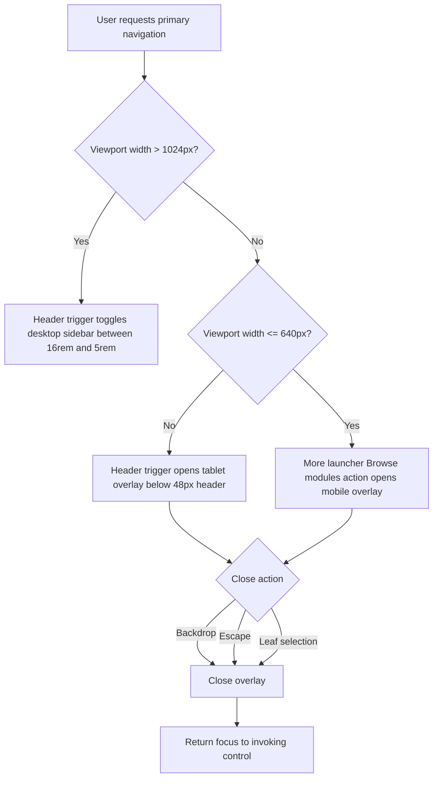
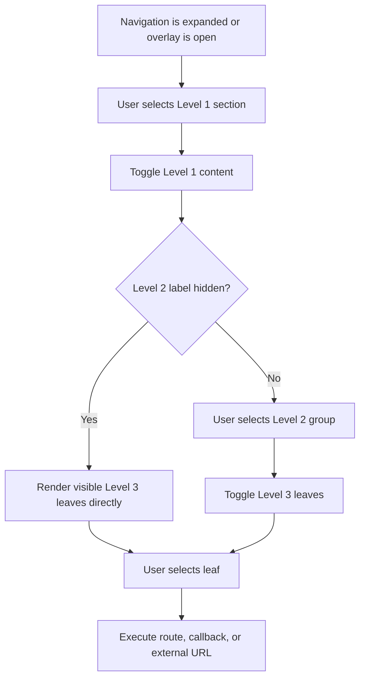
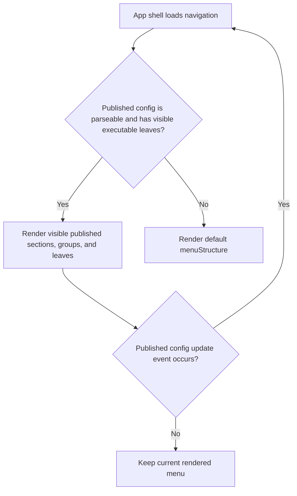
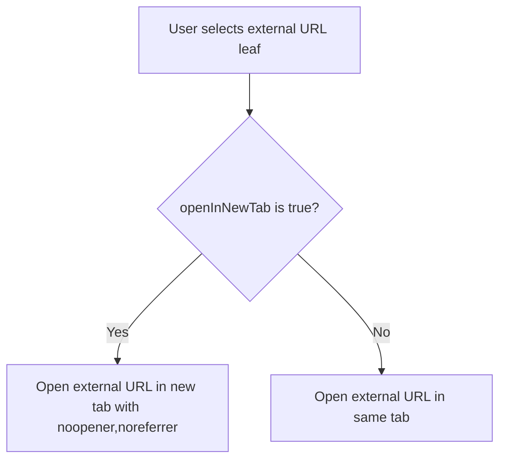

# Main Navigation Functional Requirement Document

**Version:** 1.2  
**Document Type:** Functional Requirement Document  
**Scope:** Main application runtime navigation only  
**Audience:** Product, UX, Engineering, QA, and Implementation Review  
**Status:** Target behavior specification with current implementation notes and gap tracking  

---

## 1. Purpose And Business Objectives

The main navigation shall provide persistent access to application workspaces and modules for authenticated users. It shall help users identify available work areas, move between transaction modules, keep route context visible, and support published Menu Builder configuration without requiring page-level controls.

| Business Objective ID | Objective | Navigation Capability |
|---|---|---|
| BO-01 | Reduce loss of module context during transaction work | Active leaf state and visible hierarchy |
| BO-02 | Reduce module discovery time across transaction workspaces | Level 1, Level 2, and Level 3 menu structure |
| BO-03 | Preserve content area on desktop while retaining navigation access | Collapsed desktop rail and expanded sidebar |
| BO-04 | Preserve navigation access on tablet and mobile without permanent content compression | Overlay sidebar and backdrop close behavior |
| BO-05 | Support tenant-specific menu governance | Published Menu Builder configuration with default fallback |
| BO-06 | Provide testable keyboard and assistive-technology behavior | Navigation landmark, focus states, and keyboard close behavior |
| BO-07 | Reduce repeated navigation steps for returning work | Search, Recent entries, Favorites, and collapsed flyout access |

This FRD shall not define the main header visual design, mobile More launcher tile inventory, admin/master sidebar, page tabs, form steppers, route destination page content, or the full module catalogue.

---

## 2. Requirement Status Legend

| Status | Meaning | QA Handling |
|---|---|---|
| Current | Requirement matches current implementation behavior. | QA may test against the current build. |
| Target | Requirement defines approved product behavior that may need implementation confirmation. | QA shall use for acceptance after implementation. |
| Gap | Requirement is approved target behavior and current implementation may not satisfy it. | QA shall log as a known gap until implemented. |
| Future | Requirement is intentionally deferred because runtime data or product policy is not available. | QA shall not fail current implementation. |

---

## 3. Navigation-Owned Surfaces

| Surface | Included In Scope | Purpose | Excluded Detail |
|---|---:|---|---|
| Desktop expanded sidebar | Yes | Show full navigation hierarchy | Header trigger visual design |
| Desktop search region | Yes | Search Level 1, Level 2, and Level 3 navigation labels | Global header search behavior |
| Recent entries section | Yes | Display last five opened sidebar pages or transaction documents when available | Document preview deep-link contract |
| Favorite navigation items section | Yes | Display user-saved Level 3 navigation items | Favorite management outside sidebar |
| Desktop collapsed rail | Yes | Preserve module-section access with reduced width | Page content layout internals |
| Collapsed rail flyout | Yes | Display section or group contents from collapsed rail hover or focus | Destination page content |
| Bottom launcher marker | Yes | Display Excellon Basket marker and tooltip when the launcher has no page impact | Basket destination behavior until product route exists |
| Tablet overlay sidebar | Yes | Provide navigation below the header at `641px-1024px` | Header responsive behavior |
| Mobile overlay sidebar | Yes | Provide primary navigation after the mobile More launcher invokes Browse modules | Mobile More launcher tile inventory |
| Overlay backdrop | Yes | Close tablet/mobile navigation | Page-level modal behavior |
| Level 1 sections | Yes | Group major workspaces | Permanent catalogue ownership |
| Level 2 groups | Yes | Group related leaf items | Page-specific subnavigation |
| Level 3 leaf items | Yes | Route to modules or invoke configured actions | Destination page requirements |
| Menu Builder published config | Yes | Override default runtime menu | Menu Builder editor page requirements |
| Admin/master sidebar | No | Separate admin navigation system | Governed by separate FRD if required |

The header FRD remains authoritative for the header button and mobile More launcher. This document is authoritative for the primary navigation surface after it is opened.

---

## 4. Navigation Data Contract

The runtime navigation shall consume the following data. If a value is unavailable, the fallback requirement in the table shall apply.

| Data Field | Required | Source Type | Valid Values | Fallback Requirement | Related Requirement |
|---|---:|---|---|---|---|
| `navigation.sections` | Yes | Published Menu Builder config or default `menuStructure` | Array with at least one visible executable leaf across the tree | Use default `menuStructure` when published config is missing or invalid | NAV-DATA-001 |
| `section.label` | Yes | Navigation config | 1-40 visible characters | Hide section when label is empty | NAV-COND-001 |
| `section.icon` | No | Navigation config or icon registry | Registered icon component | Display first character of `section.label` in collapsed rail | NAV-COND-002 |
| `section.isVisible` | No | Published Menu Builder config | `true`, `false`, or omitted | Treat omitted as visible | NAV-COND-003 |
| `level2.label` | Yes unless `hideLabel=true` | Navigation config | 1-40 visible characters | Hide Level 2 label when `hideLabel=true` and leaf items exist | NAV-DATA-002 |
| `level2.hideLabel` | No | Navigation config | Boolean | Treat omitted as `false` | NAV-DATA-002 |
| `level2.items` | Yes | Navigation config | Array of leaf items | Remove Level 2 group when no visible leaf items exist | NAV-COND-004 |
| `leaf.key` | Yes | Navigation config | Unique stable string within rendered tree | Hide leaf when key is empty or duplicated in same menu tree | NAV-COND-005 |
| `leaf.label` | Yes | Navigation config or localization map | 1-48 visible characters | Hide leaf when label is empty | NAV-COND-006 |
| `leaf.icon` | No | Navigation config or icon registry | Registered icon component | Render leaf label without an icon | NAV-COND-007 |
| `leaf.route` | Required unless `onClick` or `externalUrl` exists | Route registry | Valid in-app route string | Hide leaf when no executable route/action exists | NAV-COND-008 |
| `leaf.externalUrl` | No | Navigation config | Absolute `http` or `https` URL | Open according to `openInNewTab` | NAV-BEH-008 |
| `leaf.openInNewTab` | No | Navigation config | Boolean | Treat omitted as `false` | NAV-BEH-008 |
| `leaf.isVisible` | No | Published Menu Builder config | `true`, `false`, or omitted | Treat omitted as visible | NAV-COND-003 |
| `activeLeaf` | Yes | App shell route context | Known leaf key or `null` | Render no active leaf when route is unmapped | NAV-BEH-006 |
| `navigationSearchQuery` | No | Sidebar local state | Trimmed string | Search activates only when length is at least `2` characters | NAV-UTIL-001 |
| `recentDocuments` | No | Browser local storage `app-sidebar-recent-documents:v1` | Up to `5` valid page or document entries | Hide Recent section when no valid entries exist | NAV-UTIL-005 |
| `favoriteItems` | No | Browser local storage `app-sidebar-favorite-items:v1` | Valid Level 3 menu references | Hide Favorites section when no valid entries exist | NAV-UTIL-009 |

---

## 5. Navigation Data Requirements

| Requirement ID | Requirement | Business Objective | Status | QA Pass / Fail Test |
|---|---|---|---|---|
| NAV-DATA-001 | A published Menu Builder config shall be valid only when it is parseable, has a `sections` array, and contains at least one visible executable Level 3 leaf after visibility filtering. | BO-05 | Target | Pass when invalid published config falls back to default `menuStructure`. |
| NAV-DATA-002 | A Level 2 group with `hideLabel=true` shall be valid only when it contains at least one visible Level 3 leaf. | BO-02 | Current | Pass when valid flattened groups render Level 3 items without a Level 2 label. |
| NAV-DATA-003 | Duplicate visible leaf keys inside the rendered tree shall be treated as invalid leaves. | BO-05 | Gap | Pass when duplicated leaves are absent or validation prevents publication. |
| NAV-DATA-004 | Role or permission-based navigation filtering shall remain out of scope until a concrete runtime authorization field exists in the navigation data contract. | BO-05 | Future | Pass when the FRD does not require role filtering without a runtime field. |

---

## 6. Base Requirements

| Requirement ID | Requirement | Business Objective | Status | QA Pass / Fail Test |
|---|---|---|---|---|
| NAV-BASE-001 | The system shall render exactly one main runtime navigation surface inside the authenticated app shell. | BO-01 | Current | Pass when one `Primary navigation` landmark exists; fail when none or more than one exists. |
| NAV-BASE-002 | The system shall source runtime navigation from published Menu Builder configuration when a valid published config exists. | BO-05 | Current | Pass when a visible published menu change appears after publish; fail when default menu remains active. |
| NAV-BASE-003 | The system shall source runtime navigation from default `menuStructure` when no valid published config exists. | BO-05 | Current | Pass when default sections render after published config is removed or invalid. |
| NAV-BASE-004 | The system shall support three menu levels: Level 1 section, Level 2 group, and Level 3 leaf item. | BO-02 | Current | Pass when all configured visible levels render according to their data. |
| NAV-BASE-005 | The system shall not render admin/master sidebar items in the main runtime navigation. | BO-01 | Current | Pass when admin sidebar groups are absent from the main app sidebar. |
| NAV-BASE-006 | The system shall not define destination page layout through navigation requirements. | BO-01 | Current | Pass when navigation tests stop after route/action completion. |
| NAV-BASE-007 | Desktop navigation shall initialize in collapsed rail state unless a future persisted user preference explicitly overrides it. | BO-03 | Current | Pass when first authenticated desktop load renders a `5rem` sidebar. |
| NAV-BASE-008 | Navigation group expansion state shall be session-local and shall not modify the current route. | BO-03 | Current | Pass when expanding or collapsing groups leaves URL unchanged. |

---

## 7. Responsive Layout Requirements

### 7.1 Breakpoints And Metrics

| Requirement ID | Viewport | Exact Rule | Business Objective | Status | QA Pass / Fail Test |
|---|---|---|---|---|---|
| NAV-RESP-001 | Desktop | Desktop navigation behavior shall apply when viewport width is greater than `1024px`. | BO-03 | Current | Pass when header navigation trigger toggles collapsed and expanded desktop sidebar at `1025px`. |
| NAV-RESP-002 | Tablet | Tablet overlay navigation shall apply from `641px` through `1024px`; the header navigation trigger opens the primary navigation overlay. | BO-04 | Current | Pass when header trigger opens overlay navigation at `641px`, `768px`, and `1024px`. |
| NAV-RESP-003 | Mobile | Mobile primary navigation shall be opened through the header-owned More launcher `Browse modules` action at `<=640px`; the closed mobile header trigger itself remains governed by the header FRD. | BO-04 | Target | Pass when primary navigation opens from Browse modules and the header trigger still follows header FRD behavior. |
| NAV-RESP-004 | All overlay states | Overlay sidebar shall start below the `48px` header. | BO-04 | Current | Pass when overlay top edge is `48px` from viewport top. |
| NAV-RESP-005 | Desktop expanded | Expanded sidebar width shall be `16rem`. | BO-03 | Current | Pass when computed width equals `16rem`. |
| NAV-RESP-006 | Desktop collapsed | Collapsed sidebar width shall be `5rem`. | BO-03 | Current | Pass when computed width equals `5rem`. |
| NAV-RESP-007 | Tablet and mobile overlay | Overlay sidebar width shall be `min(20rem, calc(100vw - 32px))`. | BO-04 | Current | Pass when computed width follows the formula at `1024px`, `768px`, `640px`, and `360px`. |
| NAV-RESP-008 | All | Navigation shall not create horizontal page scrolling. | BO-04 | Current | Pass when document scroll width equals viewport width. |

### 7.2 Desktop Expanded `>1024px`

```text
+---------------------------------------------------------------+
| Main Header                                                   |
+--------------------------+------------------------------------+
| Search navigation        | Page content                       |
| RECENT                   |                                    |
|   Document row           |                                    |
| FAVORITES                |                                    |
|   Saved module row       |                                    |
| BROWSE                   |                                    |
| Level 1 Section v        |                                    |
|   Level 3 Leaf [Active]  |                                    |
| Level 1 Section >        |                                    |
+--------------------------+------------------------------------+
| Sidebar width: 16rem                                          |
+---------------------------------------------------------------+
Legend: v = expanded section, > = collapsed section, [Active] = active leaf.
```

| Requirement ID | Requirement | Business Objective | Status | QA Pass / Fail Test |
|---|---|---|---|---|
| NAV-DESK-001 | Desktop expanded sidebar shall show Level 1 labels, expanded Level 2/Level 3 content, and active leaf styling. | BO-01 | Current | Pass when expanded sidebar displays text labels and active leaf state. |
| NAV-DESK-002 | Selecting the header navigation trigger on desktop shall toggle between `16rem` expanded and `5rem` collapsed states. | BO-03 | Current | Pass when each trigger selection changes width to the opposite desktop state. |
| NAV-DESK-003 | Desktop expand/collapse shall preserve the current route. | BO-03 | Current | Pass when URL and rendered page remain unchanged after toggling the sidebar. |

### 7.3 Desktop Collapsed `>1024px`

```text
+---------------------------------------------------------------+
| Main Header                                                   |
+------+--------------------------------------------------------+
| [P]  | Page content                                           |
| [S]  |                                                        |
| [I]  |                                                        |
+------+--------------------------------------------------------+
| Sidebar width: 5rem                                           |
+---------------------------------------------------------------+
Legend: [P]/[S]/[I] = section icon or first-character fallback.
```

| Requirement ID | Requirement | Business Objective | Status | QA Pass / Fail Test |
|---|---|---|---|---|
| NAV-COLL-001 | Collapsed rail shall show one compact entry for each visible Level 1 section. | BO-03 | Current | Pass when each visible section has one collapsed rail entry. |
| NAV-COLL-002 | Collapsed section entries shall display the configured section icon. | BO-02 | Current | Pass when configured icon appears for each section with an icon. |
| NAV-COLL-003 | Collapsed section entries shall display the first character of section label when the icon is unavailable. | BO-02 | Current | Pass when missing icon section displays its first label character. |
| NAV-COLL-004 | Collapsed section entries shall expose the section label through the accessible name or title. | BO-06 | Current | Pass when assistive inspection exposes the full section label. |

### 7.4 Tablet Overlay `641px-1024px`

```text
+---------------------------------------------------------------+
| Main Header                                                   |
+------------------------------+--------------------------------+
| Overlay Sidebar              | Backdrop                       |
| Level 1 Section v            | Page content behind overlay    |
|   Level 3 Leaf [Active]      |                                |
+------------------------------+--------------------------------+
| Top: 48px | Width: min(20rem, calc(100vw - 32px))             |
+---------------------------------------------------------------+
```

| Requirement ID | Requirement | Business Objective | Status | QA Pass / Fail Test |
|---|---|---|---|---|
| NAV-TAB-001 | Tablet navigation shall open as an overlay below the header after selecting the header navigation trigger. | BO-04 | Current | Pass when sidebar is fixed, starts at `48px`, and overlays page content at `641px-1024px`. |
| NAV-TAB-002 | Tablet overlay backdrop shall cover the page area outside the sidebar below the header. | BO-04 | Current | Pass when backdrop covers non-sidebar content from `48px` to viewport bottom. |

### 7.5 Mobile Overlay `<=640px`

```text
+---------------------------------------------------------------+
| Mobile Header                                                 |
+---------------------------------------------------------------+
| More launcher opens first                                     |
| Browse modules action opens primary navigation overlay         |
+------------------------------+--------------------------------+
| Overlay Sidebar              | Backdrop                       |
+------------------------------+--------------------------------+
```

| Requirement ID | Requirement | Business Objective | Status | QA Pass / Fail Test |
|---|---|---|---|---|
| NAV-MOB-001 | Mobile primary navigation shall open only after the header-owned More launcher invokes Browse modules. | BO-04 | Target | Pass when Browse modules opens primary navigation and the navigation FRD does not redefine More launcher tile layout. |
| NAV-MOB-002 | Mobile primary navigation overlay shall use the same `48px` top offset and `min(20rem, calc(100vw - 32px))` width formula as tablet overlay. | BO-04 | Current | Pass when computed mobile overlay top and width match the formulas. |

---

## 8. Overlay Interaction Requirements

| Requirement ID | Requirement | Business Objective | Status | QA Pass / Fail Test |
|---|---|---|---|---|
| NAV-OVR-001 | Selecting the overlay backdrop shall close tablet/mobile primary navigation. | BO-04 | Current | Pass when backdrop selection removes the overlay sidebar. |
| NAV-OVR-002 | Pressing Escape shall close tablet/mobile primary navigation. | BO-06 | Current | Pass when Escape removes the overlay sidebar. |
| NAV-OVR-003 | Selecting a Level 3 leaf item shall close tablet/mobile primary navigation after route/action completion. | BO-04 | Current | Pass when overlay is absent after selecting a visible leaf. |
| NAV-OVR-004 | While overlay navigation is open, page content behind the overlay shall not receive keyboard focus. | BO-06 | Gap | Pass when Tab focus remains inside navigation or returns to the close trigger until overlay closes. |
| NAV-OVR-005 | Closing overlay navigation shall return focus to the control that opened the primary navigation surface. | BO-06 | Gap | Pass when focus returns to the invoking header trigger or More launcher action. |

---

## 9. Menu Behavior Requirements

| Requirement ID | Requirement | Business Objective | Status | QA Pass / Fail Test |
|---|---|---|---|---|
| NAV-BEH-001 | Selecting an expandable Level 1 section in expanded or overlay mode shall toggle that section between expanded and collapsed states. | BO-02 | Current | Pass when section content appears and disappears on selection. |
| NAV-BEH-002 | Level 1 sections in collapsed desktop rail mode shall expose `aria-expanded` when their flyout is open or closed. | BO-06 | Current | Pass when collapsed entries report expanded state that matches flyout visibility. |
| NAV-BEH-003 | Selecting an expandable Level 2 group shall toggle its Level 3 leaf items. | BO-02 | Current | Pass when Level 3 items appear and disappear on selection. |
| NAV-BEH-004 | A Level 2 group with `hideLabel=true` and visible Level 3 items shall render its Level 3 items without a visible Level 2 button. | BO-02 | Current | Pass when leaf items render directly under the Level 1 section. |
| NAV-BEH-005 | Selecting an internal route leaf shall navigate to the configured in-app route. | BO-02 | Current | Pass when URL changes to the configured route. |
| NAV-BEH-006 | A leaf whose `key` equals `activeLeaf` shall display active styling. | BO-01 | Current | Pass when only the matching leaf displays active styling. |
| NAV-BEH-007 | When route context does not map to a leaf key, no leaf shall display active styling. | BO-01 | Current | Pass when unmapped routes show no active leaf. |
| NAV-BEH-008 | Selecting an external URL leaf shall open the configured external URL in the same tab when `openInNewTab=false` and in a new tab with `noopener,noreferrer` when `openInNewTab=true`. | BO-02 | Current | Pass when external navigation follows the configured target behavior and new-tab links use `noopener,noreferrer`. |
| NAV-BEH-009 | Selecting a callback leaf shall invoke the configured callback exactly once. | BO-02 | Current | Pass when callback side effect occurs one time per selection. |
| NAV-BEH-010 | Navigation expand/collapse state shall not change route by itself. | BO-03 | Current | Pass when URL is unchanged after expanding or collapsing sections. |
| NAV-BEH-011 | Enter and Space shall activate focused Level 1, Level 2, and Level 3 navigation controls. | BO-06 | Current | Pass when Enter and Space perform the same action as pointer selection. |
| NAV-BEH-012 | Arrow-key tree navigation shall be out of scope until a formal treeview pattern is adopted. | BO-06 | Future | Pass when QA does not fail current implementation for missing arrow-key tree navigation. |

---

## 9A. Desktop Utility Requirements

| Requirement ID | Requirement | Business Objective | Status | QA Pass / Fail Test |
|---|---|---|---|---|
| NAV-UTIL-001 | Desktop expanded sidebar shall display one search input above the scrollable navigation area. | BO-07 | Current | Pass when search is visible only when desktop sidebar is expanded and absent in collapsed, tablet, and mobile states. |
| NAV-UTIL-002 | Navigation search shall activate only when the trimmed query has at least `2` characters. | BO-07 | Current | Pass when a one-character query leaves the normal Browse tree visible and a two-character query filters the tree. |
| NAV-UTIL-003 | Active navigation search shall hide Recent and Favorites sections. | BO-07 | Current | Pass when Recent and Favorites are absent while filtered results or no-result state is displayed. |
| NAV-UTIL-004 | Active navigation search with zero matches shall display `No matching navigation items` centered within the remaining sidebar body. | BO-07 | Current | Pass when the message is horizontally and vertically centered below the fixed search region. |
| NAV-UTIL-005 | Recent entries shall render below search and above Favorites only when at least one valid recent page or document exists. | BO-07 | Current | Pass when Recent is hidden with empty storage and appears after a supported document is opened. |
| NAV-UTIL-006 | Recent entries shall render no more than `5` rows. | BO-07 | Current | Pass when opening a sixth supported document removes the oldest visible recent row. |
| NAV-UTIL-007 | Each Recent row shall expose a `Remove from recent` action only on row hover or keyboard focus. | BO-07 | Current | Pass when the remove action is hidden at rest, visible on hover/focus, and reachable by keyboard. |
| NAV-UTIL-008 | Removing a Recent row shall update local recent history without changing the current route. | BO-07 | Current | Pass when the selected row disappears and URL remains unchanged. |
| NAV-UTIL-009 | Favorites shall render below Recent only when at least one valid favorite Level 3 menu item exists in the current menu tree. | BO-07 | Current | Pass when Favorites is hidden with no favorites and appears after a Level 3 item is favorited. |
| NAV-UTIL-010 | Favorite star action shall appear on Level 3 row hover or keyboard focus and shall remain visible when the row is favorited. | BO-07 | Current | Pass when unfavorited rows show the star only on hover/focus and favorited rows show a filled yellow star at rest. |
| NAV-UTIL-011 | The Browse title shall render above the full menu tree when desktop expanded sidebar is not in active search mode. | BO-02 | Current | Pass when Browse appears below Recent/Favorites or directly below search when no utility sections exist. |
| NAV-UTIL-012 | The collapsed rail flyout shall display a header with the active section or group label and a divider above flyout rows. | BO-07 | Current | Pass when hovering or focusing a collapsed section opens a flyout with a titled header. |
| NAV-UTIL-013 | Pressing Escape while a collapsed rail flyout is open shall close the flyout and return focus to the collapsed section trigger. | BO-06 | Current | Pass when Escape closes the flyout and keyboard focus returns to the rail item that opened it. |
| NAV-UTIL-014 | The Excellon Basket marker shall remain fixed at the bottom of the sidebar and show tooltip text `Excellon Basket` on hover. | BO-07 | Current | Pass when the marker does not scroll with menu content and tooltip appears on hover. |

---

## 10. Conditional Requirements

| Requirement ID | Condition | Required Behavior | Business Objective | Status | QA Pass / Fail Test |
|---|---|---|---|---|---|
| NAV-COND-001 | Section label is empty or whitespace | Hide the section and its descendants. | BO-05 | Gap | Pass when empty-label section is absent from visual and keyboard order. |
| NAV-COND-002 | Section icon is unavailable in collapsed rail | Display first visible character of section label. | BO-02 | Current | Pass when text fallback appears. |
| NAV-COND-003 | `isVisible=false` on section, group, or leaf | Do not render that item or descendants where applicable. | BO-05 | Current | Pass when hidden item is absent and not keyboard reachable. |
| NAV-COND-004 | Level 2 group has no visible leaf items | Do not render the Level 2 group. | BO-02 | Current | Pass when empty group is absent. |
| NAV-COND-005 | Leaf key is missing or duplicated in same menu tree | Hide the invalid leaf or block publishing before runtime. | BO-05 | Gap | Pass when invalid leaf is absent or publication is blocked. |
| NAV-COND-006 | Leaf label is empty or whitespace | Hide the leaf. | BO-02 | Gap | Pass when empty-label leaf is absent. |
| NAV-COND-007 | Leaf icon is unavailable | Render the leaf label without an icon. | BO-02 | Current | Pass when leaf remains selectable with label visible. |
| NAV-COND-008 | Leaf has no route, callback, or external URL | Hide the leaf. | BO-02 | Gap | Pass when non-executable leaf is absent. |
| NAV-COND-009 | Published Menu Builder config is missing, malformed, or has no visible executable leaves | Render default `menuStructure`. | BO-05 | Current | Pass when default menu appears. |
| NAV-COND-010 | Published config changes in another browser tab | Runtime navigation shall update after the storage event. | BO-05 | Current | Pass when visible menu reflects the new published config without full page reload. |

---

## 11. Accessibility Requirements

| Requirement ID | Requirement | Business Objective | Status | QA Pass / Fail Test |
|---|---|---|---|---|
| NAV-A11Y-001 | Navigation shall render inside a `nav` landmark with accessible name `Primary navigation`. | BO-06 | Current | Pass when assistive inspection exposes one `Primary navigation` landmark. |
| NAV-A11Y-002 | Every interactive navigation item shall have an accessible name. | BO-06 | Current | Pass when each focusable item exposes a non-empty name. |
| NAV-A11Y-003 | Expandable Level 1 and Level 2 items shall expose `aria-expanded` when labels are visible. | BO-06 | Current | Pass when expanded state matches rendered content. |
| NAV-A11Y-004 | Active leaf shall expose active-page semantics through `aria-current="page"` or an equivalent testable semantic state. | BO-01 | Gap | Pass when assistive inspection identifies the active item. |
| NAV-A11Y-005 | Keyboard Tab order shall follow visible navigation order from top to bottom. | BO-06 | Current | Pass when Tab sequence matches visual item order. |
| NAV-A11Y-006 | Every keyboard-focusable navigation control shall display a visible focus state. | BO-06 | Current | Pass when focused item shows focus styling. |
| NAV-A11Y-007 | Tablet/mobile overlay shall close on Escape. | BO-06 | Current | Pass when Escape closes the overlay. |
| NAV-A11Y-008 | Closing tablet/mobile overlay shall return focus to the control that opened navigation. | BO-06 | Gap | Pass when focus returns to the invoking control. |
| NAV-A11Y-009 | Hidden navigation items shall not appear in the keyboard focus order. | BO-06 | Current | Pass when hidden items cannot receive focus. |
| NAV-A11Y-010 | Decorative icons shall be hidden from assistive technology. | BO-06 | Current | Pass when icons do not appear as separate screen reader stops. |
| NAV-A11Y-011 | Sidebar width and transform animations shall be disabled or reduced when `prefers-reduced-motion: reduce` is active. | BO-06 | Gap | Pass when reduced-motion mode removes nonessential sidebar animation. |

---

## 12. User Flow Diagrams

### 12.1 Open And Close Navigation



### 12.2 Expand Group And Select Leaf



### 12.3 Published Menu Fallback



### 12.4 External Link Leaf



---

## 13. Acceptance Matrix

| Requirement ID | Viewport | Data Condition | Trigger | Expected Result | Status | Pass / Fail Rule |
|---|---|---|---|---|---|---|
| NAV-QA-001 | Desktop `1025px` | Default menu available | Load authenticated page | Sidebar renders in collapsed or expanded desktop mode | Current | Pass when one primary navigation landmark exists. |
| NAV-QA-002 | Desktop `1025px` | Sidebar expanded | Measure sidebar | Width is `16rem` | Current | Pass when computed width equals `16rem`. |
| NAV-QA-003 | Desktop `1025px` | Sidebar collapsed | Measure sidebar | Width is `5rem` | Current | Pass when computed width equals `5rem`. |
| NAV-QA-004 | Desktop `1366px` | Sidebar collapsed | Select header navigation trigger | Sidebar expands without route change | Current | Pass when width changes to `16rem` and URL is unchanged. |
| NAV-QA-005 | Desktop `1366px` | Sidebar expanded | Select header navigation trigger | Sidebar collapses without route change | Current | Pass when width changes to `5rem` and URL is unchanged. |
| NAV-QA-006 | Tablet `1024px` | Navigation closed | Select header navigation trigger | Overlay sidebar opens below header | Current | Pass when overlay top is `48px`. |
| NAV-QA-007 | Mobile `360px` | More launcher open | Select Browse modules | Primary navigation overlay opens | Target | Pass when mobile navigation opens from Browse modules, not from redefining the closed header trigger. |
| NAV-QA-008 | Tablet/mobile | Overlay open | Select backdrop | Overlay closes | Current | Pass when sidebar has closed state. |
| NAV-QA-009 | Tablet/mobile | Overlay open | Press Escape | Overlay closes | Current | Pass when sidebar has closed state. |
| NAV-QA-010 | Tablet/mobile | Overlay open and visible leaf exists | Select leaf | Route/action executes and overlay closes | Current | Pass when route/action completes and overlay is closed. |
| NAV-QA-011 | All | Published config missing | Load page | Default `menuStructure` renders | Current | Pass when default sections appear. |
| NAV-QA-012 | All | Valid published config exists | Load page | Published visible items render | Current | Pass when published labels are visible. |
| NAV-QA-013 | All | Section `isVisible=false` | Load page | Section is absent | Current | Pass when section is not visible and not keyboard reachable. |
| NAV-QA-014 | All | Leaf has no executable route/action/external URL | Load page | Leaf is absent | Gap | Pass when leaf is not visible and not keyboard reachable. |
| NAV-QA-015 | All | Active leaf key matches route context | Load page | Matching leaf is active | Current | Pass when exactly one matching leaf displays active state. |
| NAV-QA-016 | All | Route context is unmapped | Load page | No leaf is active | Current | Pass when no active leaf styling appears. |
| NAV-QA-017 | All | Level 2 has `hideLabel=true` and visible leaves | Expand Level 1 | Leaf items render without Level 2 button | Current | Pass when no Level 2 label button appears. |
| NAV-QA-018 | All | Section icon missing in collapsed rail | Collapse sidebar | First label character appears | Current | Pass when text fallback is visible. |
| NAV-QA-019 | All | Keyboard navigation | Press Tab through sidebar | Focus follows visible order | Current | Pass when focus order matches top-to-bottom order. |
| NAV-QA-020 | All | Active leaf exists | Inspect accessibility tree | Active item exposes page semantics | Gap | Pass when active item is identifiable semantically. |
| NAV-QA-021 | All | Focused navigation control | Press Enter and Space | Focused item activates | Current | Pass when both keys perform the pointer action. |
| NAV-QA-022 | Overlay | Overlay open | Press Tab repeatedly | Background page does not receive focus | Gap | Pass when focus remains in overlay or returns to invoking control. |
| NAV-QA-023 | Overlay | Overlay closed | Inspect focus | Focus returns to invoking control | Gap | Pass when focus return target is correct. |
| NAV-QA-024 | All | Reduced motion enabled | Open, close, expand, or collapse navigation | Nonessential animation is disabled or reduced | Gap | Pass when sidebar transition animation is removed or shortened. |
| NAV-QA-025 | Desktop expanded | Search query has one character | Type in sidebar search | Normal Browse tree remains visible | Current | Pass when no filtering occurs. |
| NAV-QA-026 | Desktop expanded | Search query has two or more characters and no matches | Type in sidebar search | Centered no-result message appears | Current | Pass when message text equals `No matching navigation items`. |
| NAV-QA-027 | Desktop expanded | Recent storage has six valid entries | Load sidebar | Five newest Recent rows render | Current | Pass when exactly five rows are visible. |
| NAV-QA-028 | Desktop expanded | Recent row visible | Select remove action | Row disappears and URL does not change | Current | Pass when history updates without navigation. |
| NAV-QA-029 | Desktop expanded | Level 3 row visible and not favorited | Hover or focus row | Empty star appears at row end | Current | Pass when row text does not shift and star is visible. |
| NAV-QA-030 | Desktop expanded | Favorite exists | Load sidebar | Favorites section appears below Recent and above Browse | Current | Pass when favorite row navigates through existing leaf behavior. |
| NAV-QA-031 | Desktop collapsed | Collapsed section has visible children | Hover or focus collapsed section | Flyout opens with title and divider | Current | Pass when flyout header label matches section or group context. |
| NAV-QA-032 | Desktop collapsed | Flyout open from keyboard focus | Press Escape | Flyout closes and focus returns to triggering rail item | Current | Pass when focus target is the original collapsed section button. |
| NAV-QA-033 | Desktop expanded or collapsed | Sidebar content scrolls | Scroll navigation | Excellon Basket marker remains fixed at bottom | Current | Pass when marker position does not move with scrollable menu content. |

---

## 14. Current Implementation Notes

| Area | Current Behavior | Status |
|---|---|---|
| Runtime component | Main navigation renders through `AppSidebar` inside `AppShell`. | Current |
| Default source | Default menu comes from `menuStructure`. | Current |
| Published source | `usePublishedMenu` reads published Menu Builder configuration and falls back to default structure. | Current |
| Desktop breakpoint | `AppShell` treats `window.innerWidth > 1024` as desktop toggle behavior. | Current |
| Desktop widths | CSS defines expanded width `16rem` and collapsed width `5rem`. | Current |
| Overlay width | CSS defines overlay width `min(20rem, calc(100vw - 32px))`. | Current |
| Overlay offset | CSS positions overlay sidebar at top `48px`. | Current |
| Tablet entry | Header trigger opens primary overlay navigation from `641px` through `1024px`. | Current |
| Mobile entry | Header trigger opens the mobile More launcher; Browse modules is the intended bridge to primary navigation. | Target |
| Active leaf | `level3.key === activeLeaf` controls active styling. | Current |
| Level 2 flattening | `hideLabel=true` renders Level 3 items without Level 2 label button. | Current |
| Localization | Section and item labels may resolve through localization key maps. | Current |
| Active semantics | Active styling exists; semantic `aria-current` may require implementation confirmation. | Gap |
| Focus containment and return | Overlay close works; focus containment and focus return may require implementation confirmation. | Gap |
| Invalid leaf filtering | Current fallback handles visibility filters from published config; missing route/key/label validation may require implementation confirmation. | Gap |
| Desktop search | Expanded desktop sidebar displays search above the scrollable navigation region; search activates at two trimmed characters. | Current |
| Recent entries | Recent renders from `app-sidebar-recent-documents:v1`, max five rows, and supports hover/focus remove. | Current |
| Favorites | Favorites renders from `app-sidebar-favorite-items:v1` and resolves entries against current menu structure. | Current |
| Browse zoning | Browse title separates personal utility sections from the full menu tree. | Current |
| Collapsed flyout | Collapsed rail flyout displays section/group headers and closes on Escape with focus return to the trigger. | Current |
| Excellon Basket | Bottom marker remains fixed and displays the `Excellon Basket` tooltip; route behavior is not defined in this FRD version. | Current |
| Authorization filtering | No concrete runtime authorization field is defined for main navigation. | Future |

---

## 15. Requirement Wording Guardrail

Requirements shall use observable action verbs and measurable outcomes. QA shall be able to determine pass or fail without interpreting design intent.

Future revisions shall not use vague claims about speed, ease of use, resource usage, imprecise measurement, or assumed user understanding. Each requirement shall instead specify a visible state, trigger, route result, focus result, dimension, count, or allowed range.
