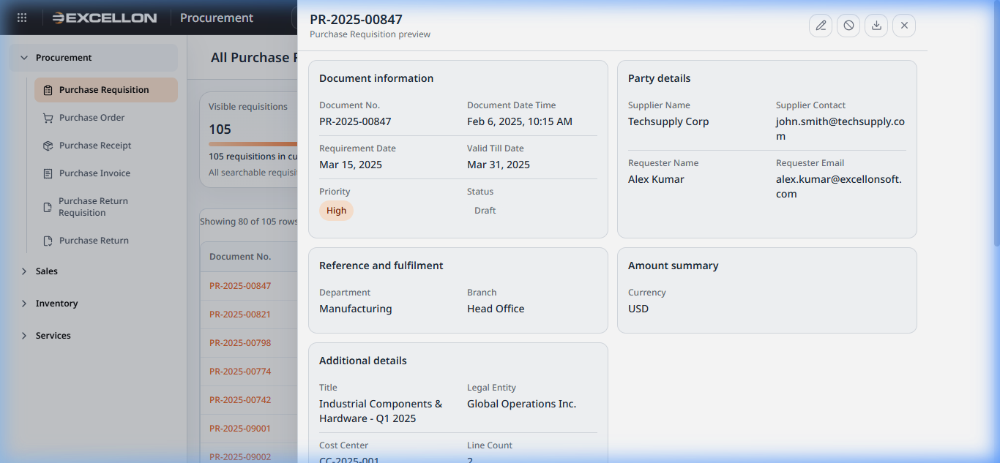
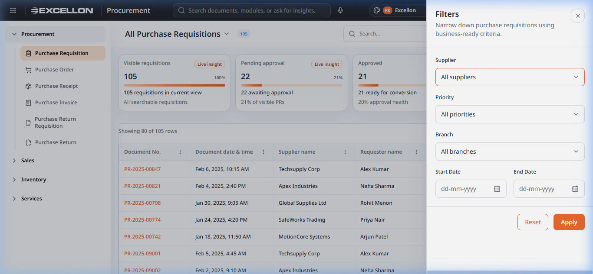
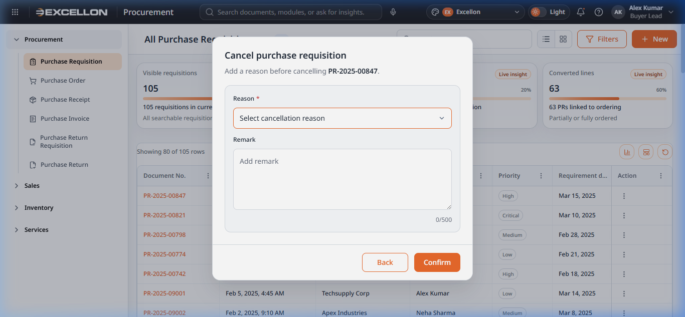
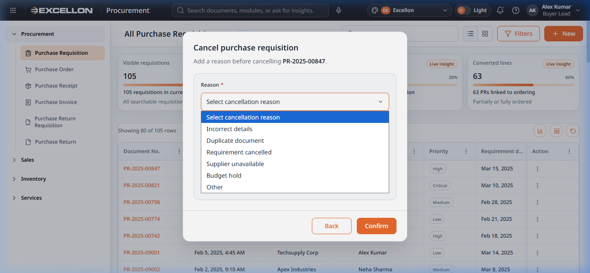
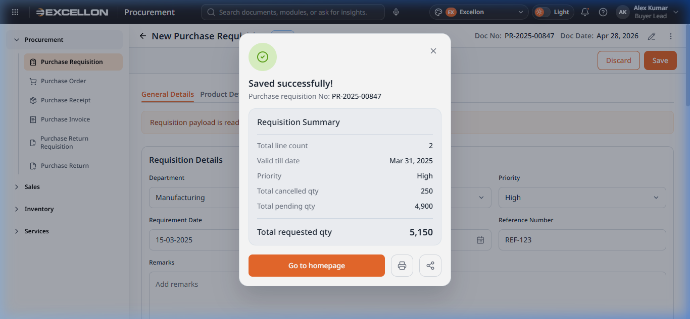
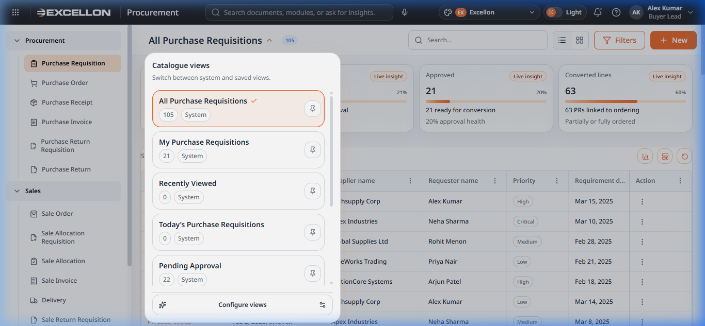
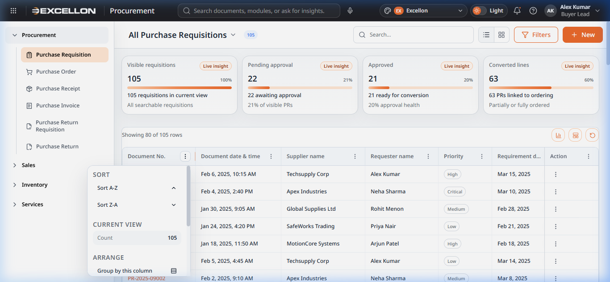

# Sale Order Documentation

## 1. Document Overview
The Sale Order document is the working record used to capture and manage a customer sales order in this project. Users can create a new sale order, edit an existing sale order, review saved orders from the catalogue, open a read-only preview, cancel a document, and view amount calculations in a side drawer.

This documentation is based only on the current project files and screenshots available in the repository.

## 2. Business Purpose
The Sale Order supports the sales fulfilment process by recording customer details, order details, product lines, payment and finance details, delivery instructions, shipping instructions, and amount calculations. It also supports downstream operational tracking through line-level allocation, invoicing, delivery, and return quantity fields.

## 3. User Roles and Access
Visible user roles or permission rules for Sale Order are not clearly defined in the project files reviewed.

Needs confirmation from project team.

## 4. Navigation Path
| Item | Details |
|---|---|
| Menu path | Sales → Sale Order |
| Catalogue route | `#/sale-order` |
| Create route | `#/sale-order/new` |
| Legacy route redirect | `#/saleorderlist` redirects to `#/sale-order`; `#/create-sale-order` redirects to `#/sale-order/new` |
| Page name | Sale Order |
| Related files | `src/routes/routeConfig.ts`, `src/routes/routeScreens.ts`, `src/components/common/appShellShared.ts`, `src/pages/sale-order/saleorderlist.tsx`, `src/pages/sale-order/CreateSaleOrder.tsx` |

## 5. Screen Overview
### 5.1 Catalogue / List View
Purpose: Shows all saved sale orders in list view or grid view, with search, filter, sort, preview, edit, and cancel actions.

Screenshot:
[Insert screenshot of Sale Order - Catalogue View here]

Related files:
- `src/pages/sale-order/saleorderlist.tsx`
- `src/components/common/CommonDataGrid.tsx`
- `src/components/common/DocumentPreviewDrawer.tsx`
- `src/components/common/CancelDocumentDialog.tsx`

### 5.2 Create Screen
Purpose: Allows a user to create a new sale order through a tab-based form.

Screenshot:
[Insert screenshot of Sale Order - Create Screen here]

Related files:
- `src/pages/sale-order/CreateSaleOrder.tsx`
- `src/pages/sale-order/saleOrderData.ts`
- `src/components/common/AmountBreakdownDrawer.tsx`
- `src/components/common/SuccessSummaryDialog.tsx`
- `src/components/common/ConfirmationDialog.tsx`

### 5.3 Edit Screen
Purpose: Uses the same page as the create screen, but loads an existing document for update.

Screenshot:
[Insert screenshot of Sale Order - Edit Screen here]

Related files:
- `src/pages/sale-order/CreateSaleOrder.tsx`
- `src/pages/sale-order/saleOrderData.ts`
- `src/stores/documentStore.ts`

### 5.4 View / Detail Screen
Purpose: No separate full page was identified. The current project uses a read-only preview drawer from the catalogue.

Screenshot:

Related files:
- `src/components/common/DocumentPreviewDrawer.tsx`
- `src/pages/sale-order/saleorderlist.tsx`

### 5.5 Related Dialogs, Drawers, and Popups
| UI Element | Purpose | Screenshot |
|---|---|---|
| Filter drawer | Filters the catalogue by customer, source, executive, priority, status, and date ranges |  |
| Cancel document dialog | Captures cancellation reason and remarks before cancelling a sale order |  |
| Cancel dialog with reason | Shows cancellation dialog after a reason is selected |  |
| Success summary dialog | Displays a success summary after saving a sale order |  |
| Amount breakdown drawer | Shows order summary and calculation breakdown | [Insert screenshot of Sale Order - Amount Breakdown Drawer here] |
| Customer change confirmation | Warns that changing/removing customer will discard entered details | [Insert screenshot of Sale Order - Customer Change Confirmation here] |

## 6. Catalogue/List View
### Catalogue Columns
| Column Name | Meaning | Source Field | Format | Sortable | Filterable | Notes |
|---|---|---|---|---|---|---|
| Document Number | Sale order reference number | `number` | Text | Yes | Global search only | Click opens preview drawer |
| Document Date | Order date | `orderDateTime` | Date | Yes | Date range filter | List view shows date only |
| Customer | Customer name | `customerName` | Text | Yes | Customer filter | Truncated when long |
| Branch | Branch reference | Not stored in current document model | Text | Yes | No dedicated filter found | Current UI shows `-` |
| Sales Executive | Sales owner | `salesExecutive` | Text | Yes | Sales Executive filter |  |
| Order Source | Source channel | `orderSource` | Text | Yes | Order Source filter |  |
| Status | Document status | `status` | Status badge/text | Yes | Status multi-select filter |  |
| Priority | Priority level | `priority` | Priority badge/text | Yes | Priority filter |  |
| Requested Delivery Date | Requested customer delivery date | `requestedDeliveryDate` | Date | Yes | Requested delivery date range filter |  |
| Promised Delivery Date | Promised fulfilment date | `promisedDeliveryDate` | Date | Yes | No dedicated filter found |  |
| Valid Till Date | Quote/order validity date | `validTillDate` | Date | Yes | No dedicated filter found |  |
| Payment Mode | Payment mode | `paymentMode` | Text | Yes | No dedicated filter found |  |
| Payment Method | Payment method | `paymentMethod` | Text | Yes | No dedicated filter found |  |
| Total Quantity | Sum of line order quantity | Derived from `lines[].orderQuantity` | Number | Yes | No | Calculated in list page |
| Total Tax Amount | Total tax amount across lines | Derived from `lines[].lineAmount - lines[].taxableAmount` | Currency | Yes | No | Calculated in list page |
| Total Amount | Document total amount | `totalAmount` | Currency | Yes | No |  |
| Net Amount | Sum of line taxable amount | Derived from `lines[].taxableAmount` | Currency | Yes | No | Calculated in list page |
| Allocation Status | Allocation progress | Derived from line quantities | Text | Yes | No | `Not Started`, `Partial`, `Completed`, or `-` |
| Invoice Status | Invoicing progress | Derived from line quantities | Text | Yes | No | `Not Started`, `Partial`, `Completed`, or `-` |
| Delivery Status | Delivery progress | Derived from line quantities | Text | Yes | No | `Not Started`, `Partial`, `Completed`, or `-` |
| Return Status | Return progress | Derived from line quantities | Text | Yes | No | `Returned` or `No Return` |
| Created By | Creator name | Not stored in current document model | Text | Yes | No | Current UI shows `-` |
| Action | Row action menu | Derived UI action column | Menu | No | No | Includes View, Edit, Cancel |

### Search Parameters
| Search Field | Search Behavior | Related Field | Notes |
|---|---|---|---|
| Global search box | Case-insensitive contains search | `number`, `customerName`, `salesExecutive`, `orderSource`, `status`, `priority` | Search runs in catalogue page memory |

### Filters
| Filter Name | Filter Type | Lookup Configuration | Conditions | Notes |
|---|---|---|---|---|
| Customer | Dropdown | Built from current document values in list page | Always visible in filter drawer | Dynamic from visible records, not from a master service |
| Order Source | Dropdown | Built from current document values in list page | Always visible | Dynamic from visible records |
| Sales Executive | Dropdown | Built from current document values in list page | Always visible | Dynamic from visible records |
| Priority | Dropdown | Static current UI options | Always visible | Current UI options are High, Medium, Low |
| Status | Multi-select checkbox list | Static current UI options | Always visible | Draft, Pending Approval, Approved, Rejected, Cancelled |
| Document Date From | Date picker | Not applicable | Always visible | Used with Document Date To |
| Document Date To | Date picker | Not applicable | Always visible | Error if earlier than From |
| Requested Delivery From | Date picker | Not applicable | Always visible | Used with Requested Delivery To |
| Requested Delivery To | Date picker | Not applicable | Always visible | Error if earlier than From |

### User Actions
| Action | Description | Condition | Result |
|---|---|---|---|
| Create | Open new Sale Order form | Always visible | Opens create screen |
| View | Open preview drawer | Available on each row | Opens read-only preview drawer |
| Edit | Open edit form | Available on each row | Opens create page in edit mode |
| Cancel | Cancel selected document | Disabled when status is Cancelled | Opens cancel dialog |
| Search | Search visible records | Always visible | Narrows rows in memory |
| Filter | Open filter drawer | Always visible | Opens side drawer |
| Sort | Sort by supported columns | Available on sortable columns | Sorts catalogue |
| Change view | Switch between list and grid | Always visible | Toggles view mode |
| Insight card filtering | Apply analytics-based filter | Visible when insight cards render | Narrows visible rows |
| Clear filters | Reset active filters | Visible when filtered empty state or filter reset used | Clears filters |

## 7. Sale Order Form Structure
| Tab Name | Section Name | Field Name | Header/Line Classification | Data Type | Lookup Configuration | Conditions | Validation | Error Messages | Notes |
|---|---|---|---|---|---|---|---|---|---|
| Customer & Order | Customer selection | Select Customer | Header | Lookup text search | Current UI uses static customer list in page file; master lookup configuration required from project team | Always visible | Required visual marker; customer change confirmation when other details exist | Not found in project files for required error; change confirmation text is found | Search box supports result dropdown |
| Customer & Order | Order details | Order Source | Header | Text enum | Current UI uses static options in page file; lookup configuration required from project team | Always visible | Not found in project files | Not found in project files |  |
| Customer & Order | Order details | Sales Executive | Header | Text enum | Current UI uses static options in page file; lookup configuration required from project team | Always visible | Not found in project files | Not found in project files |  |
| Customer & Order | Order details | Requested Delivery Date | Header | Date | Not applicable | Always visible | Must be a future date | Requested delivery date must be a future date. | Save is blocked if invalid |
| Customer & Order | Order details | Valid Till Date | Header | Date | Not applicable | Always visible | Must be current or future date; if Requested Delivery Date exists then this date must be greater than Requested Delivery Date | Valid till date must be today or a future date. / Valid till date must be greater than requested delivery date. | Save is blocked if invalid |
| Customer & Order | Order details | Place of Supply | Header | Text enum | Current UI uses static options in page file; lookup configuration required from project team | Always visible | Required visual marker | Not found in project files |  |
| Customer & Order | Order details | Promised Delivery Date | Header | Date | Not applicable | Always visible | Must be current or future date | Promised delivery date must be today or a future date. | Save is blocked if invalid |
| Customer & Order | Order details | Priority | Header | Text enum | Current UI uses static options in page file; lookup configuration required from project team | Always visible | Not found in project files | Not found in project files |  |
| Product detail | Line grid | Product Code | Line | Lookup code | Current UI uses static product list in page file; product master lookup configuration required from project team | Line grid only | Not found in project files | Not found in project files | Select drives auto-fill fields |
| Product detail | Line grid | Product Name | Line | Text | Auto-populated from selected product | Read-only after product select | Not editable | Not applicable |  |
| Product detail | Line grid | HSN/SAC | Line | Text | Auto-populated from selected product | Read-only after product select | Not editable | Not applicable |  |
| Product detail | Line grid | UOM | Line | Text enum | Derived from selected product’s UOM list; source configuration required from project team | Enabled after product select | Not found in project files | Not found in project files |  |
| Product detail | Line grid | Requested Date | Line | Date | Not applicable | Line grid only | Not found in project files | Not found in project files |  |
| Product detail | Line grid | Fulfillment Date | Line | Date | Not applicable | Line grid only | Not found in project files | Not found in project files |  |
| Product detail | Line grid | Priority | Line | Text enum | Current UI uses static options in page file; lookup configuration required from project team | Line grid only | Not found in project files | Not found in project files |  |
| Product detail | Line grid | Warehouse | Line | Text enum | Current UI uses static options in page file; warehouse lookup configuration required from project team | Line grid only | Not found in project files | Not found in project files | Changing warehouse clears dependent fields |
| Product detail | Line grid | Location/bin | Line | Text enum | Current UI depends on selected warehouse; bin lookup configuration required from project team | Visible after warehouse selection | Not found in project files | Not found in project files | Changing location clears batch details |
| Product detail | Line grid | Serial Number | Line | Text | Not applicable | Line grid only | Not found in project files | Not found in project files |  |
| Product detail | Line grid | Batch/Lot Number | Line | Text | Current UI uses static batch metadata map in page file; actual lookup configuration required from project team | Line grid only | Not found in project files | Not found in project files | When matched, manufacturing and expiry dates auto-populate |
| Product detail | Line grid | Manufacturing Date | Line | Date | Auto-populated from batch metadata | Read-only | Not editable | Not applicable |  |
| Product detail | Line grid | Expiry Date | Line | Date | Auto-populated from batch metadata | Read-only | Not editable | Not applicable |  |
| Product detail | Line grid | Rate | Line | Decimal number | Derived default from selected product; actual pricing configuration required from project team | Line grid only | Numeric sanitization only in current UI | Not found in project files | Non-numeric characters are stripped |
| Product detail | Line grid | Order Qty | Line | Decimal number | Not applicable | Line grid only | Numeric sanitization only in current UI | Not found in project files | Non-numeric characters are stripped |
| Product detail | Line grid | Cancelled Qty | Line | Decimal number | Not applicable | Read-only | Not editable | Not applicable | Defaults to 0.00 |
| Product detail | Line grid | Allocated Qty | Line | Decimal number | Not applicable | Read-only | Not editable | Not applicable | Defaults to 0.00 |
| Product detail | Line grid | Pending Allocation Qty | Line | Decimal number | Derived | Read-only | Not editable | Not applicable | Calculated field |
| Product detail | Line grid | Invoiced Qty | Line | Decimal number | Not applicable | Read-only | Not editable | Not applicable | Defaults to 0.00 |
| Product detail | Line grid | Pending Invoice Qty | Line | Decimal number | Derived | Read-only | Not editable | Not applicable | Calculated field |
| Product detail | Line grid | Delivery Qty | Line | Decimal number | Not applicable | Read-only | Not editable | Not applicable | Defaults to 0.00 |
| Product detail | Line grid | Pending Delivery Qty | Line | Decimal number | Derived | Read-only | Not editable | Not applicable | Calculated field |
| Product detail | Line grid | Returned Qty | Line | Decimal number | Not applicable | Read-only | Not editable | Not applicable | Defaults to 0.00 |
| Product detail | Line grid | Base Amount | Line | Currency number | Derived | Read-only | Not editable | Not applicable | Calculated field |
| Product detail | Line grid | Discount % | Line | Decimal number | Not applicable | Line grid only | Must be less than 100 | Not found in project files | If entered, Discount Amount auto-calculates |
| Product detail | Line grid | Discount Amount | Line | Decimal number | Not applicable | Line grid only | Must be less than line base amount | Not found in project files | If entered, Discount % auto-calculates |
| Product detail | Line grid | Taxable Amount | Line | Currency number | Derived | Read-only | Not editable | Not applicable | Calculated field |
| Product detail | Line grid | Taxation Column | Line | Text | Auto-populated from selected product; tax setup source required from project team | Read-only | Not editable | Not applicable |  |
| Product detail | Line grid | Total Amount | Line | Currency number | Derived | Read-only | Not editable | Not applicable | Calculated field |
| Product detail | Line grid | Remark | Line | Text | Not applicable | Line grid only | Not found in project files | Not found in project files |  |
| Payment and Finance | Payment | Payment Mode | Header | Text enum | Current UI uses static options in page file; lookup configuration required from project team | Always visible in tab | Not found in project files | Not found in project files | Drives finance balance calculation |
| Payment and Finance | Payment | Payment Method | Header | Text enum | Current UI uses static options in page file; lookup configuration required from project team | Always visible in tab | Not found in project files | Not found in project files |  |
| Payment and Finance | Payment | Payment Term | Header | Text enum | Current UI uses static options in page file; lookup configuration required from project team | Always visible in tab | Not found in project files | Not found in project files |  |
| Payment and Finance | Payment | Advance Payment | Header | Decimal number | Not applicable | Always visible in tab | Numeric sanitization only in current UI | Not found in project files | Used in net payable calculation |
| Payment and Finance | Payment | Payment Remarks | Header | Text | Not applicable | Always visible in tab | Not found in project files | Not found in project files |  |
| Payment and Finance | Finance | Financier | Header | Text enum | Current UI uses static options in page file; lookup configuration required from project team | Always visible in tab | Not found in project files | Not found in project files |  |
| Payment and Finance | Finance | Down Payment | Header | Decimal number | Not applicable | Always visible in tab | Numeric sanitization only in current UI | Not found in project files | Used in finance balance calculation |
| Payment and Finance | Finance | Finance Amount | Header | Decimal number | Not applicable | Always visible in tab | Numeric sanitization only in current UI | Not found in project files | Used in finance balance calculation |
| Payment and Finance | Finance | EMI amount | Header | Decimal number | Not applicable | Always visible in tab | Numeric sanitization only in current UI | Not found in project files |  |
| Payment and Finance | Finance | EMI Interest Rate | Header | Decimal number | Not applicable | Always visible in tab | Numeric sanitization only in current UI | Not found in project files |  |
| Payment and Finance | Finance | Balance Amount | Header | Decimal number | Derived in Finance mode | Always visible in tab | Read-only when Payment Mode = Finance | Not found in project files | Uses finance rule described in calculations section |
| Payment and Finance | Finance | Tenure | Header | Text enum | Current UI uses static options in page file; lookup configuration required from project team | Always visible in tab | Not found in project files | Not found in project files |  |
| Payment and Finance | Insurance Details | Insurance Provider | Header | Text enum | Current UI uses static options in page file; lookup configuration required from project team | Always visible in tab | Not found in project files | Not found in project files |  |
| Payment and Finance | Insurance Details | Policy Number | Header | Text | Not applicable | Always visible in tab | Not found in project files | Not found in project files |  |
| Payment and Finance | Insurance Details | Policy Date | Header | Date | Not applicable | Always visible in tab | Not found in project files | Not found in project files |  |
| Payment and Finance | Insurance Details | Remarks | Header | Text | Not applicable | Always visible in tab | Not found in project files | Not found in project files | Stored as insurance remarks |
| Delivery and Shipping | Delivery | Delivery Term | Header | Text enum | Current UI uses static options in page file; lookup configuration required from project team | Always visible in tab | Not found in project files | Not found in project files |  |
| Delivery and Shipping | Delivery | Delivery Type | Header | Text enum | Current UI uses static options in page file; lookup configuration required from project team | Always visible in tab | Not found in project files | Not found in project files |  |
| Delivery and Shipping | Delivery | Delivery Slot | Header | Text enum | Current UI uses static options in page file; lookup configuration required from project team | Always visible in tab | Not found in project files | Not found in project files |  |
| Delivery and Shipping | Delivery | Delivery Address | Header | Text enum | Current UI uses static options in page file; lookup configuration required from project team | Always visible in tab | Not found in project files | Not found in project files |  |
| Delivery and Shipping | Delivery | Delivery Instruction | Header | Text | Not applicable | Always visible in tab | Not found in project files | Not found in project files |  |
| Delivery and Shipping | Shipping | Shipping Address | Header | Text enum | Current UI uses static options in page file; lookup configuration required from project team | Always visible in tab | Not found in project files | Not found in project files |  |
| Delivery and Shipping | Shipping | Shipping Term | Header | Text enum | Current UI uses static options in page file; lookup configuration required from project team | Always visible in tab | Not found in project files | Not found in project files |  |
| Delivery and Shipping | Shipping | Shipping Method | Header | Text enum | Current UI uses static options in page file; lookup configuration required from project team | Always visible in tab | Not found in project files | Not found in project files |  |
| Delivery and Shipping | Shipping | Shipping Instructions | Header | Text | Not applicable | Always visible in tab | Not found in project files | Not found in project files |  |

## 8. Tab-wise Documentation
### Customer & Order
#### Purpose
Captures customer selection and the main order details used before product entry and fulfilment planning.

#### Sections
- Customer selection
- Order details

#### Fields
| Field | Notes |
|---|---|
| Select Customer | Search-based customer picker |
| Order Source | Dropdown |
| Sales Executive | Dropdown |
| Requested Delivery Date | Date validation present |
| Valid Till Date | Date validation present |
| Place of Supply | Dropdown |
| Promised Delivery Date | Date validation present |
| Priority | Dropdown |

#### User Behavior
- Customer can be searched and selected from a result list.
- If the user has already entered other details, changing or removing the customer opens a Yes/No confirmation dialog.
- The page header includes Quick links, Discard, Save, and an amount breakdown trigger.

#### Validation and Conditions
- Requested Delivery Date must be future.
- Valid Till Date must be current or future.
- Valid Till Date must be greater than Requested Delivery Date when Requested Delivery Date is entered.
- Promised Delivery Date must be current or future.

#### Screenshot
[Insert screenshot of Sale Order - Customer & Order Tab here]

#### Related Files
- `src/pages/sale-order/CreateSaleOrder.tsx`

### Product detail
#### Purpose
Captures ordered products and line-level commercial, inventory, and fulfilment details.

#### Sections
- Product line grid

#### Fields
Use the full field table in Section 7 and the line-detail table in Section 9.

#### User Behavior
- User can add and delete lines.
- Product selection auto-fills product name, HSN/SAC, default UOM, and default rate.
- Warehouse and Location/bin affect available batch metadata.
- Batch/Lot Number can auto-populate Manufacturing Date and Expiry Date when a matching record exists.
- Discount % and Discount Amount auto-calculate each other.

#### Validation and Conditions
- Discount % cannot be 100 or greater.
- Discount Amount must be less than Base Amount.
- Numeric fields strip alphabetic and unsupported characters.

#### Screenshot
[Insert screenshot of Sale Order - Product Detail Tab here]

#### Related Files
- `src/pages/sale-order/CreateSaleOrder.tsx`

### Payment and Finance
#### Purpose
Captures payment mode, payment terms, finance details, and insurance information.

#### Sections
- Payment
- Finance
- Insurance Details

#### Fields
See Section 7 for the complete field table.

#### User Behavior
- Payment Mode affects Balance Amount behavior.
- In Finance mode, Balance Amount is auto-calculated and read-only.

#### Validation and Conditions
- Balance Amount in Finance mode uses: `max(Net Amount - Down Payment - Finance Amount, 0)`.
- Numeric inputs sanitize unsupported characters.

#### Screenshot
[Insert screenshot of Sale Order - Payment and Finance Tab here]

#### Related Files
- `src/pages/sale-order/CreateSaleOrder.tsx`

### Delivery and Shipping
#### Purpose
Captures delivery and shipping planning information.

#### Sections
- Delivery
- Shipping

#### Fields
See Section 7 for the complete field table.

#### User Behavior
- User can enter delivery addresses, methods, terms, and instructions.
- User can also maintain shipping address, term, method, and instructions.

#### Validation and Conditions
No specific field-level validation messages were found for these fields in the current project files.

#### Screenshot
[Insert screenshot of Sale Order - Delivery and Shipping Tab here]

#### Related Files
- `src/pages/sale-order/CreateSaleOrder.tsx`

## 9. Line Item Details
| Line Field Name | Data Type | Lookup Configuration | Editable | Required | Calculation/Condition | Validation | Error Message | Notes |
|---|---|---|---|---|---|---|---|---|
| Product Code | Lookup | Static UI product list in page file; master lookup configuration required from project team | Yes | Needs confirmation from project team | Drives auto-fill fields | Not found in project files | Not found in project files |  |
| Product Name | Text | Auto from product | No | No | Auto-populated | Not applicable | Not applicable |  |
| HSN/SAC | Text | Auto from product | No | No | Auto-populated | Not applicable | Not applicable |  |
| UOM | Dropdown | Based on selected product | Yes | Needs confirmation from project team | Available after product select | Not found in project files | Not found in project files |  |
| Requested Date | Date | Not applicable | Yes | Needs confirmation from project team | Manual | Not found in project files | Not found in project files |  |
| Fulfillment Date | Date | Not applicable | Yes | Needs confirmation from project team | Manual | Not found in project files | Not found in project files |  |
| Priority | Dropdown | Static UI options in page file; actual lookup configuration required from project team | Yes | Needs confirmation from project team | Manual | Not found in project files | Not found in project files |  |
| Warehouse | Dropdown | Static UI options in page file; actual lookup configuration required from project team | Yes | Needs confirmation from project team | Changing value resets dependent fields | Not found in project files | Not found in project files |  |
| Location/bin | Dropdown | Depends on selected warehouse | Yes | Needs confirmation from project team | Changing value resets batch metadata | Not found in project files | Not found in project files |  |
| Serial Number | Text | Not applicable | Yes | No | Manual | Not found in project files | Not found in project files |  |
| Batch/Lot Number | Text | Static batch metadata map in current UI; actual lookup configuration required from project team | Yes | No | Can trigger auto-population of manufacturing and expiry date | Not found in project files | Not found in project files |  |
| Manufacturing Date | Date | Auto from batch metadata | No | No | Auto-populated | Not applicable | Not applicable | Read-only |
| Expiry Date | Date | Auto from batch metadata | No | No | Auto-populated | Not applicable | Not applicable | Read-only |
| Rate | Decimal | Default from product | Yes | Needs confirmation from project team | Used in amount calculations | Numeric sanitization only | Not found in project files |  |
| Order Qty | Decimal | Not applicable | Yes | Needs confirmation from project team | Used in amount and pending quantity calculations | Numeric sanitization only | Not found in project files |  |
| Cancelled Qty | Decimal | Not applicable | No | No | Read-only | Not applicable | Not applicable | Defaults to 0.00 |
| Allocated Qty | Decimal | Not applicable | No | No | Read-only | Not applicable | Not applicable | Defaults to 0.00 |
| Pending Allocation Qty | Decimal | Derived | No | No | `max(Order Qty - Allocated Qty, 0)` | Not applicable | Not applicable |  |
| Invoiced Qty | Decimal | Not applicable | No | No | Read-only | Not applicable | Not applicable | Defaults to 0.00 |
| Pending Invoice Qty | Decimal | Derived | No | No | `max(Order Qty - Invoiced Qty, 0)` | Not applicable | Not applicable |  |
| Delivery Qty | Decimal | Not applicable | No | No | Read-only | Not applicable | Not applicable | Defaults to 0.00 |
| Pending Delivery Qty | Decimal | Derived | No | No | `max(Order Qty - Delivery Qty, 0)` | Not applicable | Not applicable |  |
| Returned Qty | Decimal | Not applicable | No | No | Read-only | Not applicable | Not applicable | Defaults to 0.00 |
| Base Amount | Currency | Derived | No | No | `Rate × Order Qty` | Not applicable | Not applicable |  |
| Discount % | Decimal | Not applicable | Yes | No | Recalculates Discount Amount | Must be less than 100 | Not found in project files |  |
| Discount Amount | Decimal | Not applicable | Yes | No | Recalculates Discount % | Must be less than Base Amount | Not found in project files |  |
| Taxable Amount | Currency | Derived | No | No | `max(Base Amount - Discount Amount, 0)` | Not applicable | Not applicable |  |
| Taxation Column | Text | Auto from product tax label | No | No | Auto-populated | Not applicable | Not applicable |  |
| Total Amount | Currency | Derived | No | No | `Taxable Amount + tax` | Not applicable | Not applicable |  |
| Remark | Text | Not applicable | Yes | No | Manual | Not found in project files | Not found in project files |  |

## 10. Calculations
| Calculation Name | Formula / Logic | Source Fields | Result Field | Level | Notes |
|---|---|---|---|---|---|
| Base Amount | `Rate × Order Qty` | `rate`, `orderQuantity` | Base Amount | Line | Found in `getBaseAmount` |
| Discount Amount from percent | `(Base Amount × Discount %) / 100` | `baseAmount`, `discountPercent` | `discountAmount` | Line | Used when Discount % is entered |
| Discount % from amount | `(Discount Amount / Base Amount) × 100` | `discountAmount`, `baseAmount` | `discountPercent` | Line | Used when Discount Amount is entered |
| Taxable Amount | `max(Base Amount - Discount Amount, 0)` | Base Amount, Discount Amount | Taxable Amount | Line | Found in `getTaxableAmount` |
| Line Total Amount | `Taxable Amount + (Taxable Amount × taxRate / 100)` | Taxable Amount, product tax rate | Total Amount | Line | Found in `getLineAmount` |
| Gross Order Amount | Sum of each line `Base Amount + tax on Base Amount` | Line base amount, line tax rate | Gross order amount | Header | Used in amount drawer |
| Total Taxable Amount | Sum of line taxable amounts | `lines[].taxableAmount` logic | Taxable amount summary | Header | Used in amount drawer |
| Total Tax Amount | `max(Total Amount - Total Taxable Amount, 0)` | `totalAmount`, total taxable amount | Total tax amount | Header | Used in amount drawer |
| Total Discount Amount | Derived across lines; exact display value is used in amount drawer | Line discount values | Discount summary | Header | Current UI also supports order-level discount |
| Order-level Discount by percent | `(Base Net Order Amount × Order Discount %) / 100` | Base net order amount, order-level discount percent | Order-level discount amount | Header | Current UI supports percentage or amount entry |
| Applied Order-level Discount Amount | `min(max(order discount amount or discount by percent, 0), base net order amount)` | Order-level discount inputs | Applied order discount amount | Header | Found in create page calculation block |
| Net Order Amount | `max(Base Net Order Amount - Applied Order-level Discount Amount, 0)` | Base net order amount, order-level discount | Net Order Amount (A) | Header | Used in amount drawer |
| Net Payable Amount | `Net Order Amount + Charges Amount + (Total Tax Amount - Advance Paid Amount)` | Net order amount, charges, total tax, advance payment | Net Payable Amount | Header | Drawer label shows `Net Payable Amount (A + B + (C - D))` |
| Pending Allocation Qty | `max(Order Qty - Allocated Qty, 0)` | Order Qty, Allocated Qty | Pending Allocation Qty | Line |  |
| Pending Invoice Qty | `max(Order Qty - Invoiced Qty, 0)` | Order Qty, Invoiced Qty | Pending Invoice Qty | Line |  |
| Pending Delivery Qty | `max(Order Qty - Delivery Qty, 0)` | Order Qty, Delivery Qty | Pending Delivery Qty | Line |  |
| Balance Amount in Finance mode | `max(Net Amount - Down Payment - Finance Amount, 0)` | Net Amount, Down Payment, Finance Amount | Balance Amount | Header | Applies when Payment Mode = Finance |

## 11. Status Lifecycle
| Status | Meaning | User Action That Triggers It | Allowed Next Status | Restrictions | Related Files |
|---|---|---|---|---|---|
| Draft | Initial working state | Create/save draft data | Needs confirmation from project team | None confirmed from project files | `src/pages/sale-order/saleOrderData.ts`, `src/pages/sale-order/CreateSaleOrder.tsx` |
| Pending Approval | Waiting for approval | Needs confirmation from project team | Needs confirmation from project team | Workflow not visible in reviewed Sale Order files | `src/pages/sale-order/saleOrderData.ts` |
| Approved | Approved order | Needs confirmation from project team | Needs confirmation from project team | Workflow not visible in reviewed Sale Order files | `src/pages/sale-order/saleOrderData.ts` |
| Rejected | Rejected order | Needs confirmation from project team | Needs confirmation from project team | Workflow not visible in reviewed Sale Order files | `src/pages/sale-order/saleOrderData.ts` |
| Cancelled | Cancelled order | Cancel action from list or preview, then confirmation | No confirmed next status in current UI | Cancel action disabled when already Cancelled | `src/pages/sale-order/saleorderlist.tsx`, `src/components/common/CancelDocumentDialog.tsx` |

Lifecycle flow visible from current files:

Draft → Pending Approval → Approved  
Rejected and Cancelled are also visible statuses in sample data and list filters.

Exact workflow transitions beyond the visible statuses need confirmation from project team.

## 12. Buttons, Actions, and User Behavior
| Button/Action | Location | Purpose | Enabled When | Disabled When | Result | Confirmation Message | Error Message |
|---|---|---|---|---|---|---|---|
| Back | Create screen header | Return to list | Always | Not found in project files | Navigates to list | None | None |
| Quick links | Create screen header | Opens quick links menu | Always | Not found in project files | Shows quick links popup | None | None |
| Discard | Create screen header | Discard current form changes | Always | Not found in project files | Opens confirmation dialog | Visible confirmation dialog; exact message needs confirmation from project team | None |
| Save | Create screen header | Save sale order | Always | Date validation blocks completion when invalid | Saves data and opens success summary | None | Date help messages shown inline |
| Add line | Product detail tab | Add a new product row | When customer selected | Disabled if customer not selected | Adds empty line | None | None |
| Delete line | Product detail grid | Remove a line | Always on line row | Not found in project files | Removes row | None | None |
| Open order summary | Create screen header icon/button | Open amount breakdown drawer | Always | Not found in project files | Opens drawer | None | None |
| Yes / No | Customer change dialog | Confirm or stop customer change/removal | Dialog open | Not applicable | Yes resets entered details; No keeps current data | Changing or removing the customer will discard all entered details. Are you sure? | None |
| View | Catalogue action menu | Open preview drawer | Always | Not found in project files | Opens preview | None | None |
| Edit | Catalogue action menu / preview drawer | Open edit form | Not cancelled in preview case | Disabled when preview document is Cancelled | Opens edit form | None | None |
| Cancel | Catalogue action menu / preview drawer | Cancel document | Status is not Cancelled | Disabled when already Cancelled | Opens cancel dialog | Cancel dialog shown | Please select a cancellation reason. |
| Confirm | Cancel dialog | Submit cancellation | Reason selected | No reason selected | Cancels document | None | Please select a cancellation reason. |
| Back | Cancel dialog | Close cancel dialog | Always | Not applicable | Closes dialog | None | None |
| Go to homepage | Success summary dialog | Complete success flow | Dialog open | Not applicable | Runs primary action callback | None | None |
| Print summary | Success summary dialog | Trigger print callback | Dialog open | Not found in project files | Calls print handler if wired | None | None |
| Share summary | Success summary dialog | Trigger share callback | Dialog open | Not found in project files | Calls share handler if wired | None | None |

## 13. Dropdowns and Lookups
| Field Name | Screen/Tab | Lookup Source | Lookup Configuration | Display Value | Stored Value | Notes |
|---|---|---|---|---|---|---|
| Select Customer | Create / Customer & Order | Static page-level array `customerOptions` | Customer master lookup configuration required from project team | Customer name in search result | Customer name string | Search also shows code, email, and contact details in results |
| Order Source | Create / Customer & Order | Static page-level array | Lookup configuration required from project team | Dealer Portal, Field Sales, Marketplace, Walk-in | Same as display | Current UI uses static options |
| Sales Executive | Create / Customer & Order | Static page-level array | Lookup configuration required from project team | Executive name | Same as display | Current UI uses static options |
| Place of Supply | Create / Customer & Order | Static page-level array | Lookup configuration required from project team | State name | Same as display | Current UI uses static options |
| Priority | Create / Header and Line | Static page-level array | Lookup configuration required from project team | Low, Medium, High | Same as display | Used at header and line level |
| Product Code | Create / Product detail | Static page-level array `productLookupOptions` | Product lookup configuration required from project team | Product code | Product code | Drives dependent line fields |
| UOM | Create / Product detail | Derived from selected product | Product/UOM lookup configuration required from project team | UOM label | UOM label |  |
| Warehouse | Create / Product detail | Static page-level array | Warehouse lookup configuration required from project team | Warehouse label | Same as display |  |
| Location/bin | Create / Product detail | Derived from selected warehouse | Bin lookup configuration required from project team | Bin label | Same as display |  |
| Payment Mode | Create / Payment and Finance | Static page-level array | Lookup configuration required from project team | Cash, Finance | Same as display |  |
| Payment Method | Create / Payment and Finance | Static page-level array | Lookup configuration required from project team | Bank Transfer, UPI, Cheque | Same as display |  |
| Payment Term | Create / Payment and Finance | Static page-level array | Lookup configuration required from project team | Immediate, Net 15, Net 30 | Same as display |  |
| Financier | Create / Payment and Finance | Static page-level array | Lookup configuration required from project team | Financier name | Same as display |  |
| Tenure | Create / Payment and Finance | Static page-level array | Lookup configuration required from project team | Tenure label | Same as display |  |
| Insurance Provider | Create / Insurance Details | Static page-level array | Lookup configuration required from project team | Provider name | Same as display |  |
| Delivery Term | Create / Delivery and Shipping | Static page-level array | Lookup configuration required from project team | Door Delivery, Branch Delivery, Pickup | Same as display |  |
| Delivery Type | Create / Delivery and Shipping | Static page-level array | Lookup configuration required from project team | Standard, Express | Same as display |  |
| Delivery Slot | Create / Delivery and Shipping | Static page-level array | Lookup configuration required from project team | Morning, Afternoon, Evening | Same as display |  |
| Delivery Address | Create / Delivery and Shipping | Static page-level array | Address lookup configuration required from project team | Address label | Same as display |  |
| Shipping Address | Create / Delivery and Shipping | Static page-level array | Address lookup configuration required from project team | Address label | Same as display |  |
| Shipping Term | Create / Delivery and Shipping | Static page-level array | Lookup configuration required from project team | FOB, Ex Works, CIF | Same as display |  |
| Shipping Method | Create / Delivery and Shipping | Static page-level array | Lookup configuration required from project team | Road Transport, Courier, Pickup | Same as display |  |

## 14. Validation and Error Messages
| Field/Area | Validation Rule | Error Message | Trigger Condition | Related File |
|---|---|---|---|---|
| Requested Delivery Date | Must be a future date | Requested delivery date must be a future date. | User enters today or past date | `src/pages/sale-order/CreateSaleOrder.tsx` |
| Valid Till Date | Must be today or a future date | Valid till date must be today or a future date. | User enters past date | `src/pages/sale-order/CreateSaleOrder.tsx` |
| Valid Till Date | Must be greater than Requested Delivery Date when Requested Delivery Date exists | Valid till date must be greater than requested delivery date. | User enters equal or earlier date | `src/pages/sale-order/CreateSaleOrder.tsx` |
| Promised Delivery Date | Must be today or a future date | Promised delivery date must be today or a future date. | User enters past date | `src/pages/sale-order/CreateSaleOrder.tsx` |
| Cancel dialog | Reason is mandatory | Please select a cancellation reason. | Confirm clicked with no reason selected | `src/components/common/CancelDocumentDialog.tsx` |
| Filter drawer | Document Date To cannot be earlier than Document Date From | Document Date To cannot be earlier than Document Date From. | Invalid document date range | `src/pages/sale-order/saleorderlist.tsx` |
| Filter drawer | Requested Delivery To cannot be earlier than Requested Delivery From | Requested Delivery To cannot be earlier than Requested Delivery From. | Invalid requested delivery date range | `src/pages/sale-order/saleorderlist.tsx` |
| Discount % | Must be less than 100 | Not found in project files | User enters 100 or more | `src/pages/sale-order/CreateSaleOrder.tsx` |
| Discount Amount | Must be less than line Base Amount | Not found in project files | User enters equal or greater amount | `src/pages/sale-order/CreateSaleOrder.tsx` |
| Theme/lookup/other Sale Order fields | No additional explicit field validation messages found in current Sale Order project files | Not found in project files | Not applicable | Not applicable |

## 15. Common UI Components Used
| Component Name | Where Used | Purpose | User Behavior | Screenshot | Related Files |
|---|---|---|---|---|---|
| AppShell | List and create/edit screens | Shared page shell, header, sidebar, content layout | Wraps Sale Order pages in the standard application shell | [Insert screenshot of AppShell used with Sale Order here] | `src/components/common/AppShell.tsx` |
| FormField / Input / Select / Textarea | Create/edit form, filters, cancel dialog | Standard form controls | User enters text, picks dates, selects dropdown values, and enters remarks | [Insert screenshot of Sale Order - Form Controls here] | `src/components/common/FormControls.tsx`, `src/pages/sale-order/CreateSaleOrder.tsx` |
| Tabs | Create/edit form | Separates the form into four working areas | User switches between Customer & Order, Product detail, Payment and Finance, Delivery and Shipping | [Insert screenshot of Sale Order - Tabs here] | `src/pages/sale-order/CreateSaleOrder.tsx` |
| Product line grid | Product detail tab | Maintains line items | User adds, edits, and removes rows | [Insert screenshot of Sale Order - Product Grid here] | `src/pages/sale-order/CreateSaleOrder.tsx` |
| CommonDataGrid | Catalogue list view | Renders the list/table catalogue | User sorts, searches, and works with action menu |  | `src/components/common/CommonDataGrid.tsx`, `src/pages/sale-order/saleorderlist.tsx` |
| SideDrawer | Filter drawer, preview drawer, amount drawer | Shows secondary content without leaving the page | Opens from the right side and closes independently |  | `src/components/common/SideDrawer.tsx`, `src/components/common/DocumentPreviewDrawer.tsx`, `src/components/common/AmountBreakdownDrawer.tsx` |
| DocumentPreviewDrawer | Catalogue list view | Shows a read-only document preview | User can review details and then edit/cancel/download where enabled |  | `src/components/common/DocumentPreviewDrawer.tsx` |
| CancelDocumentDialog | Catalogue and preview actions | Captures cancellation reason and remarks | User must pick a reason before confirming |  | `src/components/common/CancelDocumentDialog.tsx` |
| ConfirmationDialog | Discard and customer-change confirmation | Confirms risky actions | User chooses Yes/No before discarding or changing customer | [Insert screenshot of Sale Order - Confirmation Dialog here] | `src/components/common/ConfirmationDialog.tsx`, `src/pages/sale-order/CreateSaleOrder.tsx` |
| SuccessSummaryDialog | After save | Shows success summary and follow-up actions | User can close, print, share, or use primary action |  | `src/components/common/SuccessSummaryDialog.tsx` |
| StatusBadge | List and preview | Displays status and priority visually | User reads color-coded status/priority | [Insert screenshot of Sale Order - Status Badge here] | `src/components/common/StatusBadge.tsx`, `src/pages/sale-order/saleorderlist.tsx`, `src/components/common/DocumentPreviewDrawer.tsx` |
| AmountBreakdownDrawer | Create/edit form | Displays order summary and editable charge inputs | User can review summary and enter charges/order discount values through the drawer | [Insert screenshot of Sale Order - Amount Breakdown Drawer here] | `src/components/common/AmountBreakdownDrawer.tsx`, `src/pages/sale-order/CreateSaleOrder.tsx` |
| Action menu | Catalogue rows and cards | Holds View/Edit/Cancel actions | Opens on click; closes on outside click or Escape |  | `src/pages/sale-order/saleorderlist.tsx` |

## 16. Related Files
### Pages / Screens
| File Name | Path | Purpose |
|---|---|---|
| CreateSaleOrder.tsx | `src/pages/sale-order/CreateSaleOrder.tsx` | Sale Order create and edit page |
| saleorderlist.tsx | `src/pages/sale-order/saleorderlist.tsx` | Sale Order catalogue/list page |

### Components
| File Name | Path | Purpose |
|---|---|---|
| AppShell.tsx | `src/components/common/AppShell.tsx` | Shared shell for pages |
| FormControls.tsx | `src/components/common/FormControls.tsx` | Shared form controls |
| CommonDataGrid.tsx | `src/components/common/CommonDataGrid.tsx` | Shared catalogue grid |
| DocumentPreviewDrawer.tsx | `src/components/common/DocumentPreviewDrawer.tsx` | Read-only preview drawer |
| CancelDocumentDialog.tsx | `src/components/common/CancelDocumentDialog.tsx` | Cancel confirmation dialog |
| ConfirmationDialog.tsx | `src/components/common/ConfirmationDialog.tsx` | Shared confirmation dialog |
| SuccessSummaryDialog.tsx | `src/components/common/SuccessSummaryDialog.tsx` | Post-save summary dialog |
| AmountBreakdownDrawer.tsx | `src/components/common/AmountBreakdownDrawer.tsx` | Order amount breakdown drawer |
| StatusBadge.tsx | `src/components/common/StatusBadge.tsx` | Visual status/priority badge |
| SideDrawer.tsx | `src/components/common/SideDrawer.tsx` | Shared side drawer container |
| CatalogueInsightCards.tsx | `src/components/common/CatalogueInsightCards.tsx` | Insight card row used in catalogue |

### Services / APIs
| File Name | Path | Purpose |
|---|---|---|
| documentStore.ts | `src/stores/documentStore.ts` | Front-end local persistence for Sale Order and Purchase Order documents |

### Models / Types / Interfaces
| File Name | Path | Purpose |
|---|---|---|
| saleOrderData.ts | `src/pages/sale-order/saleOrderData.ts` | Sale Order document and line interfaces, sample data |
| dataGridTypes.ts | `src/components/common/dataGridTypes.ts` | Grid column configuration types |

### Validations / Constants / Configurations
| File Name | Path | Purpose |
|---|---|---|
| routeConfig.ts | `src/routes/routeConfig.ts` | Route paths for Sale Order pages |
| routeScreens.ts | `src/routes/routeScreens.ts` | Lazy loading for Sale Order pages |
| appShellShared.ts | `src/components/common/appShellShared.ts` | Sidebar menu structure showing Sales → Sale Order |
| dateFormat.ts | `src/utils/dateFormat.ts` | Shared date formatting used across list and preview |

### Assets / Screenshots
| File Name | Path | Purpose |
|---|---|---|
| document_preview_drawer_1777354708412.png | `docs/sale_order/screenshots/document_preview_drawer_1777354708412.png` | Shared preview drawer reference |
| cancel_document_dialog_initial_1777356471445.png | `docs/sale_order/screenshots/cancel_document_dialog_initial_1777356471445.png` | Shared cancel dialog reference |
| cancel_document_dialog_reason_selected_v2_1777356508321.png | `docs/sale_order/screenshots/cancel_document_dialog_reason_selected_v2_1777356508321.png` | Shared cancel dialog reference with reason |
| success_summary_dialog_1777356706412.png | `docs/sale_order/screenshots/success_summary_dialog_1777356706412.png` | Shared success summary dialog reference |
| filter_drawer_1777354618843.png | `docs/sale_order/screenshots/filter_drawer_1777354618843.png` | Shared filter drawer reference |
| catalogue_view_selector_1777354444764.png | `docs/sale_order/screenshots/catalogue_view_selector_1777354444764.png` | Shared list/grid view control reference |
| column_header_menu_1777354599413.png | `docs/sale_order/screenshots/column_header_menu_1777354599413.png` | Shared menu reference; exact Sale Order context needs confirmation from project team |

## 17. Missing or Unclear Information
| Area | Missing Information | Why It Is Needed | Recommended Action |
|---|---|---|---|
| User roles | Exact Sale Order roles and permissions | Needed for access and approval understanding | Confirm security model with project team |
| Approval flow | Exact status transition rules | Needed for lifecycle and testing | Confirm Sales workflow with project team |
| Master lookups | Real lookup source for customers, products, executives, addresses, warehouse, and finance data | Needed for integration and migration planning | Confirm lookup/API design with project team |
| Branch and Created By | Actual data source | Catalogue currently shows `-` | Confirm whether these fields should be stored |
| Sale Order screenshots | Dedicated Sale Order screen screenshots | Needed for visual documentation completeness | Add approved screenshots from project team |
| Required-field rules | Formal mandatory-field rules for many header and line fields | Needed for QA test coverage | Confirm business validation rules with project team |
| Submit/approve/reject screens | Separate workflow screens were not identified | Needed for end-to-end business documentation | Confirm if handled elsewhere in project |

## 18. Final Critical Review
- All visible Sale Order tabs found in the create page have been documented.
- All visible catalogue columns currently rendered in the list page have been documented.
- Header fields and line fields have been separated.
- No dropdown values were invented. Where values come from static page arrays, that has been stated clearly.
- No calculation was documented without first locating the formula or calculation block in project files.
- No extra statuses were added beyond those visible in the current files.
- Dedicated Sale Order screenshots were not found in the repository; placeholders remain where needed.
- Shared screenshots were used only for shared components already present in the repository.
- Unclear items are marked as “Needs confirmation from project team.” or “Lookup configuration required from project team.”

## 19. Completion Checklist
| Checklist Item | Status | Notes |
|---|---|---|
| All identified tabs are documented | Done | Four tabs documented |
| All identified sections are documented | Done | Header, line, payment, insurance, delivery, shipping sections documented |
| All identified fields are listed in table format | Done | Section 7 and Section 9 |
| Header and line fields are classified | Done | Included in field tables |
| Data types are documented | Done | Based on current UI controls and model structure |
| Lookup configuration is documented or marked as required | Done | Marked where actual source is unclear |
| No mock dropdown data is used | Done | Only current code-visible values were used |
| Conditions are documented | Done | Customer change, date validation, finance balance, discount behavior documented |
| Validations are documented | Done | Explicit rules listed where found |
| Error messages are documented | Done | Explicit messages listed where found |
| All available screenshots are included | Needs confirmation | No dedicated Sale Order screenshots were found; only shared component screenshots were copied |
| Missing screenshots are highlighted | Done | Placeholders inserted |
| All related file names are listed | Done | Related file tables added |
| Catalogue columns are documented | Done | Exact current column order documented |
| Search parameters are documented | Done | Global search documented |
| Filters are documented | Done | Filter drawer fields documented |
| Status lifecycle is documented | Needs confirmation | Exact workflow transitions beyond visible statuses need business confirmation |
| Calculations are documented | Done | Only formulas found in code were used |
| Common UI components are documented | Done | Shared components table added |
| Language is simple and non-technical | Done | Business-user-friendly wording used |
| Document is suitable for business users | Done | Written from user and implementation perspective |
| Unclear areas are marked as “Needs confirmation from project team.” | Done | Included throughout where needed |
