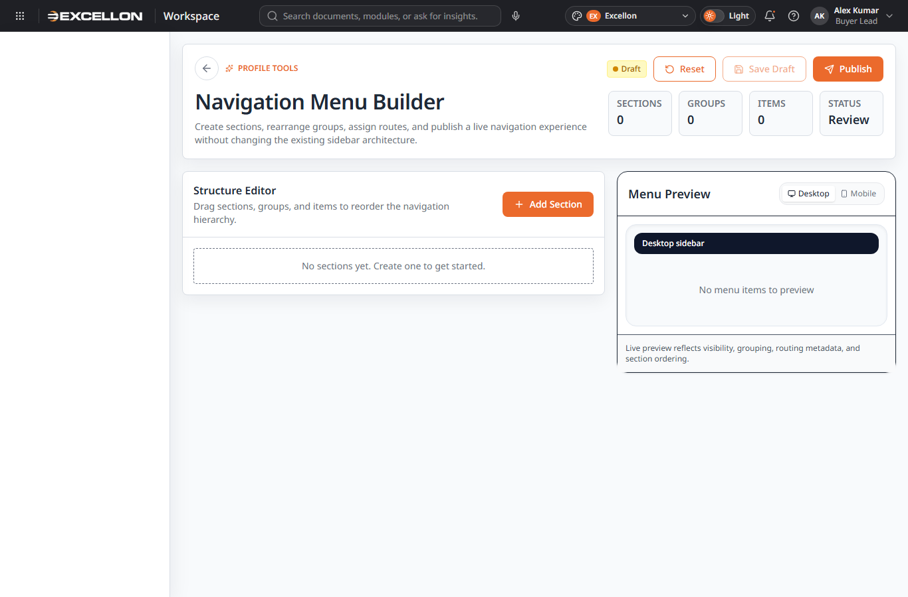
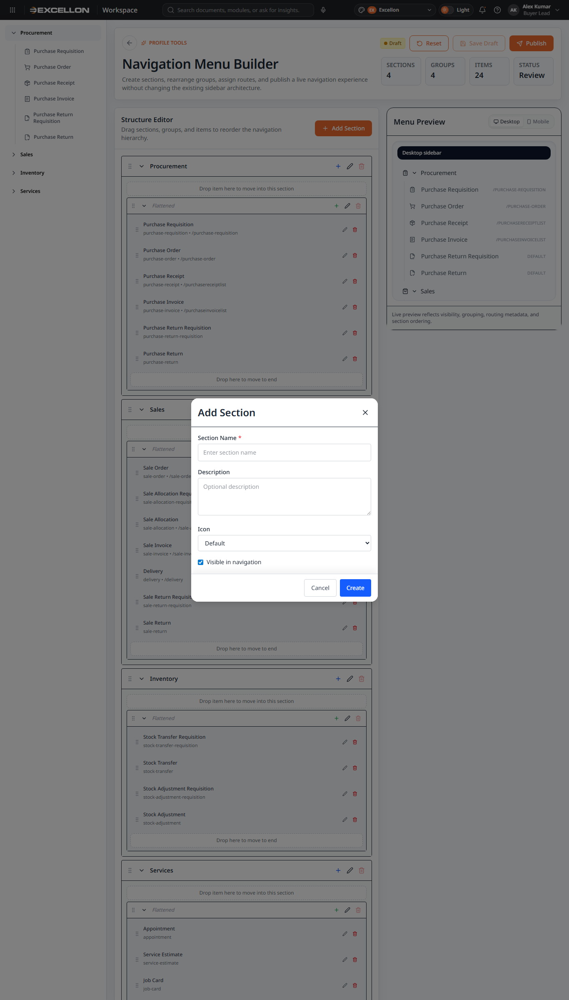
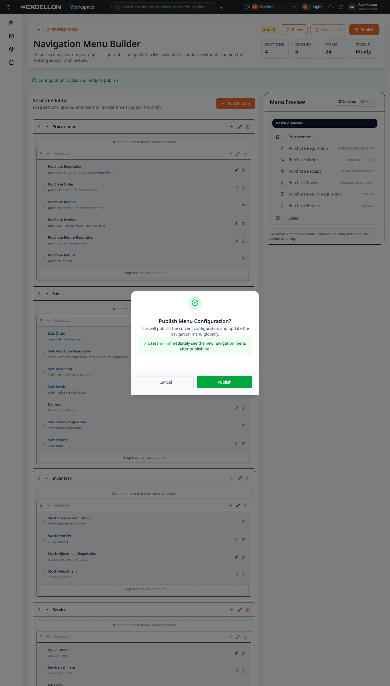
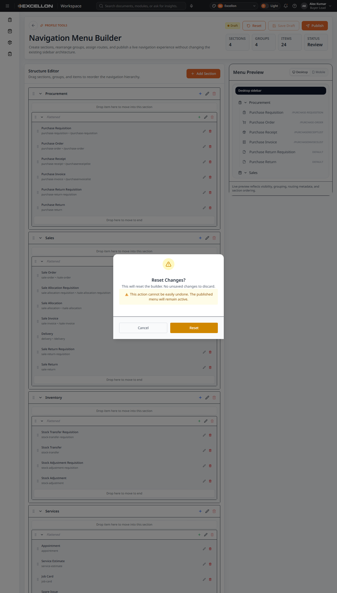
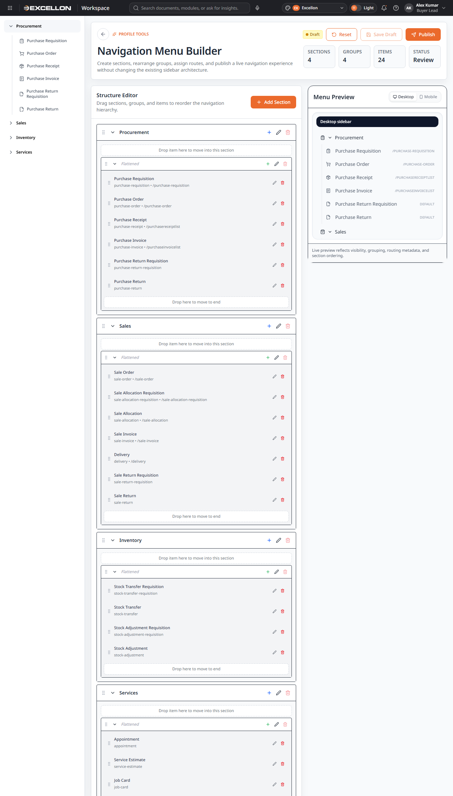
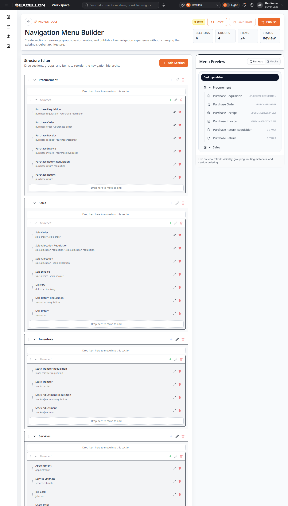
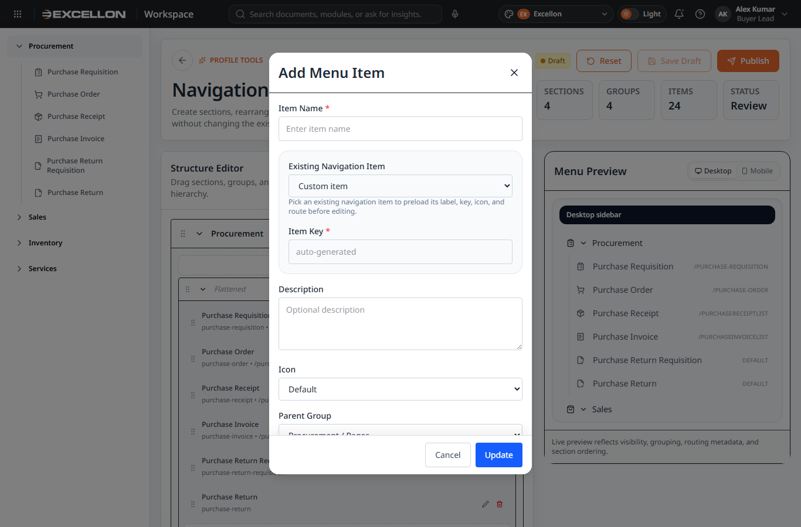

# Menu Builder Documentation

## 1. Purpose
Menu Builder allows a user to manage the application navigation menu without changing the existing sidebar architecture. It supports section creation, group creation, menu item creation, drag-and-drop reordering, validation, draft save, reset, and publish.

## 2. Navigation Path
| Item | Details |
|---|---|
| Route path | `#/profile/menu-builder` |
| Navigation area | Profile Tools |
| Related files | `src/routes/routeConfig.ts`, `src/routes/routeScreens.ts`, `src/routes/profileRoutes.tsx`, `src/pages/profile/MenuBuilder.tsx` |

## 3. Screen Overview
### Main builder page
Purpose: Provides the structure editor, preview panel, status area, actions, and metrics.

### Empty state
Purpose: Shows the builder entry state when structure is empty or being initialized.

### Create / Edit dialogs
Purpose: Create or edit Section, Group, or Menu Item records.

### Live preview
Purpose: Shows the menu outcome in preview format.

### Publish and reset confirmations
Purpose: Confirm high-impact actions before execution.

## 4. Tabs / Sections
Menu Builder does not use tabs in the current UI. It uses layout sections.

### Page sections
- Hero section
- Top action area
- Metrics area
- Validation summary
- Structure Editor panel
- Preview panel
- Form dialog
- Reset confirmation dialog
- Publish confirmation dialog

## 5. Fields
### Section form
| Field | Data Type | Control Type | Validation | Notes |
|---|---|---|---|---|
| Section Name | Text | Input | Required | Error: `Section name is required` |
| Description | Text | Textarea | No explicit validation found | Optional |
| Icon | Text enum | Dropdown | No explicit validation found | Uses internal icon registry |
| Visible in navigation | Boolean | Checkbox | No explicit validation found | Default true |

### Group form
| Field | Data Type | Control Type | Validation | Notes |
|---|---|---|---|---|
| Group Name | Text | Input | Required | Error: `Group name is required` |
| Description | Text | Textarea | No explicit validation found | Optional |
| Parent Section | Lookup | Dropdown | Required | Error: `Select a parent section` |
| Hide label and flatten items | Boolean | Checkbox | No explicit validation found | Group-level display behavior |
| Visible in navigation | Boolean | Checkbox | No explicit validation found | Default true |

### Menu Item form
| Field | Data Type | Control Type | Validation | Notes |
|---|---|---|---|---|
| Existing Navigation Item | Lookup | Dropdown | Optional | Preloads label, key, icon, and route |
| Item Name | Text | Input | Required | Error: `Item name is required` |
| Item Key | Text | Input | Required | Error: `Item key is required` |
| Description | Text | Textarea | No explicit validation found | Optional |
| Icon | Text enum | Dropdown | No explicit validation found | Uses internal icon registry |
| Parent Group | Lookup | Dropdown | Required | Error: `Select a parent group` |
| Route | Text | Input with datalist | Route or External URL required | Error: `Provide a route or an external URL` |
| External URL | URL | Input | Must be valid URL if entered | Error: `Enter a valid external URL` |
| Open in new tab when using external URL | Boolean | Checkbox | No explicit validation found | Used for external links |
| Visible in navigation | Boolean | Checkbox | No explicit validation found | Default true |

## 6. Dropdowns / Lookups
| Field Name | Lookup Source | Lookup Configuration | Notes |
|---|---|---|---|
| Icon | Internal icon registry | Current UI uses `menuBuilderIconRegistry` | Available values come from Lucide icon mapping in project files |
| Parent Section | Current draft sections | Built from current draft menu data | No external lookup used |
| Parent Group | Current draft level-2 groups | Built from current draft menu data | No external lookup used |
| Existing Navigation Item | Current draft navigation items | Built from current draft menu data | Used as preset helper |
| Route suggestions | Existing item routes | Built from current draft/navigation data | Datalist only |

## 7. User Actions
| Action | Location | Result |
|---|---|---|
| Back | Hero | Navigates back |
| Reset | Hero actions | Opens reset confirmation |
| Save Draft | Hero actions | Saves current draft locally |
| Publish | Hero actions | Opens publish confirmation if validation passes |
| Add Section | Structure Editor header | Opens Section create dialog |
| Add Group | Structure tree | Opens Group create dialog for selected section |
| Add Menu Item | Structure tree | Opens Menu Item create dialog for selected group |
| Edit Section / Group / Item | Structure tree | Opens edit dialog |
| Remove Section | Structure tree | Removes empty section only |
| Remove Group | Structure tree | Removes empty group only |
| Remove Item | Structure tree | Removes item |
| Drag and drop | Structure tree | Reorders sections, groups, and items |
| Select node | Structure tree | Sets active selection in builder state |
| Cancel | Dialogs | Closes dialog without saving |
| Create / Update | Form dialog | Saves Section/Group/Item data |

## 8. Validations
| Area | Validation Rule | Error / Warning Message |
|---|---|---|
| Menu configuration | At least one section required | `Menu must have at least one section` |
| Menu configuration | Maximum 20 sections allowed | `Maximum 20 sections allowed` |
| Section | Section name required | `Section name is required` |
| Section | Duplicate section name warning | `Duplicate section name` |
| Section | Section exceeds maximum groups | `Section "<name>" exceeds maximum level2 groups` |
| Group | Group name required | `Level2 group name is required` |
| Group | Duplicate group name warning | `Duplicate group name in section "<section>"` |
| Group | Flattened group with no visible items warning | `Flattened group "<group>" has no visible menu items` |
| Group | Parent section required in form | `Select a parent section` |
| Item | Level 2 exceeds maximum items | `Level2 group "<group>" exceeds maximum items` |
| Item | Item name required | `Item name is required` |
| Item | Item key required | `Item key is required` |
| Item | Duplicate item key | `Duplicate item key "<key>"` |
| Item | Route or external URL required | `Menu item "<label>" needs a route or external URL` or `Provide a route or an external URL` |
| Item | External URL must be valid | `Menu item "<label>" has an invalid external URL` or `Enter a valid external URL` |
| Validation summary | Valid config state | `Configuration is valid and ready to publish` |
| Publish blocker | Invalid config | `Cannot publish: Configuration has errors` / `Fix validation errors before publishing` |

## 9. Persistence and Behavior
- Draft config is stored under `menu-builder:draft-config`.
- Published config is stored under `menu-builder:published-config`.
- Builder state is stored under `menu-builder:state`.
- Menu Builder uses a global provider: `src/theme/MenuBuilderContext.tsx`.
- Publishing dispatches menu update events through the menu builder navigation utility.
- Reset restores the draft from the published configuration.
- Publish marks the published configuration as active and keeps the working draft in draft status.

## 10. Screenshots
| Screenshot | Purpose |
|---|---|
|  | Entry screen |
|  | Main builder page |
|  | Reordering behavior |
|  | Section or group create dialog |
|  | Parent selection behavior |
|  | Menu item form |
|  | Preview panel |
|  | Publish confirmation |
|  | Reset confirmation |
|  | Empty/initial state |

## 11. Related Files
| File Name | Path | Purpose |
|---|---|---|
| MenuBuilder.tsx | `src/pages/profile/MenuBuilder.tsx` | Page wrapper |
| MenuBuilderPage.tsx | `src/components/common/MenuBuilder/MenuBuilderPage.tsx` | Main screen |
| MenuFormDialog.tsx | `src/components/common/MenuBuilder/MenuFormDialog.tsx` | Create/edit dialog |
| MenuConfirmationDialog.tsx | `src/components/common/MenuBuilder/MenuConfirmationDialog.tsx` | Reset and publish confirmations |
| MenuPreview.tsx | `src/components/common/MenuBuilder/MenuPreview.tsx` | Live preview panel |
| MenuTree.tsx | `src/components/common/MenuBuilder/MenuTree.tsx` | Structure editor tree |
| MenuStatusBadge.tsx | `src/components/common/MenuBuilder/MenuStatusBadge.tsx` | Draft/published badge |
| MenuValidationSummary.tsx | `src/components/common/MenuBuilder/MenuValidationSummary.tsx` | Validation summary |
| MenuBuilderContext.tsx | `src/theme/MenuBuilderContext.tsx` | Global builder state and persistence |
| menuBuilderTypes.ts | `src/utils/menuBuilderTypes.ts` | Data model and constants |
| menuBuilderUtils.ts | `src/utils/menuBuilderUtils.ts` | Operations, validation, and move logic |
| menuBuilderNavigation.ts | `src/utils/menuBuilderNavigation.ts` | Canonical route mapping, icon mapping, publish notifications |
| appShellShared.ts | `src/components/common/appShellShared.ts` | Canonical sidebar structure referenced by builder |
| routeConfig.ts | `src/routes/routeConfig.ts` | Builder route path |
| routeScreens.ts | `src/routes/routeScreens.ts` | Lazy-loaded screen registration |
| profileRoutes.tsx | `src/routes/profileRoutes.tsx` | Route wiring |

## 12. Missing Information
| Area | Missing Information | Recommended Action |
|---|---|---|
| User permissions | Admin-only restriction is not clearly enforced in reviewed files | Confirm access rules with project team |
| Backend integration | No backend API found for menu persistence | Confirm whether local storage is final or temporary |
| Publish governance | No approval/governance flow found | Confirm whether menu publish needs review workflow |
| Production deployment behavior | No server-side persistence or environment sync found in reviewed files | Confirm deployment expectations with project team |

## 13. Final Checklist
| Checklist Item | Status | Notes |
|---|---|---|
| Purpose documented | Done |  |
| Navigation path documented | Done |  |
| Screen overview documented | Done |  |
| Sections documented | Done |  |
| Fields documented | Done |  |
| Dropdowns/lookups documented | Done |  |
| User actions documented | Done |  |
| Validations documented | Done |  |
| Screenshots added | Done | Real screenshots copied from repository |
| Related files listed | Done |  |
| Missing information flagged | Done |  |
