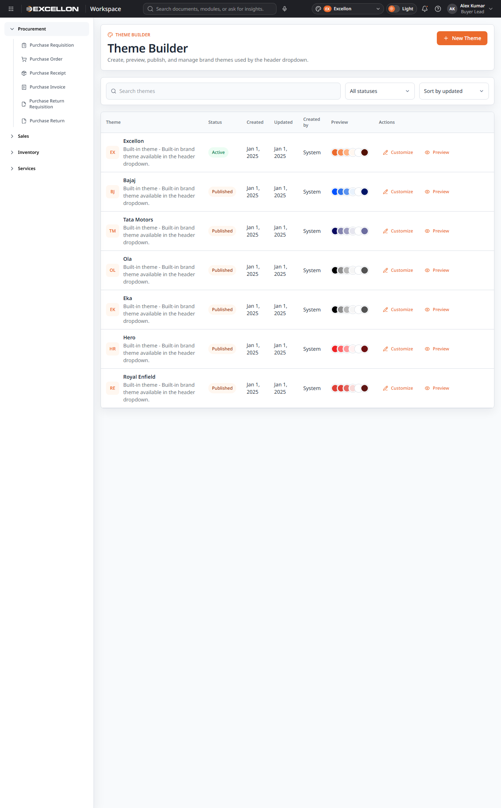
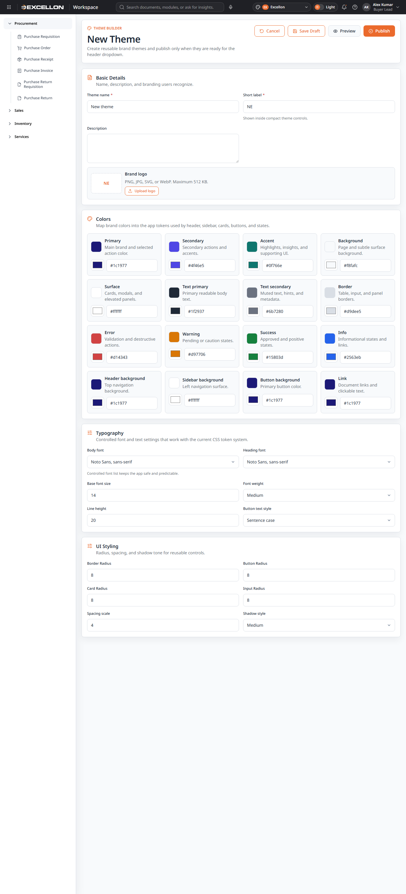
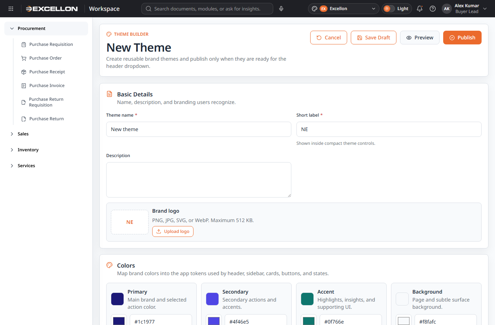
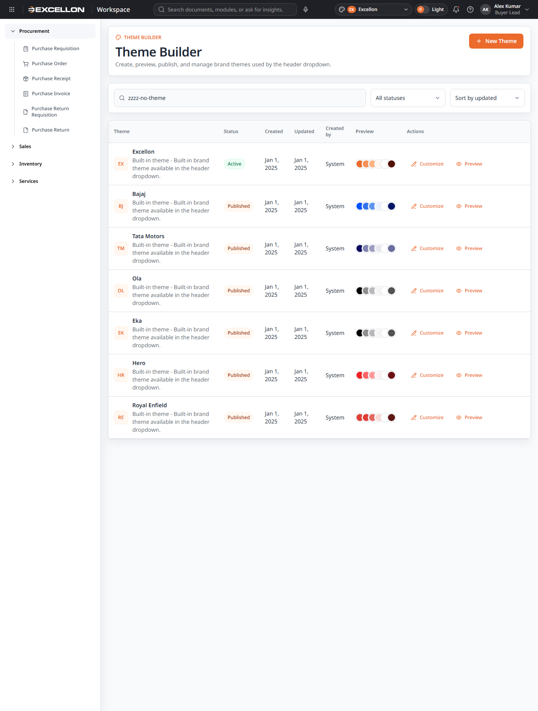
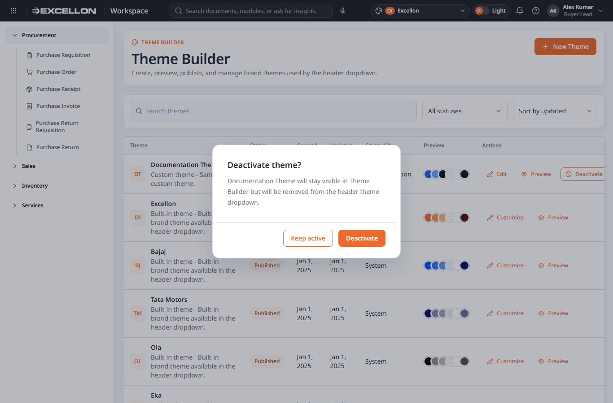
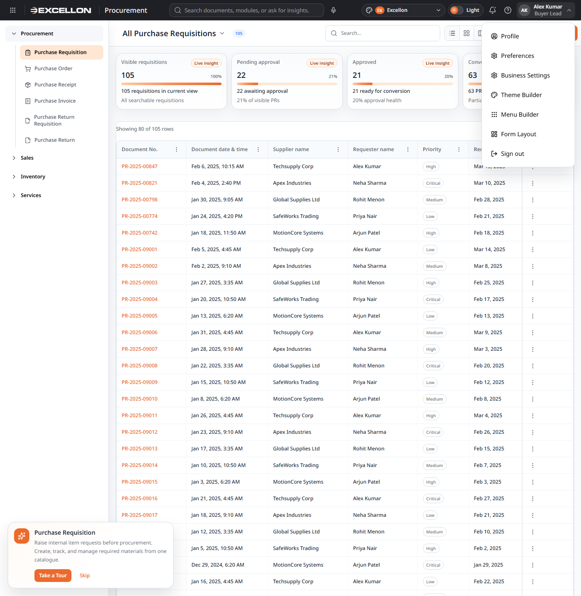

# Theme Builder Documentation

## 1. Purpose
Theme Builder allows a user to create, preview, publish, deactivate, reactivate, and manage reusable application themes that appear in the header theme dropdown. It is designed for brand-level UI setup rather than transaction entry.

## 2. Navigation Path
| Item | Details |
|---|---|
| Route path | `#/profile/theme-builder` |
| Navigation area | Profile Tools |
| Related files | `src/routes/routeConfig.ts`, `src/routes/routeScreens.ts`, `src/routes/profileRoutes.tsx`, `src/pages/profile/ThemeBuilder.tsx` |

## 3. Screen Overview
### List view
Purpose: Shows available themes with status, preview swatches, search, filters, sort, and actions.

### Create / Edit form
Purpose: Allows a user to create a new theme or edit/customize an existing theme.

### Preview overlay
Purpose: Displays a live sample of header, sidebar, cards, text, inputs, and buttons without changing the active app theme.

### Empty state
Purpose: Guides the user when no themes match the current search/filter result.

### Deactivate confirmation
Purpose: Confirms that a theme will be hidden from the header dropdown.

## 4. Tabs / Sections
Theme Builder does not use tabs in the current UI. It uses form sections.

### List page sections
- Hero section
- Search and filter toolbar
- Theme table
- Empty or loading state

### Form page sections
- Basic Details
- Colors
- Typography
- UI Styling
- Preview overlay

## 5. Fields
| Section | Field Name | Data Type | Control Type | Validation | Notes |
|---|---|---|---|---|---|
| Basic Details | Theme name | Text | Input | Required; must be unique | Error: `Theme name is required.` / `Theme name must be unique.` |
| Basic Details | Short label | Text | Input | Required before publish | Max length 4; error: `Short label is required before publishing.` |
| Basic Details | Description | Text | Textarea | No explicit validation found | Optional |
| Basic Details | Brand logo | File / image | Upload control | File type and size validation | PNG/JPG/SVG/WebP only, max 512 KB |
| Colors | Primary | HEX color | Color picker + input | Must be valid HEX | Error: `Use a valid HEX color.` |
| Colors | Secondary | HEX color | Color picker + input | Must be valid HEX |  |
| Colors | Accent | HEX color | Color picker + input | Must be valid HEX |  |
| Colors | Background | HEX color | Color picker + input | Must be valid HEX |  |
| Colors | Surface | HEX color | Color picker + input | Must be valid HEX |  |
| Colors | Text primary | HEX color | Color picker + input | Must be valid HEX |  |
| Colors | Text secondary | HEX color | Color picker + input | Must be valid HEX |  |
| Colors | Border | HEX color | Color picker + input | Must be valid HEX |  |
| Colors | Error | HEX color | Color picker + input | Must be valid HEX |  |
| Colors | Warning | HEX color | Color picker + input | Must be valid HEX |  |
| Colors | Success | HEX color | Color picker + input | Must be valid HEX |  |
| Colors | Info | HEX color | Color picker + input | Must be valid HEX |  |
| Colors | Header background | HEX color | Color picker + input | Must be valid HEX |  |
| Colors | Sidebar background | HEX color | Color picker + input | Must be valid HEX |  |
| Colors | Button background | HEX color | Color picker + input | Must be valid HEX |  |
| Colors | Link | HEX color | Color picker + input | Must be valid HEX |  |
| Typography | Body font | Text enum | Dropdown | Controlled font list only | Font source is internal allowed list |
| Typography | Heading font | Text enum | Dropdown | Controlled font list only |  |
| Typography | Base font size | Number | Number input | Range enforced in sanitization | 12 to 18 |
| Typography | Font weight | Number enum | Dropdown | Controlled list only | Regular, Medium, Semibold, Bold |
| Typography | Line height | Number | Number input | Range enforced in sanitization | 16 to 28 |
| Typography | Button text style | Enum | Dropdown | Controlled list only | Sentence case or Uppercase |
| UI Styling | Border Radius | Number | Number input | Range enforced in sanitization | 0 to 24 |
| UI Styling | Button Radius | Number | Number input | Range enforced in sanitization | 0 to 24 |
| UI Styling | Card Radius | Number | Number input | Range enforced in sanitization | 0 to 24 |
| UI Styling | Input Radius | Number | Number input | Range enforced in sanitization | 0 to 24 |
| UI Styling | Spacing Scale | Number | Number input | Range enforced in sanitization | 2 to 8 |
| UI Styling | Shadow Style | Enum | Dropdown | Controlled list only | Soft, Medium, Strong |

## 6. Dropdowns / Lookups
| Field Name | Lookup Source | Lookup Configuration | Visible Values | Notes |
|---|---|---|---|---|
| Body font | Internal allowed font list | Current UI uses internal configuration | `"Noto Sans", sans-serif`, `Arial, sans-serif`, `Inter, "Noto Sans", sans-serif`, `Georgia, serif`, `Verdana, sans-serif` | Controlled list |
| Heading font | Internal allowed font list | Current UI uses internal configuration | Same as Body font | Controlled list |
| Font weight | Static current UI options | Internal configuration | Regular, Medium, Semibold, Bold |  |
| Button text style | Static current UI options | Internal configuration | Sentence case, Uppercase |  |
| Shadow style | Static current UI options | Internal configuration | Soft, Medium, Strong |  |
| Status filter | Static current UI options | Internal configuration | All statuses, Active, Draft, Published, Inactive | List screen |
| Sort | Static current UI options | Internal configuration | Sort by updated, Sort by created | List screen |

## 7. User Actions
| Action | Location | Result |
|---|---|---|
| New Theme | List hero | Opens create form |
| Search themes | List toolbar | Filters themes by theme name |
| Status filter | List toolbar | Filters by All, Active, Draft, Published, Inactive |
| Sort | List toolbar | Sorts by updated or created date |
| Customize / Edit | Action column | Opens form using selected theme data |
| Preview | Action column and form | Opens preview overlay |
| Publish | Action column or form | Publishes theme if validation passes |
| Deactivate | Action column | Opens deactivate confirmation |
| Reactivate | Action column | Returns inactive theme to published state |
| Cancel | Form hero | Returns to list mode |
| Save Draft | Form hero | Saves theme locally as draft |
| Expand / Compact | Preview overlay | Changes preview size only |
| Close | Preview overlay | Closes preview |

## 8. Validations
| Area | Validation Rule | Error Message |
|---|---|---|
| Theme name | Required | Theme name is required. |
| Theme name | Must be unique | Theme name must be unique. |
| Short label | Required before publish | Short label is required before publishing. |
| Each color field | Must be valid HEX color | Use a valid HEX color. |
| Logo upload | File type must be PNG/JPG/SVG/WebP | Logo must be a PNG, JPG, SVG, or WebP file. |
| Logo upload | File size must be 512 KB or smaller | Logo file must be 512 KB or smaller. |

## 9. Persistence and Behavior
- Custom themes are stored in local storage under `theme-builder-themes:v1`.
- The page dispatches an update event named `theme-builder-themes-updated`.
- Built-in themes are loaded from `src/theme/themeRegistry.ts`.
- Only published themes are intended to appear in the header dropdown.
- Deactivated themes remain visible in Theme Builder but are not meant to appear in the header dropdown.

## 10. Screenshots
| Screenshot | Purpose |
|---|---|
|  | Entry point reference |
|  | Main list view |
|  | Create/edit form |
|  | Basic details section |
|  | Color editing section |
|  | Typography section |
|  | UI styling section |
|  | Preview overlay |
|  | Empty state |
|  | Deactivate confirmation |

## 11. Related Files
| File Name | Path | Purpose |
|---|---|---|
| ThemeBuilder.tsx | `src/pages/profile/ThemeBuilder.tsx` | Main Theme Builder page |
| customThemeBuilder.ts | `src/theme/customThemeBuilder.ts` | Theme draft creation, validation, sanitization, and storage |
| themeRegistry.ts | `src/theme/themeRegistry.ts` | Built-in themes and theme keys |
| useTheme.ts | `src/theme/useTheme.ts` | Active theme hook |
| AppTopHeader.tsx | `src/components/common/AppTopHeader.tsx` | Header theme dropdown consumer |
| routeConfig.ts | `src/routes/routeConfig.ts` | Theme Builder route |
| routeScreens.ts | `src/routes/routeScreens.ts` | Lazy-loaded page registration |
| profileRoutes.tsx | `src/routes/profileRoutes.tsx` | Profile route wiring |

## 12. Missing Information
| Area | Missing Information | Recommended Action |
|---|---|---|
| User permissions | Admin-only restriction is not clearly enforced in reviewed files | Confirm access rules with project team |
| Backend integration | No backend API found for theme persistence | Confirm whether front-end local storage is final or temporary |
| Theme publish approvals | No approval workflow found | Confirm whether publishing needs governance |

## 13. Final Checklist
| Checklist Item | Status | Notes |
|---|---|---|
| Purpose documented | Done |  |
| Navigation path documented | Done |  |
| Screen overview documented | Done |  |
| Sections documented | Done |  |
| Fields documented | Done |  |
| Dropdowns/lookups documented | Done |  |
| User actions documented | Done |  |
| Validations documented | Done |  |
| Screenshots added | Done | Real screenshots copied from repository |
| Related files listed | Done |  |
| Missing information flagged | Done |  |
