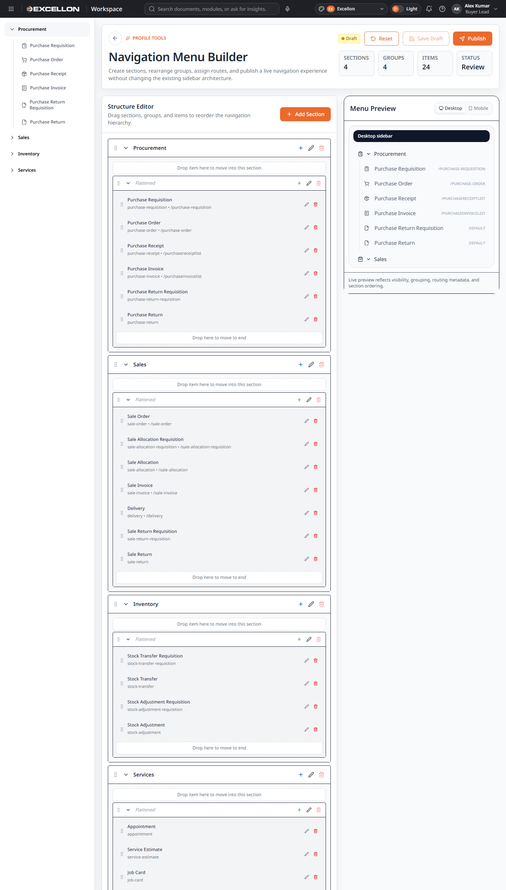
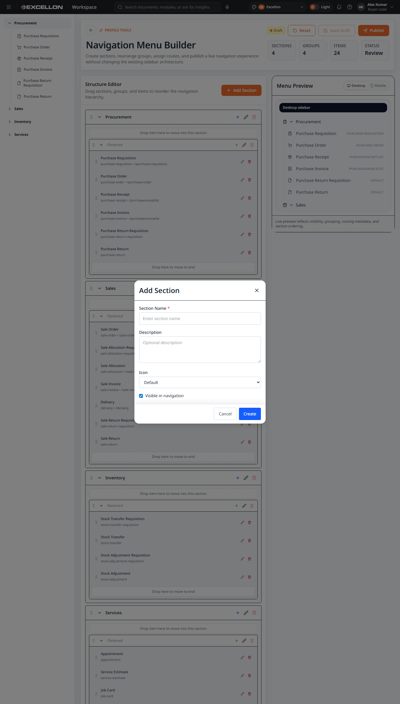
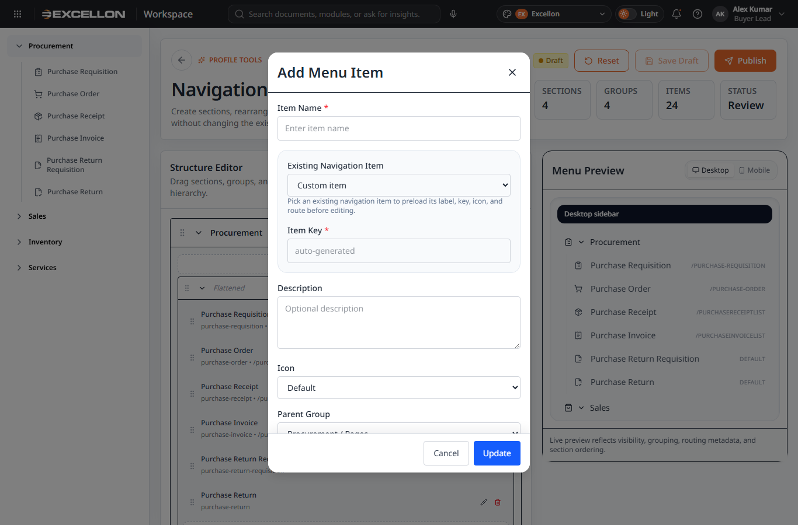
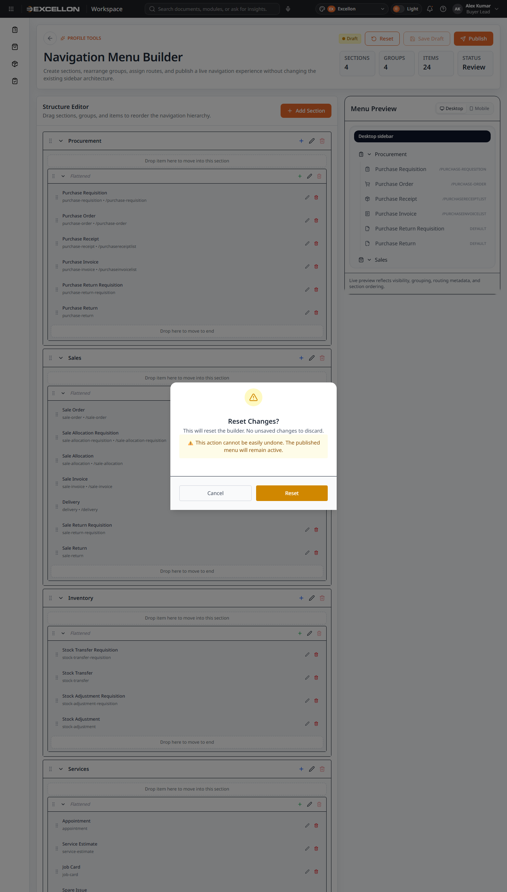
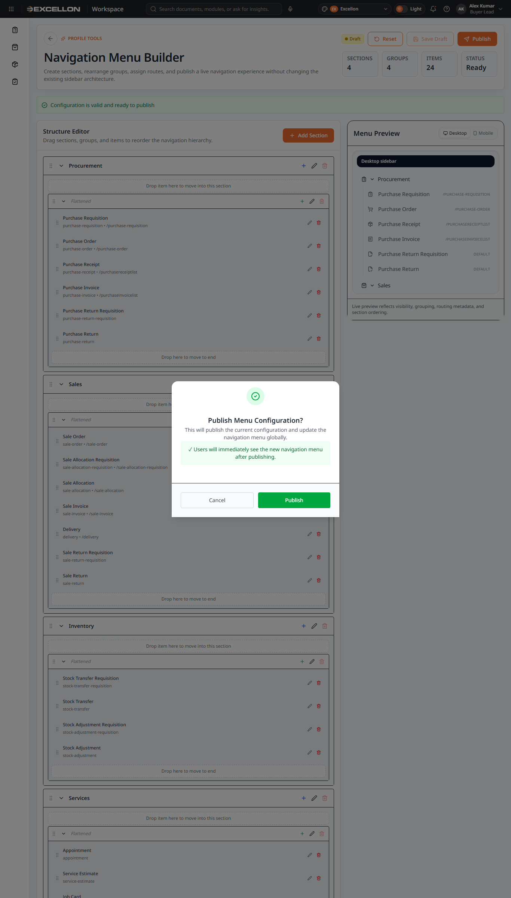
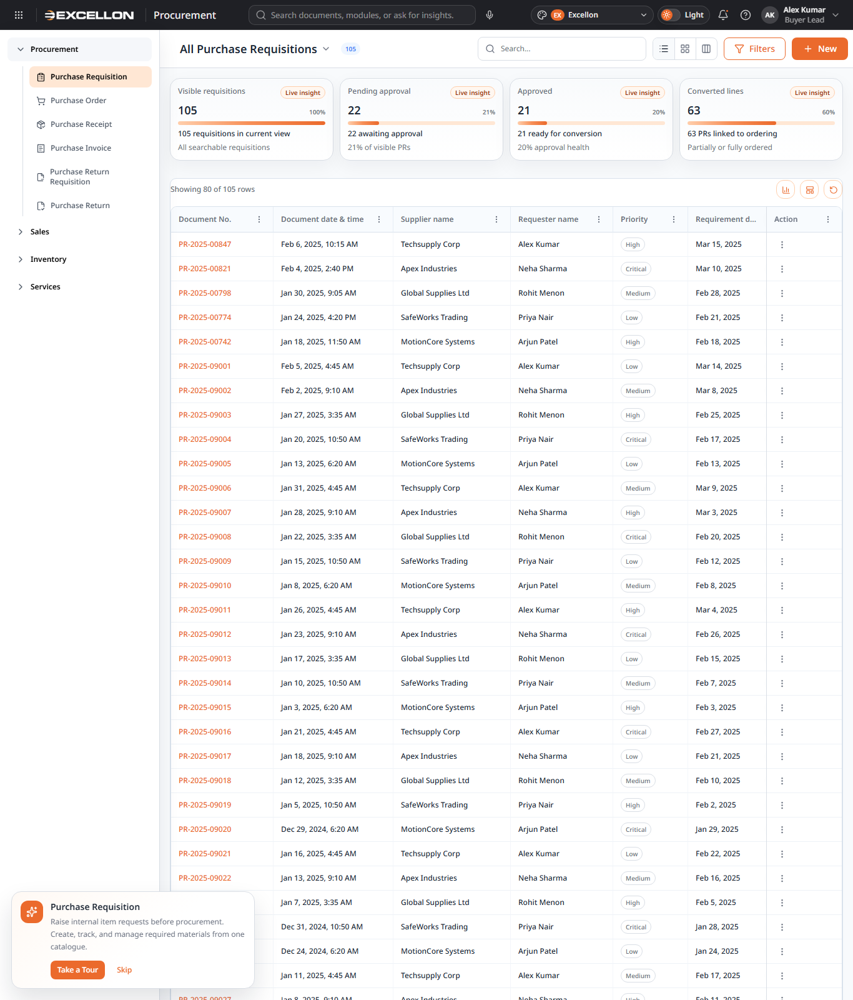
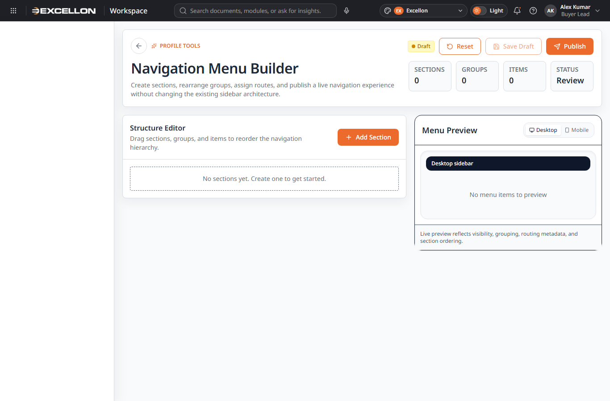

# Menu Builder Documentation

## Title Page

| Item | Details |
|---|---|
| Project name | my-react-app / iDMS UI |
| Document name | Menu Builder Documentation |
| Version | 0.1 |
| Date | April 29, 2026 |
| Status | Draft |

## Table of Contents

1. [Purpose](#purpose)
2. [Audience](#audience)
3. [User Journey](#user-journey)
4. [Menu Builder Screens and Components](#menu-builder-screens-and-components)
5. [Menu Level Explanation](#menu-level-explanation)
6. [Parent Level Selection](#parent-level-selection)
7. [Drag-and-Drop Behavior](#drag-and-drop-behavior)
8. [Live Preview](#live-preview)
9. [Reset, Draft, and Publish](#reset-draft-and-publish)
10. [Menu Form Layout](#menu-form-layout)
11. [Business Rules](#business-rules)
12. [Error, Empty, Loading, and Validation States](#error-empty-loading-and-validation-states)
13. [Related Files Summary](#related-files-summary)
14. [Screenshot Inventory](#screenshot-inventory)
15. [Final Critical Review Checklist](#final-critical-review-checklist)
16. [Missing Information / Needs Confirmation](#missing-information--needs-confirmation)

## Purpose

Menu Builder helps users manage the application navigation. Users can create sections, create groups, manage menu items, move items between levels, preview the menu, reset changes, save a draft, and publish the menu. Published menu changes update the real sidebar navigation.

Draft changes stay inside Menu Builder until the user publishes them.

## Audience

This document is written for business users, product owners, QA testers, support teams, implementation teams, and project stakeholders.

## User Journey

1. User opens Menu Builder from Profile Tools or the route `#/profile/menu-builder`.
2. User reviews the current navigation structure.
3. User creates menu sections.
4. User enters a section or group name.
5. User selects a parent level when creating or editing a group or item.
6. User creates or edits menu items.
7. User moves menu items between levels.
8. User uses drag-and-drop to reorder sections, groups, and menu items.
9. User checks the live preview.
10. User resets changes if needed.
11. User saves draft.
12. User publishes the menu.
13. The navigation bar/sidebar updates after publish.

## Menu Builder Screens and Components

## Menu Builder Entry Point

**Purpose:**  
Gives users a way to open the Menu Builder feature.

**What the user sees:**  
The top header profile menu contains a **Menu Builder** option. The screen can also be opened by route.

**What the user can do:**  
Open Menu Builder and return to the normal workspace.

**Behavior:**  
The route loads Menu Builder inside the standard application shell.

**Screenshot:**  

**Related Files:**  
- `src/components/common/AppTopHeader.tsx`
- `src/routes/routeConfig.ts`
- `src/routes/profileRoutes.tsx`
- `src/routes/routeScreens.ts`
- `src/pages/profile/MenuBuilder.tsx`

## Menu Builder Main Screen

**Purpose:**  
Shows the full navigation configuration workspace.

**What the user sees:**  
The page header, draft/published status, Reset, Save Draft, Publish buttons, summary metrics, Structure Editor, and Menu Preview.

**What the user can do:**  
Add sections, edit navigation structure, drag and drop entries, preview the menu, save draft, reset, or publish.

**Behavior:**  
Draft changes affect the builder preview only. Published changes update the real navigation.

**Screenshot:**  

**Related Files:**  
- `src/components/common/MenuBuilder/MenuBuilderPage.tsx`
- `src/pages/profile/MenuBuilder.tsx`
- `src/theme/MenuBuilderContext.tsx`

## Menu Level Management

**Purpose:**  
Lets users organize navigation into clear levels.

**What the user sees:**  
A Structure Editor containing sections, groups, and menu items. Each row includes controls for adding, editing, deleting, expanding, and dragging.

**What the user can do:**  
Create, edit, reorder, expand, collapse, and remove safe items.

**Behavior:**  
Sections can hold groups. Groups can hold menu items. Deletion is blocked for non-empty sections and groups to prevent accidental bulk removal.

**Screenshot:**  

**Related Files:**  
- `src/components/common/MenuBuilder/MenuBuilderPage.tsx`
- `src/components/common/MenuBuilder/MenuTree.tsx`
- `src/theme/MenuBuilderContext.tsx`

## Create Level Form

**Purpose:**  
Allows users to create a new navigation section or group.

**What the user sees:**  
A modal form with name, description, icon, visibility, and action buttons.

**What the user can do:**  
Enter details and create the new level.

**Behavior:**  
The section name is required. Similar validation is used for groups.

**Screenshot:**  

**Related Files:**  
- `src/components/common/MenuBuilder/MenuFormDialog.tsx`
- `src/components/common/MenuBuilder/MenuBuilderPage.tsx`

## Parent Level Selector

**Purpose:**  
Lets users choose where a group or item belongs.

**What the user sees:**  
Parent dropdown fields such as Parent Section or Parent Group depending on what is being edited.

**What the user can do:**  
Select the parent location for the menu item or group.

**Behavior:**  
Parent selection controls where the item appears in the structure and preview.

**Screenshot:**  

**Related Files:**  
- `src/components/common/MenuBuilder/MenuFormDialog.tsx`
- `src/components/common/MenuBuilder/MenuBuilderPage.tsx`

## Menu Item Form

**Purpose:**  
Lets users create or update a clickable navigation item.

**What the user sees:**  
Fields for existing navigation preset, item key, description, icon, parent group, route, external URL, open in new tab, and visibility.

**What the user can do:**  
Create a custom item or preload details from an existing navigation item.

**Behavior:**  
Menu item name/key and route or external URL are required for valid publish behavior.

**Screenshot:**  

**Related Files:**  
- `src/components/common/MenuBuilder/MenuFormDialog.tsx`
- `src/utils/menuBuilderNavigation.ts`

## Menu Tree/List

**Purpose:**  
Shows the editable navigation hierarchy.

**What the user sees:**  
Section rows, group rows, menu item rows, drag handles, add icons, edit icons, delete icons, and drop zones.

**What the user can do:**  
Select a node, expand or collapse sections and groups, edit entries, remove safe entries, and drag items.

**Behavior:**  
Selecting and editing updates the draft structure. Drop zones show where content can be moved.

**Screenshot:**  

**Related Files:**  
- `src/components/common/MenuBuilder/MenuTree.tsx`

## Drag-and-Drop Area

**Purpose:**  
Lets users rearrange the menu visually.

**What the user sees:**  
Drag handles beside sections, groups, and menu items.

**What the user can do:**  
Move sections, move groups within or between sections, and move menu items within or between groups. Moving an item to a section uses the first available group inside that section.

**Behavior:**  
The underlying draft menu order changes immediately and the preview updates from the draft.

**Screenshot:**  

**Related Files:**  
- `src/components/common/MenuBuilder/MenuTree.tsx`
- `src/components/common/MenuBuilder/MenuBuilderPage.tsx`
- `src/theme/MenuBuilderContext.tsx`

## Live Menu Preview

**Purpose:**  
Shows how the navigation will look after publish.

**What the user sees:**  
A desktop sidebar preview with sections, icons, labels, and route labels. A mobile preview toggle is also visible.

**What the user can do:**  
Review the menu structure before publishing.

**Behavior:**  
The preview reflects the draft structure, not necessarily the current live navigation.

**Screenshot:**  

**Related Files:**  
- `src/components/common/MenuBuilder/MenuPreview.tsx`

## Reset Action and Dialog

**Purpose:**  
Lets users discard builder changes and return to the published version.

**What the user sees:**  
A **Reset** button and a confirmation dialog titled **Reset Changes?**

**What the user can do:**  
Cancel or confirm reset.

**Behavior:**  
Reset affects the builder draft only. The published live navigation remains active.

**Screenshot:**  

**Related Files:**  
- `src/components/common/MenuBuilder/MenuConfirmationDialog.tsx`
- `src/components/common/MenuBuilder/MenuBuilderPage.tsx`

## Save as Draft Action

**Purpose:**  
Saves work without changing the live navigation.

**What the user sees:**  
A **Save Draft** button in the page header.

**What the user can do:**  
Save the current draft configuration.

**Behavior:**  
Draft is saved locally. It does not update the live sidebar until Publish is clicked.

**Screenshot:**  

**Related Files:**  
- `src/components/common/MenuBuilder/MenuBuilderPage.tsx`
- `src/theme/MenuBuilderContext.tsx`

## Publish Action and Dialog

**Purpose:**  
Makes the current draft the live navigation configuration.

**What the user sees:**  
A **Publish** button and a confirmation dialog titled **Publish Menu Configuration?**

**What the user can do:**  
Confirm publish or cancel.

**Behavior:**  
Publish validates the draft first. If valid, it becomes the published configuration and the live navigation updates.

**Screenshot:**  

**Related Files:**  
- `src/components/common/MenuBuilder/MenuConfirmationDialog.tsx`
- `src/components/common/MenuBuilder/MenuBuilderPage.tsx`
- `src/theme/MenuBuilderContext.tsx`
- `src/hooks/usePublishedMenu.ts`

## Updated Navigation Bar

**Purpose:**  
Shows users the navigation produced by the published menu configuration.

**What the user sees:**  
The normal application sidebar/navigation.

**What the user can do:**  
Use navigation normally after publish.

**Behavior:**  
Only the published configuration is used by the real navigation. If no published configuration exists, the application falls back to its default navigation.

**Screenshot:**  

**Related Files:**  
- `src/components/common/AppSidebar.tsx`
- `src/hooks/usePublishedMenu.ts`
- `src/utils/menuBuilderNavigation.ts`

## Empty State

**Purpose:**  
Explains what happens when no sections exist.

**What the user sees:**  
The structure area displays **No sections yet. Create one to get started.**

**What the user can do:**  
Create a section.

**Behavior:**  
The empty state disappears once a section exists.

**Screenshot:**  

**Related Files:**  
- `src/components/common/MenuBuilder/MenuTree.tsx`

## Loading State

**Purpose:**  
Indicates that the menu builder is loading its configuration.

**What the user sees:**  
A centered spinner and loading text area.

**What the user can do:**  
Wait for the builder to load.

**Behavior:**  
The builder shows the main screen after configuration is available.

**Screenshot:**  
[Screenshot missing: Menu Builder Loading State - Needs confirmation from project team.]

**Related Files:**  
- `src/components/common/MenuBuilder/MenuBuilderPage.tsx`

## Error State

**Purpose:**  
Explains what happens if menu configuration fails.

**What the user sees:**  
Needs confirmation from project team.

**What the user can do:**  
Needs confirmation from project team.

**Behavior:**  
Needs confirmation from project team.

**Screenshot:**  
[Screenshot missing: Menu Builder Error State - Needs confirmation from project team.]

**Related Files:**  
- `src/components/common/MenuBuilder/MenuBuilderPage.tsx`

## Validation Messages

**Purpose:**  
Helps users correct invalid navigation configuration before publishing.

**What the user sees:**  
Messages such as section name required, item key required, route or external URL required, and fix validation errors before publishing.

**What the user can do:**  
Correct missing or invalid details.

**Behavior:**  
Invalid configuration blocks publishing.

**Screenshot:**  
[Screenshot missing: Menu Builder Validation State - Needs confirmation from project team.]

**Related Files:**  
- `src/components/common/MenuBuilder/MenuValidationSummary.tsx`
- `src/utils/menuBuilderUtils.ts`

## Menu Level Explanation

Menu Builder uses three practical levels:

| Level | Simple Meaning | Example |
|---|---|---|
| Section | A root-level menu area. | Procurement |
| Group | A child level inside a section. | Pages |
| Menu item | A clickable navigation link inside a group. | Purchase Requisition |

A root level is a top-level section with no parent section above it. A child level sits inside another level. A parent level is the place where a group or item belongs.

Example: A root level may be **Settings**. A child group under it may be **User Management**. A menu item inside that group may be **Roles**.

## Parent Level Selection

When creating or editing groups and menu items, the user selects where the entry belongs. A group belongs to a section. A menu item belongs to a group. Parent selection determines the final hierarchy shown in the Structure Editor and Menu Preview.

The code uses controlled parent fields. The exact visible wording for **No Parent** was not confirmed in the captured UI and needs confirmation from project team.

## Drag-and-Drop Behavior

Users can drag sections, groups, and items by their drag handles.

| Movement | Behavior |
|---|---|
| Section to section position | Reorders sections. |
| Group within same section | Reorders groups. |
| Group to another section | Moves the group to the target section. |
| Item within same group | Reorders items. |
| Item to another group | Moves the item to the target group. |
| Item to a section | Moves the item into the first group in that section when available. If no group exists, the user is asked to add a group first. |

Preview updates from the draft configuration after movement.

## Live Preview

Live Preview shows the menu as a sidebar-like structure so users can understand what will change after publish. The preview displays the draft, including visibility, grouping, labels, icons, and route metadata. It does not update the real navigation until the user publishes.

## Reset, Draft, and Publish

| Action | What It Does | Affects Live Navigation? | User Result |
|---|---|---|---|
| Reset | Reverts the builder draft to the published version. | No | Draft changes are discarded. |
| Save as Draft | Saves the current builder work locally. | No | User can return later and continue editing. |
| Publish | Validates and publishes the current draft. | Yes | Users see the new navigation menu. |
| Preview | Shows how the draft navigation looks. | No | User can review before publishing. |

## Menu Form Layout

Menu Builder places primary actions in the header: Reset, Save Draft, and Publish. The main body has the Structure Editor on the left and Menu Preview on the right. The editor uses sections, groups, and items so users can understand the menu hierarchy without reading technical routing details.

Forms open as centered dialogs. Required fields are marked with an asterisk. Parent fields appear when the selected item needs a parent. The preview remains visible behind dialogs so users keep context while editing.

**Screenshots:**  

## Business Rules

| Rule | Explanation |
|---|---|
| Draft menu does not update live navigation. | Draft changes are safe until published. |
| Published menu updates live navigation. | Publish makes the draft active. |
| Reset affects builder changes only unless published. | Reset does not change the live navigation by itself. |
| Preview does not update live navigation. | Preview is for review only. |
| Menu items can move between levels. | Drag-and-drop and parent selection can move entries. |
| Invalid parent-child relationships should not be allowed. | The builder protects structure integrity through controlled levels and validation. |
| Existing navigation behavior must remain unaffected. | If there is no published custom menu, the default navigation remains available. |
| Non-empty containers are protected from deletion. | Users must move or remove child content before deleting sections or groups. |

## Error, Empty, Loading, and Validation States

| Area | Message/State | Meaning for User | User Action |
|---|---|---|---|
| Empty structure | No sections yet. Create one to get started. | No menu sections exist in the builder. | Create a section. |
| Section form | Section Name required | A section needs a name. | Enter a section name. |
| Item form | Item key required | A menu item needs a stable key. | Enter or select an item key. |
| Item form | Provide route or external URL | A menu item needs a destination. | Enter a route or external URL. |
| External URL | Enter valid external URL | The URL is not valid. | Correct the URL. |
| Publish | Fix validation errors before publishing | The draft is not ready to publish. | Correct validation issues. |
| Save draft | Draft saved locally / Draft saved locally with validation issues | Draft was saved. | Continue editing or publish after fixes. |
| Loading | Loading spinner | Builder is loading configuration. | Wait. |
| Error | Needs confirmation from project team. | Needs confirmation from project team. | Needs confirmation from project team. |

## Related Files Summary

| Feature/Component | Related File Name | Purpose |
|---|---|---|
| Menu Builder route wrapper | `src/pages/profile/MenuBuilder.tsx` | Wraps the common Menu Builder page for routing. |
| Main Menu Builder page | `src/components/common/MenuBuilder/MenuBuilderPage.tsx` | Main screen, toolbar, metrics, editor, preview, and actions. |
| Menu form dialog | `src/components/common/MenuBuilder/MenuFormDialog.tsx` | Create/edit dialogs for sections, groups, and items. |
| Structure editor tree | `src/components/common/MenuBuilder/MenuTree.tsx` | Shows editable hierarchy and drag/drop rows. |
| Menu preview | `src/components/common/MenuBuilder/MenuPreview.tsx` | Shows draft menu preview. |
| Confirmation dialogs | `src/components/common/MenuBuilder/MenuConfirmationDialog.tsx` | Reset and publish confirmation dialogs. |
| Status badge | `src/components/common/MenuBuilder/MenuStatusBadge.tsx` | Shows draft or published status. |
| Validation summary | `src/components/common/MenuBuilder/MenuValidationSummary.tsx` | Shows validation feedback. |
| Menu Builder exports | `src/components/common/MenuBuilder/index.ts` | Exports Menu Builder components. |
| Menu state provider | `src/theme/MenuBuilderContext.tsx` | Stores draft/published menu state and actions. |
| Published menu hook | `src/hooks/usePublishedMenu.ts` | Supplies published menu to the live sidebar. |
| Navigation helpers | `src/utils/menuBuilderNavigation.ts` | Icon registry, default routes, and update notifications. |
| Menu types | `src/utils/menuBuilderTypes.ts` | Menu configuration data shape and storage keys. |
| Menu utilities | `src/utils/menuBuilderUtils.ts` | Validation, lookup, reorder, and movement helpers. |
| Menu utility tests | `src/utils/menuBuilderUtils.test.ts` | Existing test coverage for menu helper behavior. |
| Menu initialization | `src/utils/menuInitialization.ts` | Initializes default menu data. |
| Live sidebar | `src/components/common/AppSidebar.tsx` | Reads published navigation for the application sidebar. |
| App setup | `src/main.tsx` | Initializes menu builder and provides state to the app. |
| Route configuration | `src/routes/routeConfig.ts` | Stores the Menu Builder route. |
| Profile routes | `src/routes/profileRoutes.tsx` | Connects the route to Menu Builder. |

## Screenshot Inventory

| Screenshot Required | File Name | Included? | Notes |
|---|---|---|---|
| Menu Builder entry point | `menu-builder-entry-point.png` | Yes | Captured in light mode with Excellon theme. |
| Menu Builder main screen | `menu-builder-main-screen.png` | Yes | Captured in light mode with Excellon theme. |
| Level management | `menu-builder-main-screen.png` | Yes | Structure Editor visible. |
| Create level form | `menu-builder-create-level-form.png` | Yes | Add Section dialog captured. |
| Parent selector | `menu-builder-parent-selector.png` | Yes | Captured inside the menu item form. |
| Menu item form | `menu-builder-menu-item-form.png` | Yes | Captured in the Add Menu Item dialog. |
| Drag-drop area | `menu-builder-main-screen.png` | Yes | Drag handles and drop zones visible. |
| Live preview | `menu-builder-main-screen.png` | Yes | Preview panel visible. |
| Reset dialog | `menu-builder-reset-dialog.png` | Yes | Captured, but Add Section dialog remains behind it due automation state. |
| Save draft | `menu-builder-main-screen.png` | Yes | Button visible. |
| Publish action | `menu-builder-publish-action.png` | Yes | Captured, but Add Section dialog remains behind it due automation state. |
| Navigation after publish | `navigation-after-menu-publish.png` | Yes | Captured on the live purchase requisition navigation screen. |
| Empty state | `menu-builder-empty-state.png` | Yes | Captured with an empty draft menu configuration. |
| Loading state | `menu-builder-loading-state.png` | No | Needs confirmation from project team. |
| Validation state | `menu-builder-validation-state.png` | No | Needs confirmation from project team. |

## Final Critical Review Checklist

| Review Item | Status | Notes |
|---|---|---|
| All Menu Builder screens reviewed | Partially Completed | Main screen, create form, reset, publish, preview, and code paths reviewed. |
| All reusable components documented | Completed | Common Menu Builder components are listed. |
| Full-screen screenshots captured in light mode | Partially Completed | Key screens captured. Some states need confirmation. |
| Excellon theme used for screenshots | Completed | Captured screenshots show Excellon selected. |
| Navigation bar/sidebar closed during screenshots | Partially Completed | Sidebar is visible in normal app layout; no overlay navigation menu is open. |
| Screenshot links added | Completed | Available screenshots and missing placeholders are included. |
| Missing screenshots marked clearly | Completed | Missing items use the required confirmation wording. |
| Related file names listed | Completed | Only actual project file names are listed. |
| Reset/draft/publish/preview explained | Completed | Business behavior is explained. |
| Drag-and-drop explained | Completed | Supported movement behavior is summarized. |
| Language is non-technical | Completed | Written for business and QA readers. |
| Document is suitable for business users | Completed | Technical details are limited to related file names. |
| Unclear items marked as Needs confirmation | Completed | Unconfirmed states are marked. |

## Missing Information / Needs Confirmation

- Confirm exact wording and behavior for parent selector options, including whether **No Parent** is shown.
- Confirm if the Menu Item form should be captured for every item type or only the standard item edit form.
- Confirm whether reset and publish dialog screenshots should be retaken with no other dialog behind them.
- Confirm live navigation screenshot after publish using approved test data.
- Confirm exact error-state behavior, because a distinct error screen was not visible in the current local run.
