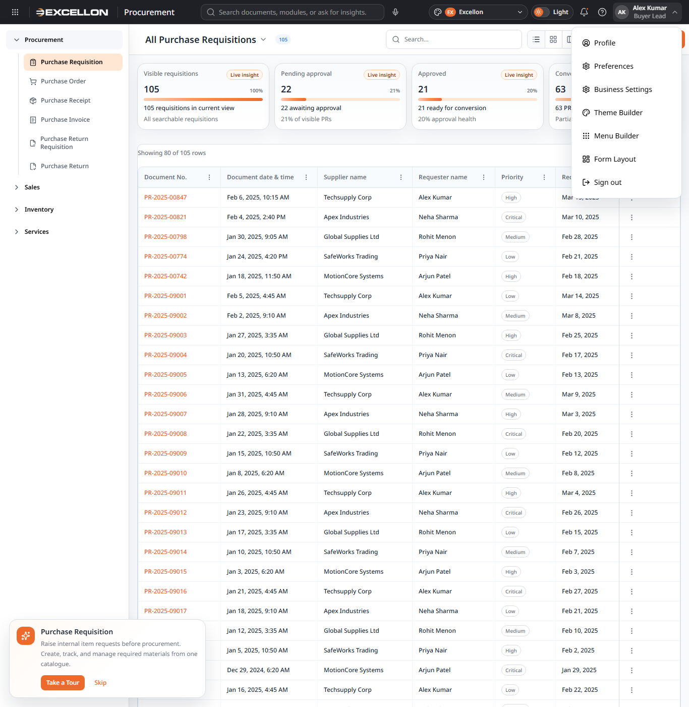
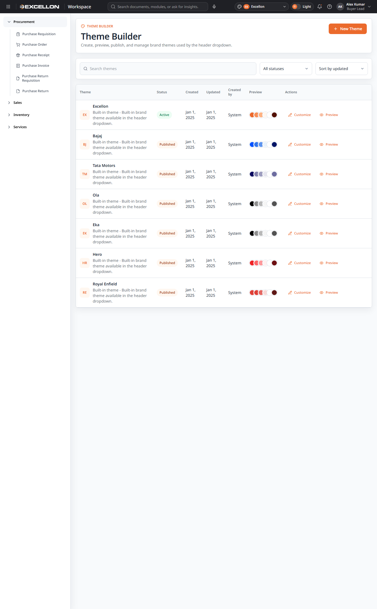
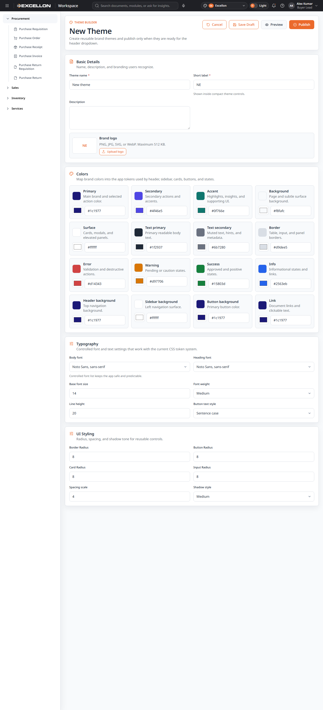
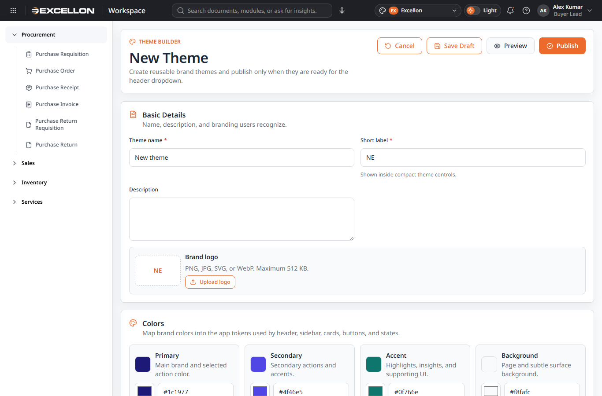
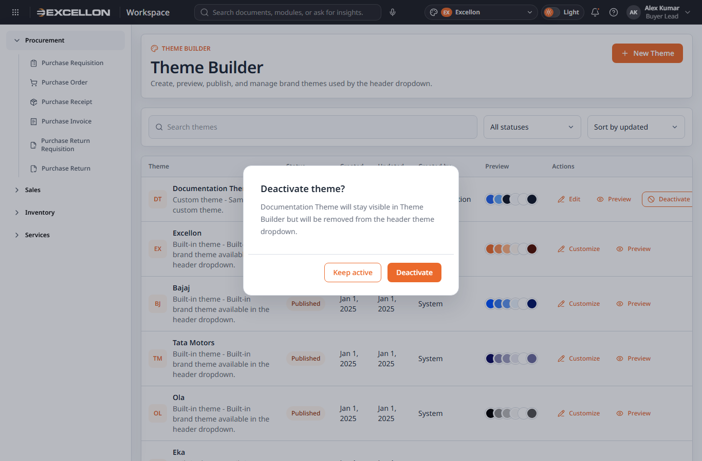
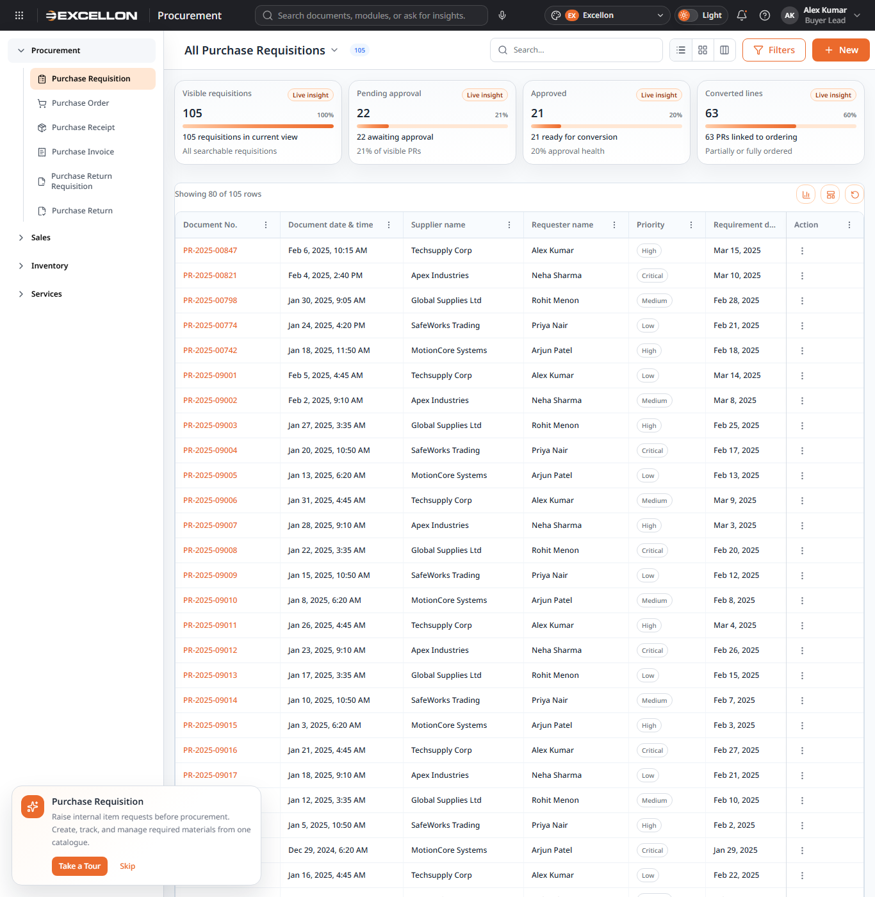
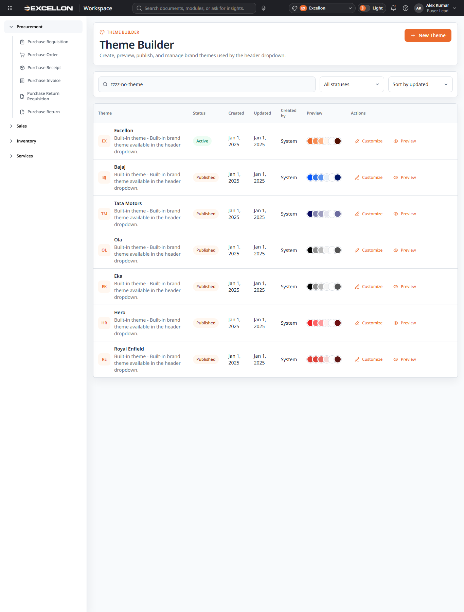

# Theme Builder Documentation

## Title Page

| Item | Details |
|---|---|
| Project name | my-react-app / iDMS UI |
| Document name | Theme Builder Documentation |
| Version | 0.1 |
| Date | April 29, 2026 |
| Status | Draft |

## Table of Contents

1. [Purpose](#purpose)
2. [Audience](#audience)
3. [User Journey](#user-journey)
4. [Theme Builder Screens and Components](#theme-builder-screens-and-components)
5. [Theme Status Explanation](#theme-status-explanation)
6. [Theme Form Layout](#theme-form-layout)
7. [Business Rules](#business-rules)
8. [Error, Empty, Loading, and Validation States](#error-empty-loading-and-validation-states)
9. [Related Files Summary](#related-files-summary)
10. [Screenshot Inventory](#screenshot-inventory)
11. [Final Critical Review Checklist](#final-critical-review-checklist)
12. [Missing Information / Needs Confirmation](#missing-information--needs-confirmation)

## Purpose

Theme Builder helps users manage the application visual appearance in one place. A user can create, edit, preview, save as draft, publish, reactivate, and deactivate brand themes. Themes can include brand colors, fonts, logo, short label, description, and layout styling such as radius, spacing, and shadow style.

Published active themes are available in the header theme dropdown. Draft and deactivated themes stay inside Theme Builder and are not offered as selectable live themes.

## Audience

This document is written for business users, product owners, QA testers, support teams, implementation teams, and project stakeholders.

## User Journey

1. User opens Theme Builder from Profile Tools or the route `#/profile/theme-builder`.
2. User views existing themes, including built-in themes such as Excellon, Bajaj, Tata Motors, Ola, Eka, Hero, and Royal Enfield where available.
3. User clicks **New Theme**.
4. User enters theme details such as name, short label, and description.
5. User configures logo, colors, fonts, and layout styling.
6. User opens Preview to review the theme without changing the live application theme.
7. User saves the theme as draft or publishes it.
8. Published themes appear in the header theme dropdown.
9. User can deactivate a custom theme if it should no longer be used.

## Theme Builder Screens and Components

## Theme Builder Entry Point

**Purpose:**  
Gives users a way to open the Theme Builder feature.

**What the user sees:**  
The top header profile menu contains a **Theme Builder** option. The screen can also be opened by route.

**What the user can do:**  
Open Theme Builder and return to the normal workspace.

**Behavior:**  
The route loads the Theme Builder inside the standard application shell.

**Screenshot:**  

**Related Files:**  
- `src/components/common/AppTopHeader.tsx`
- `src/routes/routeConfig.ts`
- `src/routes/profileRoutes.tsx`
- `src/routes/routeScreens.ts`
- `src/pages/profile/ThemeBuilder.tsx`

## Theme Builder List View

**Purpose:**  
Shows all available themes in one searchable list.

**What the user sees:**  
The page title, **New Theme** button, search field, status filter, sort dropdown, theme table, status badges, color swatches, and row actions.

**What the user can do:**  
Search themes, filter by status, sort by date, customize a built-in theme, edit a custom theme, preview a theme, publish a draft custom theme, deactivate a custom theme, or reactivate an inactive custom theme.

**Behavior:**  
Built-in themes are shown together with saved custom themes. Built-in themes can be customized by creating a draft override instead of directly changing the built-in record.

**Screenshot:**  

**Related Files:**  
- `src/pages/profile/ThemeBuilder.tsx`
- `src/theme/themeRegistry.ts`
- `src/theme/customThemeBuilder.ts`

## New Theme Button

**Purpose:**  
Starts the theme creation process.

**What the user sees:**  
A primary **New Theme** button at the top right of the Theme Builder list page.

**What the user can do:**  
Click the button to open a new theme form.

**Behavior:**  
The form opens with default theme values and status ready for draft or publish.

**Screenshot:**  

**Related Files:**  
- `src/pages/profile/ThemeBuilder.tsx`

## Create/Edit Theme Form

**Purpose:**  
Lets the user create a new theme or update an existing custom/built-in theme copy.

**What the user sees:**  
A form header with **Cancel**, **Save Draft**, **Preview**, and **Publish** buttons in one row. Below it are grouped sections for basic details, logo, colors, typography, and layout.

**What the user can do:**  
Change theme details, upload a logo, adjust color values, select fonts, tune layout styling, save draft, preview, or publish.

**Behavior:**  
Save Draft stores the theme without adding it to the header dropdown. Publish validates required fields before making it available in the header dropdown.

**Screenshot:**  

**Related Files:**  
- `src/pages/profile/ThemeBuilder.tsx`
- `src/components/common/FormControls.tsx`
- `src/theme/customThemeBuilder.ts`

## Basic Details Section

**Purpose:**  
Captures the identity of the theme.

**What the user sees:**  
Fields for theme name, short label, and description.

**What the user can do:**  
Enter a business-friendly theme name, compact label, and optional description.

**Behavior:**  
Theme name is required. Short label is required before publishing.

**Screenshot:**  

**Related Files:**  
- `src/pages/profile/ThemeBuilder.tsx`
- `src/components/common/FormControls.tsx`

## Branding and Logo Section

**Purpose:**  
Allows a theme to carry a recognizable brand logo.

**What the user sees:**  
A logo preview box and an upload button.

**What the user can do:**  
Upload, replace, or remove a logo.

**Behavior:**  
Accepted logo formats are PNG, JPG, SVG, and WebP. Maximum file size is 512 KB.

**Screenshot:**  

**Related Files:**  
- `src/pages/profile/ThemeBuilder.tsx`

## Color Configuration Section

**Purpose:**  
Maps brand colors to application areas such as header, sidebar, cards, buttons, states, and links.

**What the user sees:**  
Color picker controls with helper text and manual HEX input.

**What the user can do:**  
Pick or type colors for primary, secondary, accent, background, surface, text, border, error, warning, success, info, header, sidebar, button, and link colors.

**Behavior:**  
Invalid HEX values display validation messages and block publishing.

**Screenshot:**  

**Related Files:**  
- `src/pages/profile/ThemeBuilder.tsx`
- `src/theme/customThemeBuilder.ts`

## Typography and Font Section

**Purpose:**  
Controls font settings used by the theme.

**What the user sees:**  
Font family, heading font, base font size, font weight, line height, and button text style controls.

**What the user can do:**  
Select supported fonts and adjust safe numeric typography settings.

**Behavior:**  
The allowed font list comes from the theme builder configuration. Unsafe external font loading was not observed.

**Screenshot:**  

**Related Files:**  
- `src/pages/profile/ThemeBuilder.tsx`
- `src/theme/customThemeBuilder.ts`

## Layout Styling Section

**Purpose:**  
Controls theme-level shape and spacing.

**What the user sees:**  
Controls for border radius, button radius, card radius, input radius, spacing scale, and shadow style.

**What the user can do:**  
Adjust layout styling within safe numeric ranges.

**Behavior:**  
Saved settings are kept with the theme configuration.

**Screenshot:**  

**Related Files:**  
- `src/pages/profile/ThemeBuilder.tsx`
- `src/theme/customThemeBuilder.ts`

## Theme Preview Section

**Purpose:**  
Lets users review a theme before applying it to the application.

**What the user sees:**  
A preview dialog with sample header, sidebar, card, input, action button, link, and color swatches. The dialog says preview only and includes expand/compact and close controls.

**What the user can do:**  
Open preview, expand it, close it, and continue editing.

**Behavior:**  
Preview does not permanently apply the selected theme to the live application.

**Screenshot:**  

**Related Files:**  
- `src/pages/profile/ThemeBuilder.tsx`

## Save as Draft Action

**Purpose:**  
Lets users save work before it is ready for use.

**What the user sees:**  
A **Save Draft** button on the create/edit form.

**What the user can do:**  
Save current theme changes as draft.

**Behavior:**  
Draft themes are saved but do not appear in the header theme dropdown.

**Screenshot:**  

**Related Files:**  
- `src/pages/profile/ThemeBuilder.tsx`
- `src/theme/customThemeBuilder.ts`

## Publish Action

**Purpose:**  
Makes a valid theme available for users to select in the header.

**What the user sees:**  
A **Publish** button on the create/edit form and publish actions in the list for eligible custom themes.

**What the user can do:**  
Publish a theme after required fields are valid.

**Behavior:**  
Publishing changes the theme status to published and makes it available in the header theme dropdown.

**Screenshot:**  

**Related Files:**  
- `src/pages/profile/ThemeBuilder.tsx`
- `src/theme/ThemeProvider.tsx`
- `src/theme/customThemeBuilder.ts`

## Deactivate Action and Dialog

**Purpose:**  
Removes a custom theme from user selection without deleting it from Theme Builder.

**What the user sees:**  
A deactivate action for custom themes and a confirmation dialog titled **Deactivate theme?**.

**What the user can do:**  
Confirm deactivation or keep the theme active.

**Behavior:**  
Deactivated themes remain visible in Theme Builder but no longer appear in the header theme dropdown.

**Screenshot:**  

**Related Files:**  
- `src/pages/profile/ThemeBuilder.tsx`
- `src/components/common/ConfirmationDialog.tsx`

## Theme Status Badges

**Purpose:**  
Shows the current usage state of each theme.

**What the user sees:**  
Badges such as Active, Published, Draft, and Inactive.

**What the user can do:**  
Use the badges to understand whether a theme is live, available, unfinished, or unavailable for selection.

**Behavior:**  
The Active badge appears when a published theme is currently selected in the application header.

**Screenshot:**  

**Related Files:**  
- `src/pages/profile/ThemeBuilder.tsx`

## Header Theme Dropdown

**Purpose:**  
Lets users select the active brand theme.

**What the user sees:**  
A compact brand theme selector in the top header beside the light/dark mode switch.

**What the user can do:**  
Select an available published active theme.

**Behavior:**  
Only published active themes are expected to appear. Draft and deactivated custom themes are excluded.

**Screenshot:**  

**Related Files:**  
- `src/components/common/ThemeSwitcher.tsx`
- `src/components/common/AppTopHeader.tsx`
- `src/theme/ThemeProvider.tsx`
- `src/theme/customThemeBuilder.ts`

## Empty State

**Purpose:**  
Explains what happens when no themes match the current search or filter.

**What the user sees:**  
An empty message: **No themes found** with guidance to create a theme or adjust filters.

**What the user can do:**  
Create a new theme or change filters/search.

**Behavior:**  
The empty state appears when the visible theme list is empty after filtering.

**Screenshot:**  

**Related Files:**  
- `src/pages/profile/ThemeBuilder.tsx`

## Loading State

**Purpose:**  
Indicates that themes are being loaded.

**What the user sees:**  
Needs confirmation from project team.

**What the user can do:**  
Needs confirmation from project team.

**Behavior:**  
Needs confirmation from project team.

**Screenshot:**  
[Screenshot missing: Theme Builder Loading State - Needs confirmation from project team.]

**Related Files:**  
- `src/pages/profile/ThemeBuilder.tsx`

## Error State

**Purpose:**  
Explains what happens if themes cannot be loaded.

**What the user sees:**  
Needs confirmation from project team.

**What the user can do:**  
Needs confirmation from project team.

**Behavior:**  
Needs confirmation from project team.

**Screenshot:**  
[Screenshot missing: Theme Builder Error State - Needs confirmation from project team.]

**Related Files:**  
- `src/pages/profile/ThemeBuilder.tsx`

## Validation Messages

**Purpose:**  
Helps users fix invalid information before publishing.

**What the user sees:**  
Inline validation such as **Theme name is required.**, **Use a valid HEX color.**, **Short label is required before publishing.**, and **Resolve validation messages before publishing.**

**What the user can do:**  
Correct the highlighted fields.

**Behavior:**  
Invalid required fields prevent publish.

**Screenshot:**  
[Screenshot missing: Theme Builder Validation State - Needs confirmation from project team.]

**Related Files:**  
- `src/pages/profile/ThemeBuilder.tsx`
- `src/theme/customThemeBuilder.ts`

## Theme Status Explanation

| Status | Meaning for User | Appears in Header Theme Dropdown? | User Action Available |
|---|---|---|---|
| Draft | Theme is saved but not ready for live use. | No | Edit, Preview, Publish |
| Published | Theme is available for selection. | Yes | Edit, Preview, Deactivate for custom themes |
| Active | Theme is published and currently selected. | Yes | Preview, customize built-in copy, or deactivate if custom |
| Deactivated/Inactive | Theme is saved but removed from live selection. | No | Reactivate, Edit, Preview |

## Theme Form Layout

The form is arranged as a business-friendly setup page. The header contains the page title and the main actions: Cancel, Save Draft, Preview, and Publish. Basic Details appears first because users need to name the theme before managing deeper visual settings. Branding/logo follows so users can confirm the theme identity. Colors, typography, and layout settings are grouped separately so the form does not feel like one long technical configuration page.

Required fields are marked with an asterisk. Helper text explains where settings are used. Validation messages appear near the field that needs attention. The current form is shown inside the application shell and responds to available screen width.

**Screenshots:**  

## Business Rules

| Rule | Explanation |
|---|---|
| Draft themes do not appear in the header theme dropdown. | Drafts are saved for later editing only. |
| Published active themes appear in the header theme dropdown. | Users can select only themes that are ready for live use. |
| Deactivated themes do not appear in the header theme dropdown. | Deactivation removes the theme from selection but keeps it in Theme Builder. |
| Preview does not permanently apply the theme. | Preview is a safe review mode only. |
| Publish requires valid required fields. | The user must correct required fields and invalid colors before publishing. |
| Built-in themes are protected. | Customizing a built-in theme creates an editable theme copy instead of rewriting the built-in theme. |
| Existing functionality must remain unaffected. | If users do not publish a new configuration, current application behavior continues. |

## Error, Empty, Loading, and Validation States

| Area | Message/State | Meaning for User | User Action |
|---|---|---|---|
| Theme list | No themes found | No themes match the current filters or search. | Create a theme or clear filters. |
| Theme name | Theme name is required. | A name is required before saving or publishing. | Enter a theme name. |
| Short label | Short label is required before publishing. | The compact header label is missing. | Enter a short label. |
| Colors | Use a valid HEX color. | A color value is not valid. | Enter a valid HEX color. |
| Publish | Resolve validation messages before publishing. | Required information is incomplete or invalid. | Fix the validation messages. |
| Loading | Needs confirmation from project team. | Needs confirmation from project team. | Needs confirmation from project team. |
| Error | Needs confirmation from project team. | Needs confirmation from project team. | Needs confirmation from project team. |

## Related Files Summary

| Feature/Component | Related File Name | Purpose |
|---|---|---|
| Theme Builder page | `src/pages/profile/ThemeBuilder.tsx` | Main Theme Builder list, form, preview, status, and actions. |
| Theme storage and validation helpers | `src/theme/customThemeBuilder.ts` | Theme data shape, defaults, sanitization, local storage helpers, and published-theme filtering. |
| Built-in theme registry | `src/theme/themeRegistry.ts` | Built-in themes available to the application. |
| Theme application provider | `src/theme/ThemeProvider.tsx` | Loads and applies available themes to the application. |
| Header theme selector | `src/components/common/ThemeSwitcher.tsx` | Header dropdown used to select a published active theme. |
| Top header | `src/components/common/AppTopHeader.tsx` | Profile menu entry point and theme selector placement. |
| Shared confirmation dialog | `src/components/common/ConfirmationDialog.tsx` | Deactivation confirmation dialog. |
| Shared form controls | `src/components/common/FormControls.tsx` | Input, select, and form field controls. |
| Route configuration | `src/routes/routeConfig.ts` | Stores the Theme Builder route. |
| Profile routes | `src/routes/profileRoutes.tsx` | Connects the route to the Theme Builder page. |
| Lazy route screens | `src/routes/routeScreens.ts` | Lazy-loads Theme Builder. |

## Screenshot Inventory

| Screenshot Required | File Name | Included? | Notes |
|---|---|---|---|
| Theme Builder entry point | `theme-builder-entry-point.png` | Yes | Captured in light mode with Excellon theme. |
| Theme Builder list view | `theme-builder-list-view.png` | Yes | Captured in light mode with Excellon theme. |
| New Theme button | `theme-builder-list-view.png` | Yes | Button visible on list view. |
| Create/Edit Theme form | `theme-builder-create-form.png` | Yes | Captured in light mode with Excellon theme. |
| Basic Details | `theme-builder-create-form.png` | Yes | Visible in create form. |
| Branding/logo | `theme-builder-create-form.png` | Yes | Visible in create form. |
| Color picker | `theme-builder-color-picker.png` | Yes | Captured as a full-page form screenshot. |
| Typography | `theme-builder-typography.png` | Yes | Captured as a full-page form screenshot. |
| Preview drawer | `theme-builder-preview.png` | Yes | Captured in expanded preview mode. |
| Save Draft | `theme-builder-create-form.png` | Yes | Button visible in create form. |
| Publish action | `theme-builder-create-form.png` | Yes | Button visible in create form. |
| Deactivate dialog | `theme-builder-deactivate-dialog.png` | Yes | Captured with a seeded custom published theme. |
| Header theme dropdown | `theme-header-dropdown.png` | Yes | Captured with the closed native theme selector visible. Native open options are browser-controlled. |
| Empty state | `theme-builder-empty-state.png` | Yes | Captured with a no-result search state. |
| Loading state | `theme-builder-loading-state.png` | No | Needs confirmation from project team. |
| Validation state | `theme-builder-validation-state.png` | No | Needs confirmation from project team. |

## Final Critical Review Checklist

| Review Item | Status | Notes |
|---|---|---|
| All Theme Builder screens reviewed | Partially Completed | Main list, create form, actions, and code paths reviewed. Some states need live confirmation. |
| All reusable components documented | Partially Completed | Related shared components are listed where identifiable. |
| Full-screen screenshots captured in light mode | Partially Completed | Main list and create form captured. |
| Excellon theme used for screenshots | Completed | Captured screenshots show Excellon selected. |
| Navigation bar/sidebar closed during screenshots | Partially Completed | Sidebar is visible in the app layout; no expanded overlay navigation menu is open. |
| Screenshot links added | Completed | Available screenshots and missing placeholders are included. |
| Missing screenshots marked clearly | Completed | Missing items use the required confirmation wording. |
| Related file names listed | Completed | Only actual project file names are listed. |
| Draft/publish/preview/deactivate explained | Completed | Business behavior is explained. |
| Language is non-technical | Completed | Written for business and QA readers. |
| Document is suitable for business users | Completed | Technical details are limited to related file names. |
| Unclear items marked as Needs confirmation | Completed | Unconfirmed states are marked. |

## Missing Information / Needs Confirmation

- Confirm whether there is a supported way to capture the full-width Theme Preview drawer in automated documentation runs.
- Confirm exact loading and error states for Theme Builder, because the current implementation appears largely local-storage based.
- Confirm whether a custom inactive theme is available in shared test data for deactivation dialog screenshots.
- Confirm whether the open native header theme dropdown should be documented with a browser-specific screenshot or a closed selector screenshot.
- Confirm final business wording for built-in theme customization and whether built-in themes are considered system-owned.
